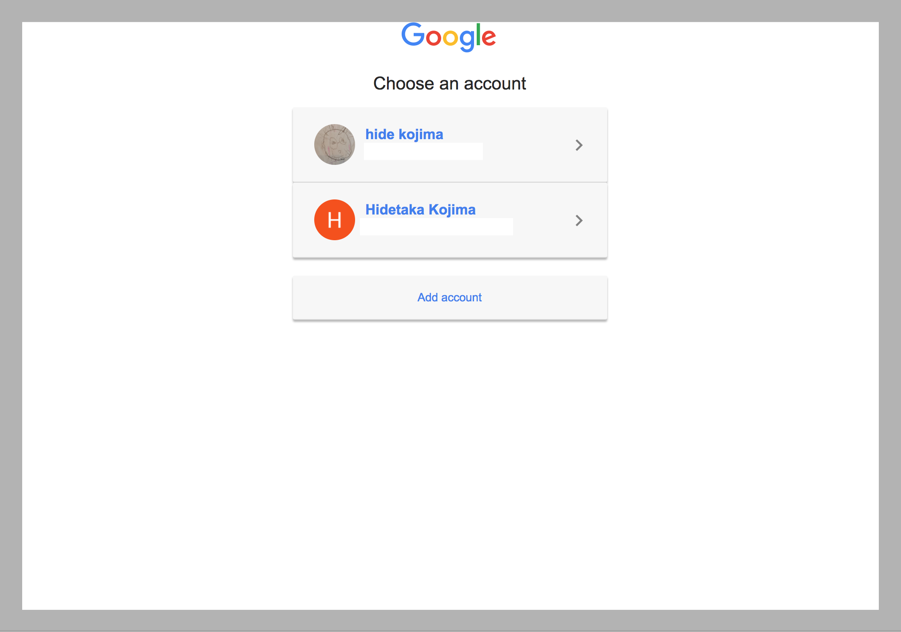
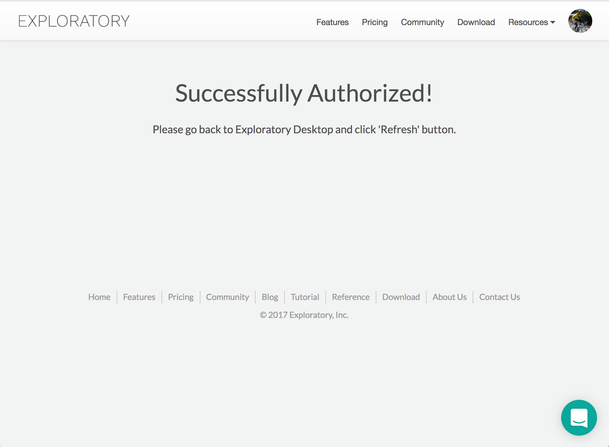

# Google Spreadsheet Data Import

## 1. Select Google Spreadsheet Data Menu

- Select 'Import Remote Data' from Add Data Frames dropdown

- Click 'Google Sheets'

## 2. OAuth for Google Sheets

If this is your first time to create a Google Sheets Data Source, you want to create a new connection for Google Sheets. Click "create" link on Import Dialog.

This will opens up Connection Dialog.

And click "Add" button.

And Select "Google Analytics". Then Click OK on the popup.

Select your google account that you want to use.

And you will see Authorized message.

Go back to Exploratory and click "Refresh" button. And you will see small dialog message changes like below.

So click Close. Then close Connection List Dialog too. 

And now ready to select parameters.

## 3. Set Parameters

- Type Data Frame Name

- Select Google Spreadsheet name from the dropdown menu

- Type Worksheet name or its index number (e.g. 1, 2, etc.)

- Set parameters for how to read the data.

## 4. Preview and Import

Click 'Get Data' button

If the data in the preview table look ok, then click 'Save' button to import the data into Exploratory.
