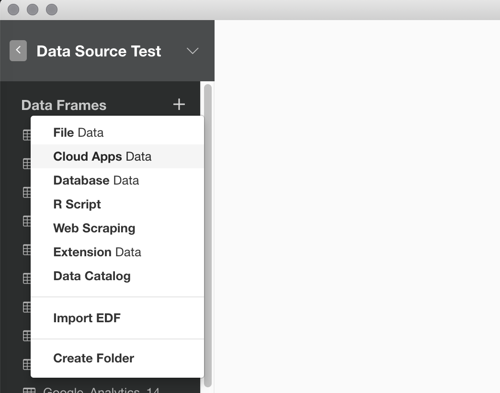
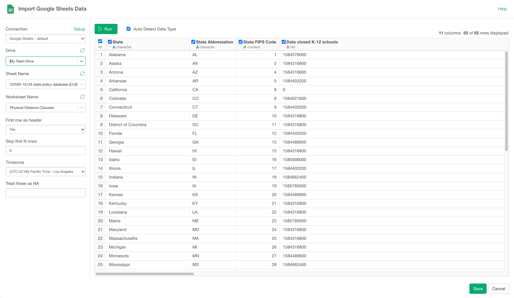

# Google Spreadsheet Data Import

## 1. Select Google Spreadsheet Data Menu

Click '+' button next to 'Data Frames' and select 'Import Cloud Apps Data'.

Click 'Google Sheets'

## 2. OAuth Setting

Create a connection following [this instruction](https://blog.exploratory.io/how-to-setup-oauth-cloud-apps-connections-in-exploratory-a5c20d18e7c7).

## 3. Set Parameters

- Type Data Frame Name

- Select Google Spreadsheet name from the dropdown menu

- Select Worksheet name from the dropdown menu

- Set parameters for how to read the data.

Now you can set below parameters:

1. First row as header - Set Yes if the first row is the header row.

2. Skip first N rows - Number of lines to skip before reading data

3. Timezone - Timezone you want to use for the POSIXct columns

4. Treat these as NA - Character vector of strings to interpret as missing values. 

## 4. Preview and Import

Click 'Get Data' button

If the data in the preview table look ok, then click 'Save' button to import the data into Exploratory.
