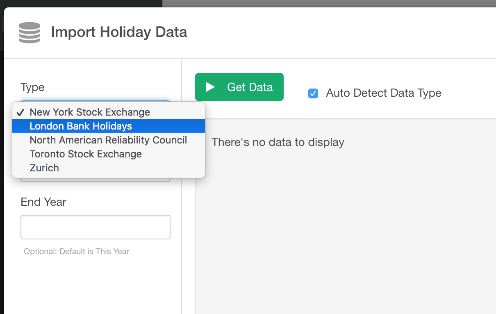
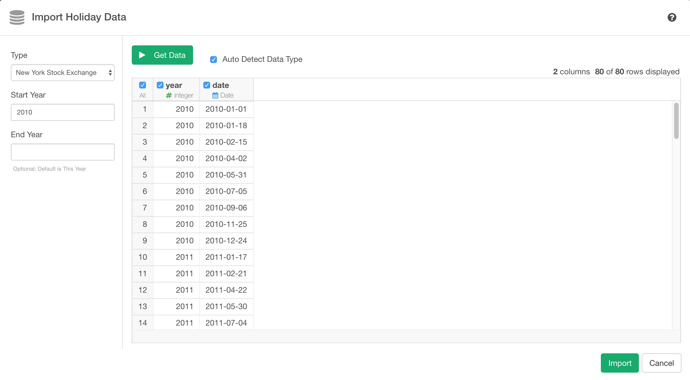

# Holiday Data Import

Allows to get holiday calendar for New York Stock Exchange, bank holidays in London, holiday calendar for NERC, the North American Reliability Council,a holiday calendar for the Toronto Stock Exchange, and holiday calendar for Zurich.

## 1. Parameters

### 1.1 Type

You can select either of followings to get a holiday calendar.

- New Yor Stock Exchange
- London Bank Holiday
- North American Reliability Council
- Toronto Stock Exchange
- Zurich

#### Start Year

Start year that you want to get holiday calendar.

#### End Year

End year that you want to get holiday calendar

## 2. Import

Once you confirmed the query result, click `Import` button to import the data as a data frame in Exploratory.

## 3. Output

* year - Year of the holiday in Integer Data Type.
* date - Date of the holiday in Date Data Type.

