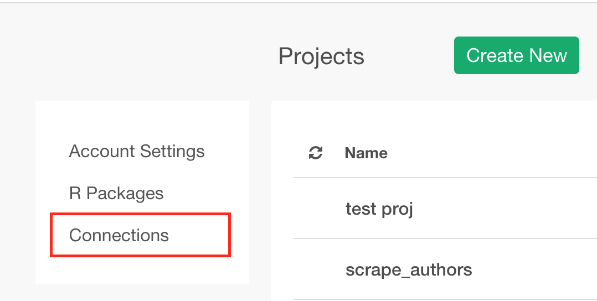
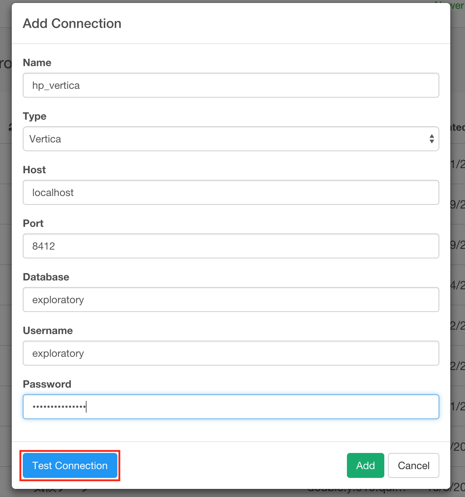
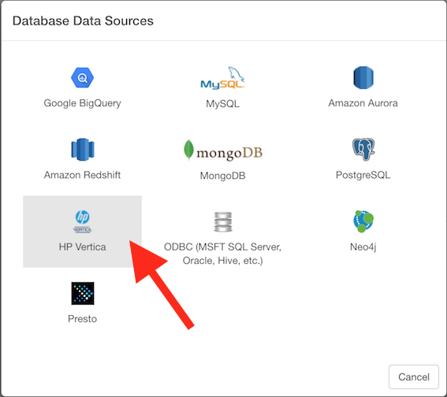
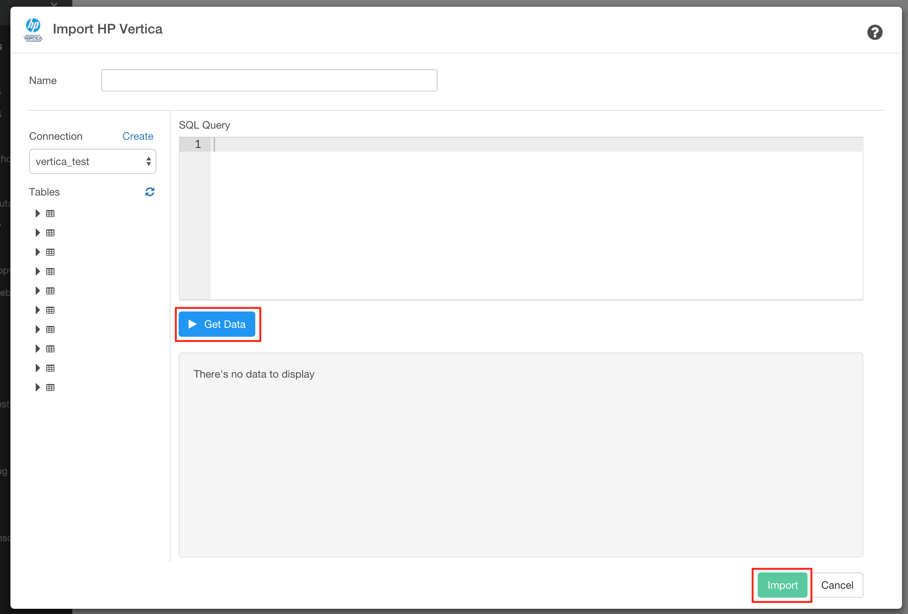

# HP Vertica Database Data Import

You can quickly import data from your HP Vertica Database into Exploratory.

## 1. Create a connection for HP Vertica database

First, you want to create a connection for HP Vertica database.



After filling the database information, click ‘Test Connection’ button to make sure the information is correct, before you save it.



## 2. Open HP Vertica Import dialog

Select 'Import Database Data' from Add New Data Frame menu.


Click HP Vertica to select.




## 3. Preview and Import

Click "Get Data" button to see the data back from your HP Vertica db.



If it looks ok, then you can click 'Import' to import the data into Exploratory.

## 4. Using Variables in SQL

First, define a variable in R script file.

```
cutoff_date <- "\'2016-01-15\'"
```

Note that the ‘\’ (backslash) symbols are used to escape the single quotes, which are required to be used for characters in SQL queries.

Second, load the R script file.


Finally, you can use @{} to surround a variable name inside the query like below.

```
select *
from airline_2016_01
where fl_date > @{cutoff_date}
```

Here's a [blog post](https://blog.exploratory.io/using-variables-in-sql-query-2740924d9f20#.bdcn5v68x) for more detail.
