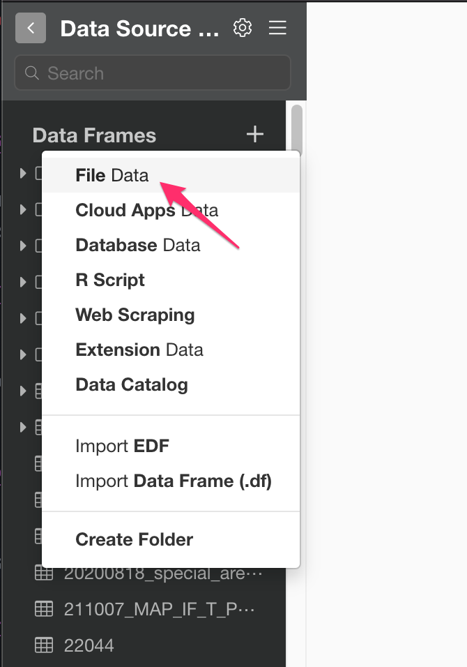
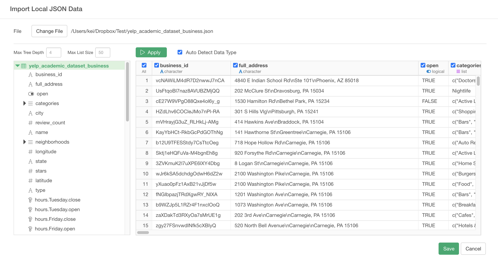

# Import JSON Data

You can import both local and remote JSON File Data quickly.

## 1. Select CSV / Delimited File Data Menu

Click '+' button next to 'Data Frames' and select 'Import File Data'.

If you import JSON File on your desktop or laptop, make sure Local tab is selected. If you import a JSON file from remote server like Amazon S3, Dropbox, etc or accessing REST APIs that return JSON data, make sure Remote tab is selected. Click 'JSON File'

## 2. Select File.
If you select local, file picker shows up so select a file to import.
### 2.1 Local File

### 2.2 Remote File
if you select remote, small dialog shows up so enter a URL for the file.

## 3. JSON Tree

JSON Tree and Preview sections are same for both local and remote.

Select node on JSON Tree.

On the left hand side, you an see JSON Tree and you can select red table icon for importing data.

## 4. Preview and Import

Select red table node on the tree (or Click Get Data button) to see the data in JSON File (or REST API). If it looks ok, then you can click 'Import' to import the JSON data into Exploratory.

## 5. More details about JSON

* [Analyzing JSON data by taking advantage of what makes it JSON in R](https://blog.exploratory.io/analyzing-json-data-by-taking-advantage-of-the-structure-in-r-1e0508e30117)
