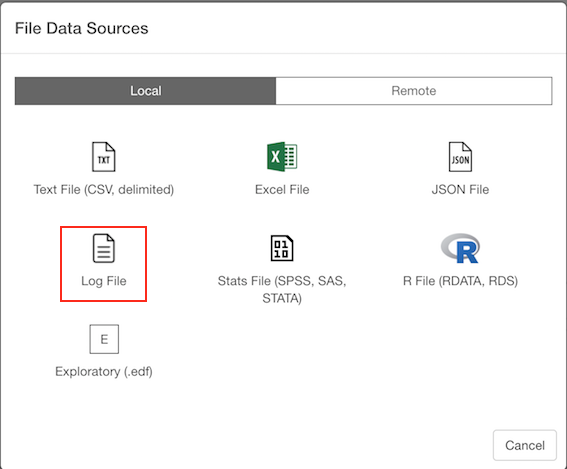
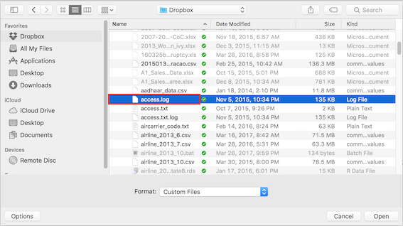
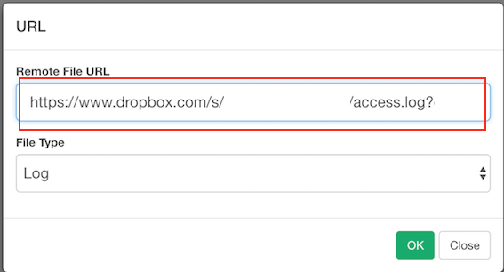
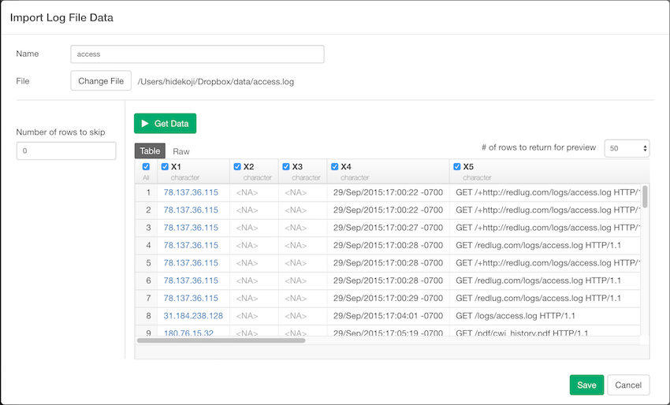

# Import Log File Data

You can import both local and remote Log File Data quickly.

## 1. Select Log File Data Menu

Click '+' button next to 'Data Frames' and select 'Import File Data'.

If you import Log File on your desktop or laptop, make sure Local tab is selected. If you import a file from remote server like Amazon S3, Dropbox, etc make sure Remote tab is selected. Click 'Text File (CSV, delimited)'

## 2. Select File.
If you select local, file picker shows up so select a file to import.
### 2.1 Local File

### 2.2 Remote File
if you select remote, small dialog shows up so enter a URL for the file.

## 3. Input parameters

Input parameters are same for local and remote file import.

Set these parameters.

* Number of rows to skip - Number of lines to skip before reading data.

## 4. Preview and Import

Click Preview button to see the data in Log File. You can limit number of rows for the preview by selecting number from pulldown list on the preview table. If it looks ok, then you can click 'Import' to import Log data into Exploratory.
