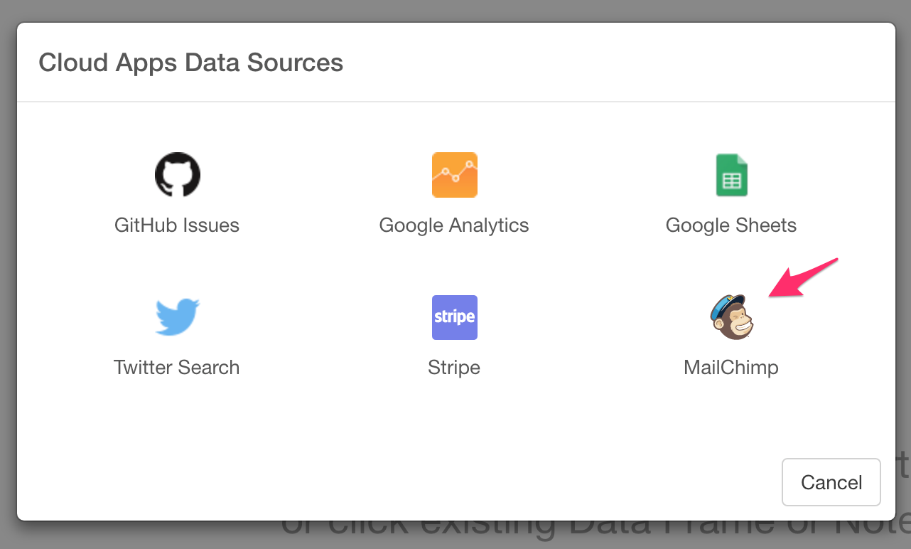

# Import MailChimp API Data

You can get your MailChimp related data quickly.

## 1. Select Stripe Data Menu

- Select 'Import Cloud Apps Data' from Add Data Frames dropdown

- Click 'MailChimp'

## 2. OAuth Setting

Create a connection following [this instruction](https://blog.exploratory.io/how-to-setup-oauth-cloud-apps-connections-in-exploratory-a5c20d18e7c7).

## 3. Input parameters

Set these parameters.

* Data Type - Select a type of MailChimp data set.
  * Members - Get members and all of their associated details.
  * Subscriber Activities - Get all Subscriber Activity.
  * Authorized Apps - Get registered, connected apps for your MailChimp account with the Authorized Apps endpoints.
  * Automations - Get a summary of an account’s Automations. Automation is a paid feature that lets you build a series of triggered emails that are sent to subscribers over a set period of time.
  * Batches - Get a summary of batch requests that have been made.
  * Batch Webhooks - Get all webhooks that have been configured for batches.
  * Campaign Folders - Get all folders used to organize campaigns.
  * Campaigns - Get all campaigns in an account.
  * E-commerce Stores - Get information about all stores in the account.
  * File Manager Files - Get a list of available images and files stored in the File Manager for the account.
  * File Manager Folders - Get a list of all folders in the File Manager.
  * Lists - Get information about all lists in the account.
  * Reports - Get campaign reports.
  * Template Folders - Get all folders used to organize templates.
* Date Range - Select a type of date filtering. If you choose 'After This Date', you can indicate explicit date like '2015-11-03' in 'Value for Date Range'. If you choose 'Last N ~', you can indicate a positive integer in 'Value for Date Range' and data is filtered by the number with the time unit in the option.
* Value for Date Range - If this is empty, all data is imported. If 'Date Range' is 'After This Date', this should be explicit date like '2015-11-03'. If 'Date Range' is 'Last N ~', this should be a positive integer.

## 4. Preview and Import

Click Preview button to see the data back from MailChimp. If it looks ok, then you can click 'Import' to import the data into Exploratory.
