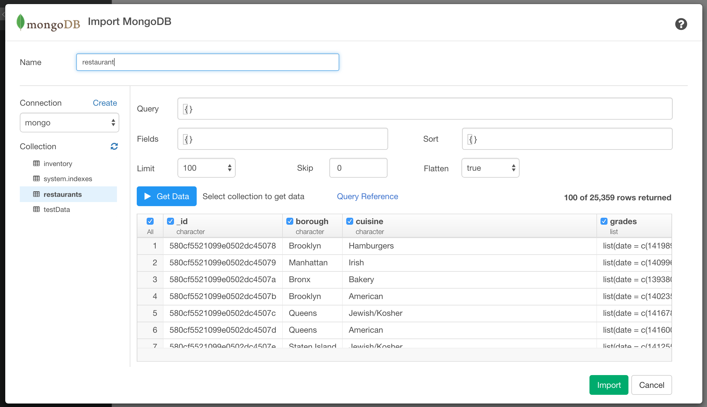
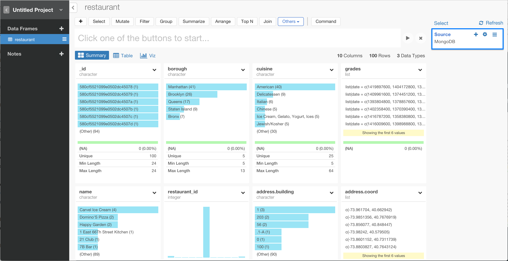

# MongoDB Data Import

You can quickly import data from your MongoDB into Exploratory.

## 1. Create a Connection to use

Create a connection following [this instruction](connection.html).

## 2. Open MongoDB Import dialog

Click '+' button next to 'Data Frames' and select 'Import Database Data'.

Click MongoDB to select.

## 3. Preview the data

1. Put the data frame name at 'Name'.
2. Select connection from left dialog box.
3. Select collection from left dialog box. Then you will see the preview of the data.
4. Modify 'Query', 'Fields', 'Sort', 'Limit', 'Skip' and 'Flatten' to customize your query. Click "Get Data" button to update the preview of the data.

## 4. Import

You can choose which columns to import by checking the checkboxes in the header of the preview data table.

If it looks ok, then you can click 'Import' to import the data into Exploratory.

You will see the data showing up in Summary view!

