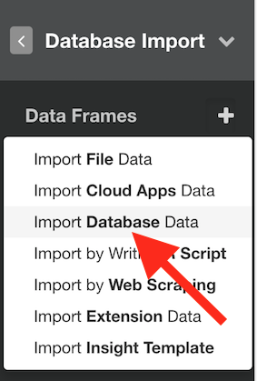

# MongoDB Data Import

You can quickly import data from your MongoDB into Exploratory.

## 1. Create a Connection to use

Create a connection following [this instruction](connection.html).

## 2. Open MongoDB Import dialog

Click '+' button next to 'Data Frames' and select 'Import Database Data'.

Click MongoDB to select.

## 3. Preview Data

### 3.1 Find

1. Put the data frame name at 'Name'.
2. Select connection from left dialog box.
3. Select collection from left dialog box. Then you will see the preview of the data. 

You can use Input Parameters to fine tune your query result.

#### 3.1.1 Input Parameters

* Query - You can set the filtering condition.
* Fields - You can select the columns (or fields) by either keeping them or excluding them explicitly.
* Sort - You can use this to set the sorting rules.
* Limit - 100 by default, which means it will query only the first 100 rows (documents) of the data. You can change this to other values and eventually you want to set it to ‘All’ once you finalize your queries and are ready for importing the data into Exploratory.

### 3.2 Aggregate

The aggregation pipeline has an internal optimization phase that provides improved performance for certain sequences of operators. For details, see (Aggregation Pipeline Optimization)[https://docs.mongodb.com/manual/core/aggregation-pipeline-optimization/]

See [An Introduction to MongoDB Query for Beginners](https://blog.exploratory.io/an-introduction-to-mongodb-query-for-beginners-bd463319aa4c) for each Input Parameter details.

## 4. Import

If it looks ok, then you can click 'Import' to import the data into Exploratory.
