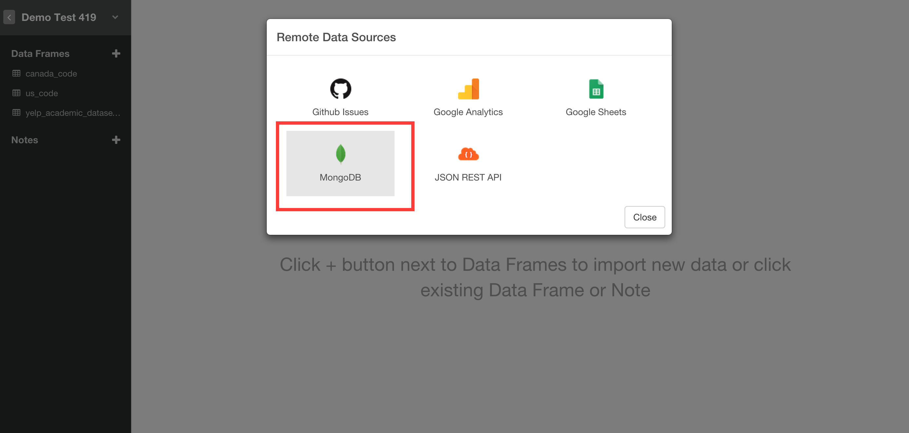
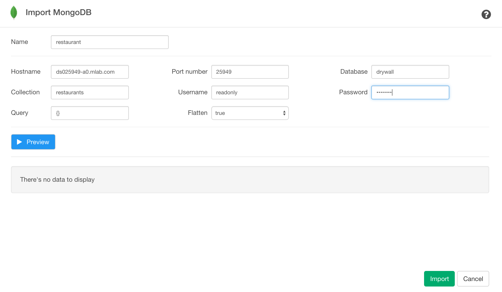
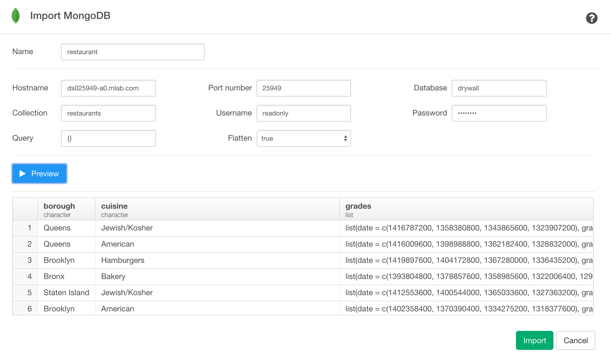
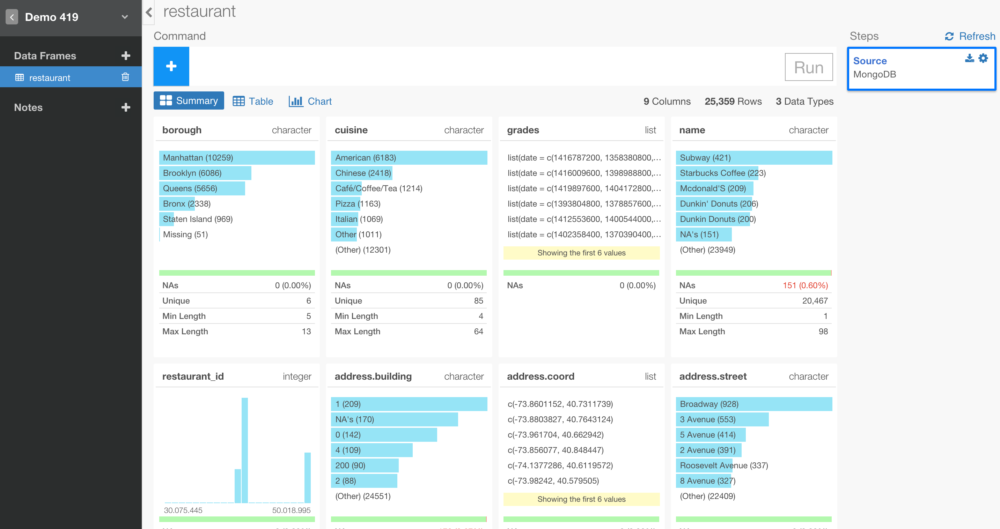

# Mongo DB Data Import

You can quickly import data from your Mongo DB into Exploratory.

## 1. Open Mongo DB Import dialog

Select 'Import Remote Data' from Add New Data Frame menu.

Click Mongo DB to select.

## 2. Set Parameters

Type your new data frame name

Type the following your Mongo DB connection related parameter values.

- Host name
- Port number
- Database name
- Collection name
- Username
- Password
- Query

Note: We support the connection with username and password. If you are working with locally installed MongoDB and don't have username and password then please create them in order for Exploratory to be able to access to it. We will support the connection without username/password soon. 

## 3. Preview and Import

Click Preview button to see the data back from your Mongo DB.

If it looks ok, then you can click 'Import' to import the data into Exploratory.

You will see the data showing up in Summary view!

