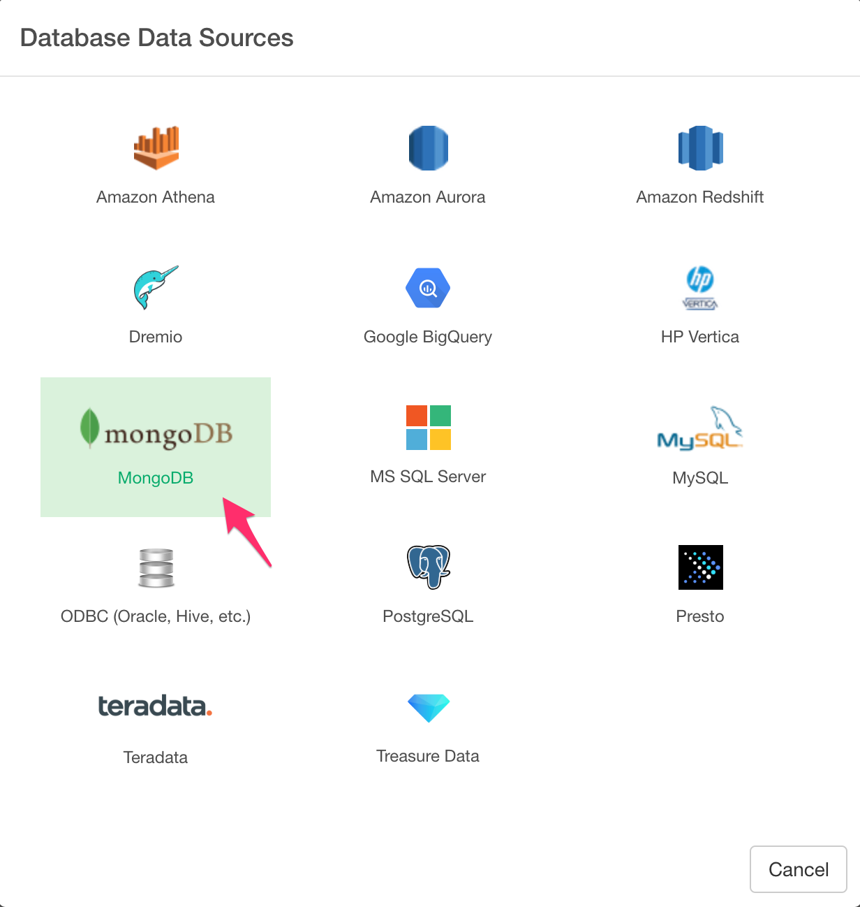

# MongoDB Data Import

You can quickly import data from your MongoDB into Exploratory.

## 1. Create a Connection to use

In Exploratory, there are three types of MongoDB connections.

- Connection string
- Single Host
- Multiple Hosts

### 1.1 Connection String

If you want to connect to your MongoDB with DNS Seedlist Connection Format or if you already have a working MongoDB Connection String, you can use this "Connection String" Connection Type. Simply copy and paste the Connection String to the text area and click the Test Connection button. If the connection test went well, click the Add button to save it.

You can find MongoDB connection Sting details [here](https://docs.mongodb.com/manual/reference/connection-string/).


### 1.2 Single Host

If you prefer to connection to your MongoDB by supplying Host, Port, Database, Username, and Password from the Connection Dialog, you can use this "Single Host" Connection Type. Like other Database connections, type in required fields then click Test Connection button. If the connection test went well, click Add to save it. 


### 1.3 Multiple Hosts

If you prefer to connection to your MongoDB (Sharded Cluster) by supplying Cluster, Database, Username, and Password from the Connection Dialog, you can use this "Multiple Hosts" Connection Type. Type in Cluster and other required fields, then click the Test Connection button. If the connection test went well, click Add button to save it. 


## 2. Open MongoDB Import dialog

Click '+' button next to 'Data Frames' and select 'Import Database Data'.


Click MongoDB to select.



## 3. Preview Data

### 3.1 Find


1. Select connection from left dialog box.
2. Select collection from left dialog box. Then you will see the preview of the data. 

You can use Input Parameters to fine tune your query result.

See [An Introduction to MongoDB Query for Beginners](https://blog.exploratory.io/an-introduction-to-mongodb-query-for-beginners-bd463319aa4c) for each Input Parameter details.

#### 3.1.1 Input Parameters

* Query - You can set the filtering condition.
* Fields - You can select the columns (or fields) by either keeping them or excluding them explicitly.
* Sort - You can use this to set the sorting rules.
* Limit - 100 by default, which means it will query only the first 100 rows (documents) of the data. You can change this to other values and eventually you want to set it to ‘All’ once you finalize your queries and are ready for importing the data into Exploratory.

### 3.2 Aggregate


The aggregation pipeline has an internal optimization phase that provides improved performance for certain sequences of operators. For details, see [Aggregation Pipeline Optimization](https://docs.mongodb.com/manual/core/aggregation-pipeline-optimization/)

## 4. Using Parameters in Find

First, click Parameter link on the MongoDB Data Import Dialog.


Second, define a parameter and click Save button.


Finally, you can use @{} to surround a variable name inside the query like below.

  ```
  {borough: @{borough}}
  ```
  
  If you type @ then it suggests parameters like below. And now it shows restaurants in Manhattan.
  
  


Here's a [blog post](https://exploratory.io/note/kanaugust/An-Introduction-to-Parameter-in-Exploratory-WCO4Vgn7HJ) for more detail.

## 5. Import


If it looks ok, then you can click 'Import' to import the data into Exploratory.
