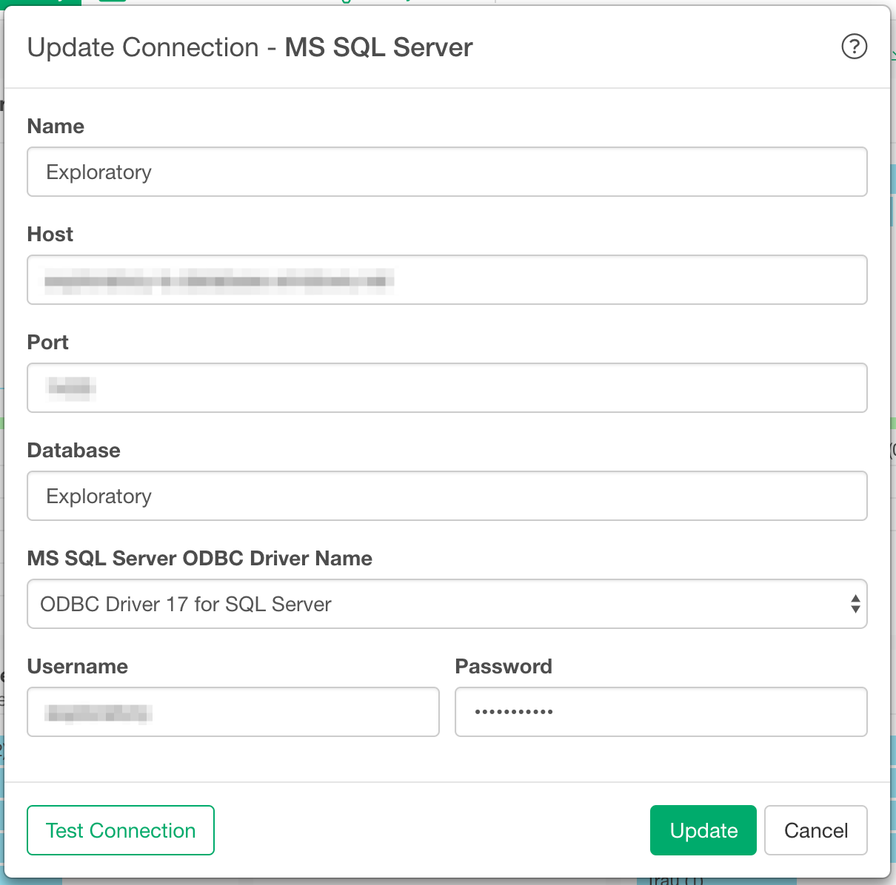
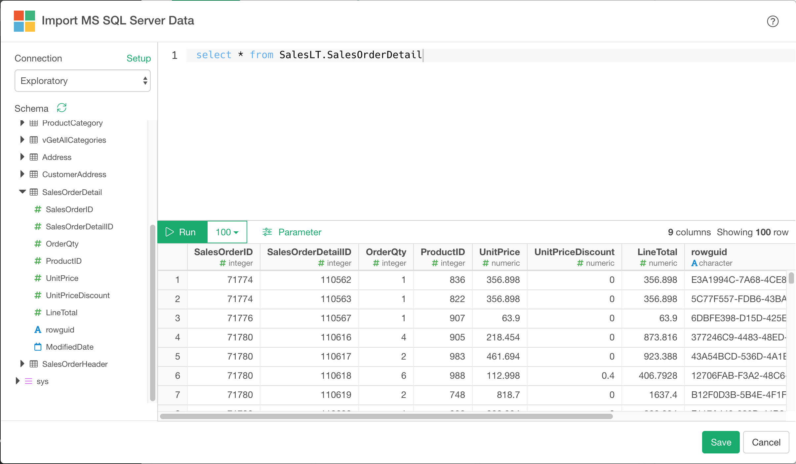

# SQL Server Data Import

You can quickly import data from your SQL Server into Exploratory.

## 1. Create a connection for MS SQL Server 

First, you want to create a connection for SQL Server.



After filling the below database information:

- Host - Host name of the SQL Server
- Port - Port number for the SQL Server. 
- Database - Database Name
- MS SQL Server ODBC Driver - It shows list of installed drivers. Regardless of the driver selected here, when you publish a Data source that uses the connection, ODBC Driver 17 for SQL Server is used for Scheduling. (Both exploratory.io and Collaboration Server have ODBC Driver 17 for SQL Server)
- Username - Username of the SQL Server
- Password - Password of the SQL Server

To Install ODBC Driver for SQL Server, please follow the [instruction](https://docs.microsoft.com/en-us/sql/connect/odbc/download-odbc-driver-for-sql-server?view=sql-server-ver15). 

Click ‘Test Connection’ button to make sure the information is correct, before you save it.

## Troubleshooting

If you use Mac and installed ODBC Driver 17 for SQL Server version 17.8 or older, you might see the below error when connection to your SQL Server 

```r
[08001][Microsoft][ODBC Driver 17 for SQL Server]SSL Provider: [OpenSSL library could not be loaded, make sure OpenSSL 1.0 or 1.1 is installed]
```

If this is the case, try the below steps:
It assume you use brew to install openssl and brew prefix is `/usr/local`. (you can check it with `brew --prefix`)   

```sh
$ rm -rf /usr/local/opt/openssl

$ ln -s /usr/local/Cellar/openssl@1.1/1.1.1m /usr/local/opt/openssl
```

Then restart Exploratory.

## 2. Open SQL Server Import dialog

Select 'Import Database Data' from Add New Data Frame menu.


Click SQL Server to select.


## 3. Preview and Import

Click "Run" button to see the data back from your SQL Server.




If it looks ok, then you can click 'Import' to import the data into Exploratory.
