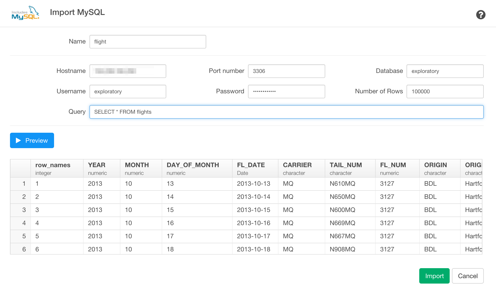

# MySQL Data Import

You can quickly import data from your MySQL Database into Exploratory.

## 1. Open MySQL Import dialog

Select 'Import Remote Data' from Add New Data Frame menu.

Click MySQL DB to select.

## 2. Set Parameters

Type your new data frame name

Type the following your MySQL DB connection related parameter values.

- Host name
- Port number
- Database name
- Username
- Password
- Number of Rows
- Query

## 3. Preview and Import

Click Preview button to see the data back from your MySQL db.

If it looks ok, then you can click 'Import' to import the data into Exploratory.
