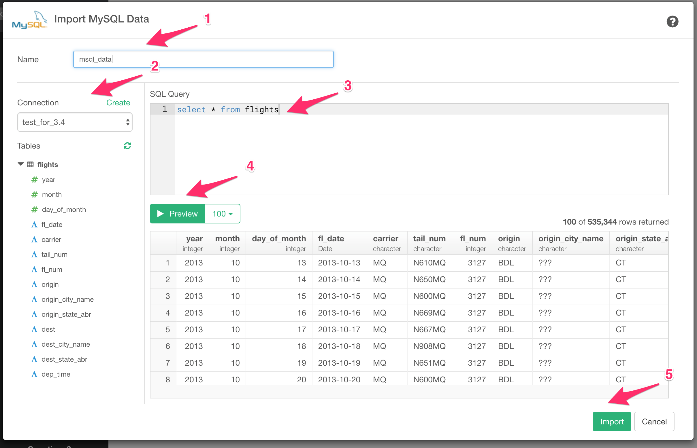

# MariaDB (MySQL) データインポート

MySQLデータベースからExploratoryに素早くデータをインポートすることができます。

## 1. 使用するデータコネクションを作成する

[この手順](https://docs.exploratory.io/data_import/database-data/connection)に従って、データコネクションを作成します。

* SSL接続かどうかは自動的に判別されます。

## 2. MariaDB (MySQL) インポートダイアログを開く

データフレームの横の「＋」ボタンをクリックし、「データベースデータ」を選択します。


MariaDB (MySQL) をクリックします。


## 3. インポート

1. 左のダイアログボックスから接続を選択します。

2. 入力フィールドにクエリを記述します。

3. "実行 "ボタンをクリックします。すると、データのプレビューが表示されます。

4. "保存"ボタンをクリックします。




## 4. SQLでパラメーターを使用する

まず、SQLデータインポートダイアログの「パラメーター」リンクをクリックします。


次に、パラメーターを定義し、[保存]ボタンをクリックします。


最後に、クエリ内の変数名を@{}で囲むと、以下のようになります。

  ```
  select *
  from airline_2016_01
  where carrier = @{carrier}
  ```
  
  を入力すると、以下のようなパラメーターが表示されます。
  
  のようになります。


詳しくはこちらの[ブログ記事](https://exploratory.io/note/kanaugust/An-Introduction-to-Parameter-in-Exploratory-WCO4Vgn7HJ)をご覧ください。

## 5. AWSセキュリティグループの設定 (Amazon RDSのみ)


MySQLのデータベースとしてAmazon RDSを使用していて、データベース接続エラーが発生した場合、AWSコンソールにアクセスし、MySQLデータベースインスタンスに関連付けられたDBセキュリティグループのルール (インバウンド) にクライアントPCのIPアドレスが追加されていることを確認してください。

## 6. 実際の行数

パフォーマンスの観点から、クエリ全体を再実行しないと取得できない、実際の行数を表示しないようにしました。


それでもクエリの結果の実数を表示したい場合は、システム設定により表示させることができます。


そして、"SQLデータインポートダイアログで実際の行数を表示"を「はい」に設定します。


これにより、以下のように実際の行数が表示されます。


