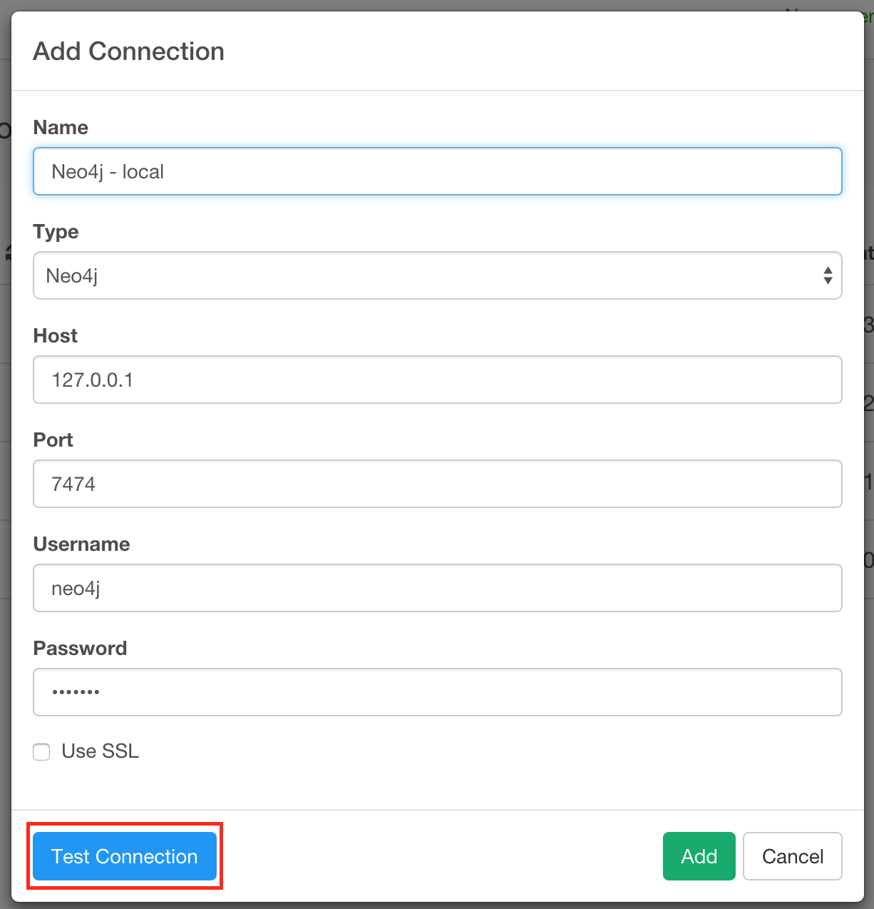
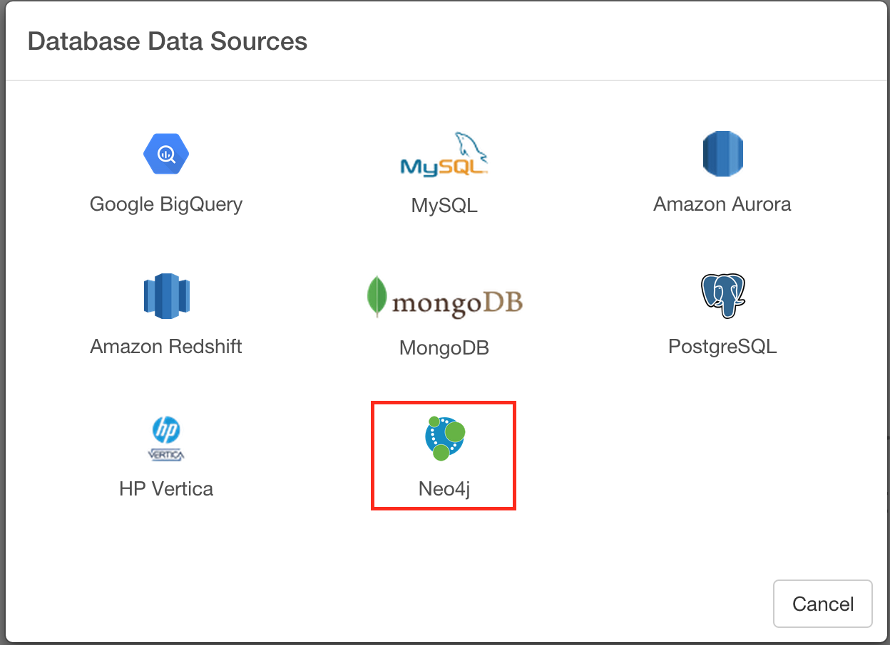
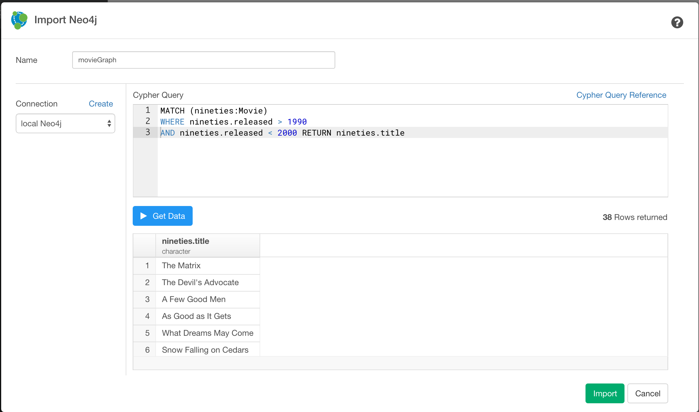

# Neo4j Database Data Import

You can quickly import data from your Neo4j Database into Exploratory.

## 1. Create a connection for Neo4j database

First, you want to create a connection for Neo4j database.

After filling the database information, click ‘Test Connection’ button to make sure the information is correct, before you save it.

## 2. Open Neo4j  Import dialog

Select 'Import Database Data' from Add New Data Frame menu.

Click Neo4j to select.

## 3. Preview and Import

Click "Get Data" button to see the data back from your Neo4j database.

If it looks ok, then you can click 'Import' to import the data into Exploratory.
