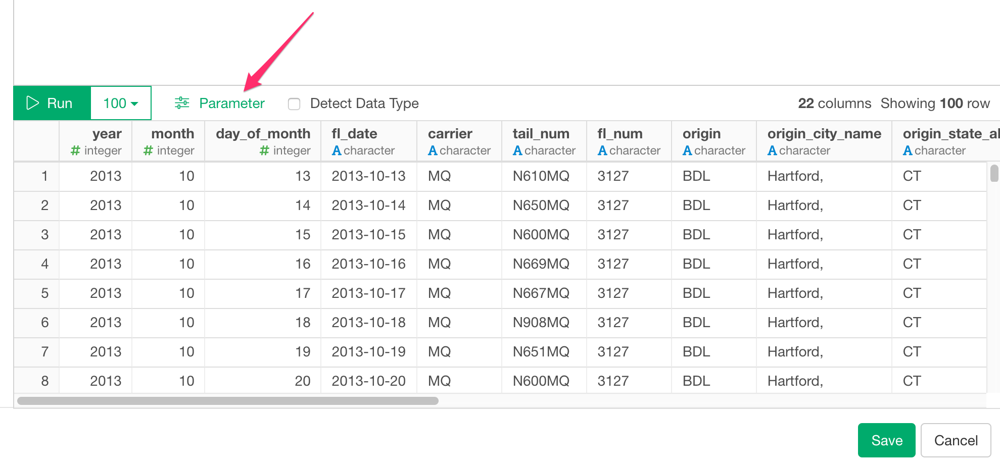

# ODBC Database Data Import

You can quickly import data from your ODBC Database Connection into Exploratory.

## 1. Install ODBC Drivers and Set Up Data Source Name (DSN)

First, install ODBC Drivers and set up Data Source Name (DSN) for the database you want to connect Exploratory to. Following are instructions to create ODBC DSN for some of the types of databases we verified that they work.

* [Snowflake](https://exploratory.io/note/2ac8ae888097/How-to-import-data-from-Snowflake-nhP3FTm5ZM) (from Exploratory for Mac/Windows)
* [Oracle](https://community.exploratory.io/t/connecting-to-oracle-database-through-odbc-from-windows-with-oracle-instance-client/499) (from Exploratory for Windows)
* [Oracle](https://community.exploratory.io/t/connecting-to-oracle-database-through-odbc-from-mac/347) (from Exploratory for Mac)
* [Microsoft SQL Server](https://community.exploratory.io/t/connecting-to-ms-sql-server-through-odbc-from-windows/341) (from Exploratory for Windows)
* [Microsoft SQL Server](https://community.exploratory.io/t/connecting-to-ms-sql-server-through-odbc-from-mac/339) (from Exploratory for Mac)

## 2. Create a Connection to use

Select the "Data Connection" menu from the menu right next to the project name.


Click the "Add" button.


Select the "ODBC" icon.


Select the DSN created at Step 1 and click the Test and make sure it works.


Click the "Add" button to save the connection.


## 3. Open ODBC Import dialog

Click '+' button next to 'Data Frames' and select 'Database Data'.


Click ODBC to select.


## 4. Preview and Import

Click Preview button to see the data from your ODBC database connection.


If it looks ok, then you can click 'Import' to import the data into Exploratory.

## 5. Using Parameters in SQL

First, click a parameter link on the SQL Data Import Dialog.



Second, define a parameter and click Save button.


Finally, you can use @{} to surround a variable name inside the query like below.

  ```
  select *
  from airline_2016_01
  where carrier = @{carrier}
  ```
  
  If you type @ then it suggests parameters like below.
  
  


Here's a [blog post](https://exploratory.io/note/kanaugust/An-Introduction-to-Parameter-in-Exploratory-WCO4Vgn7HJ) for more detail.

## 6. Number of rows

From performance point of view, we no longer show actual number of rows which can be only fetched by executing whole query again.


If you still want to show the actual number of query for your query, you can do so by setting System Configuration.


Then set "Yes" For "Show Actual Number of Rows on SQL Data Import Dialog"


This will show you Actual Number of Rows like below.


