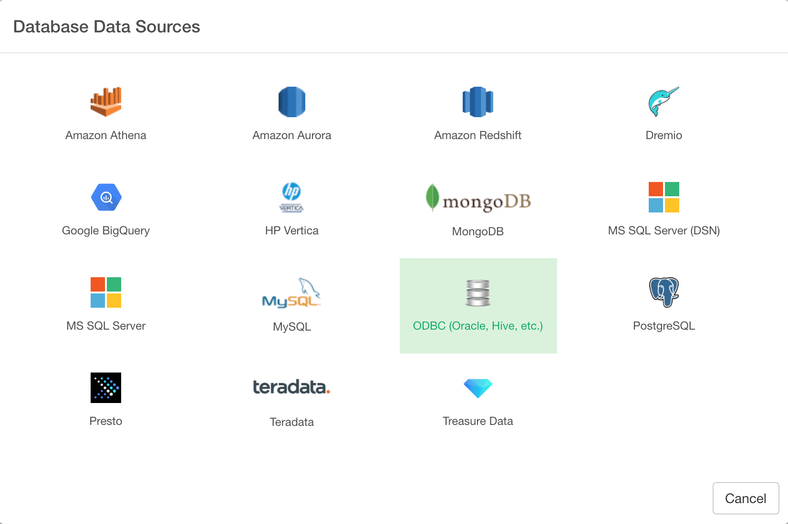

# ODBC Database Data Import

You can quickly import data from your ODBC Database Connection into Exploratory.

## 1. Set up ODBC Data Source Name (DSN)

First, set up ODBC DSN for the database you want to connect Exploratory to. Following are instructions to create ODBC DSN for some of the types of databases we virified that they work.

* [Microsoft SQL Server](https://community.exploratory.io/t/connecting-to-ms-sql-server-through-odbc-from-mac/339) (from Exploratory for Mac)
* [Microsoft SQL Server](https://community.exploratory.io/t/connecting-to-ms-sql-server-through-odbc-from-windows/341) (from Exploratory for Windows)
* [Oracle](https://community.exploratory.io/t/connecting-to-oracle-database-through-odbc-from-mac/347) (from Exploratory for Mac)
* [Oracle](https://community.exploratory.io/t/connecting-to-oracle-database-through-odbc-from-windows/348) (from Exploratory for Windows)

## 2. Register the ODBC DSN Connection to Exploratory

Create a connection for ODBC DSN.

After filling the ODBC DSN information, click ‘Test Connection’ button to make sure the information is correct, before you save it.

## 3. Open ODBC Import dialog

Select 'Import Database Data' from Add New Data Frame menu.

Click ODBC to select.

## 4. Preview and Import

Click Preview button to see the data from your ODBC database connection.

If it looks ok, then you can click 'Import' to import the data into Exploratory.
