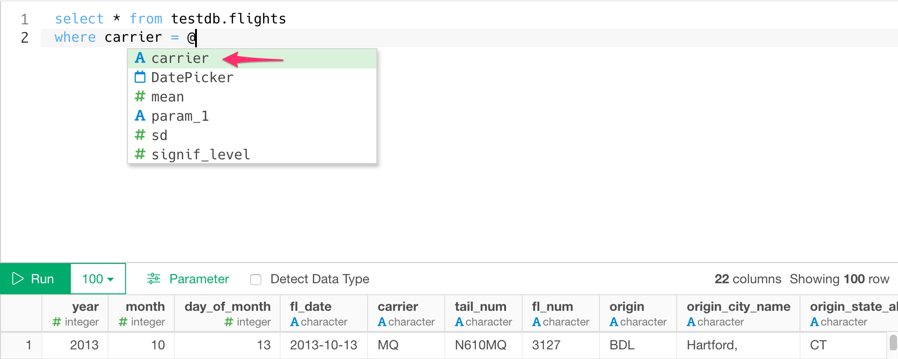

# PostgreSQL Database Data Import

You can quickly import data from your PostgreSQL Database into Exploratory.

## 1. Create a Connection to use

Create a connection following [this instruction](https://docs.exploratory.io/data_import/database-data/connection).

* Whether the connection is SSL or not is automatically detected.

## 2. Open PostgreSQL Import dialog

Click '+' button next to 'Data Frames' and select 'Database Data'.


Click PostgreSQL to select.


## 3. Preview and Import

Click Preview button to see the data back from your PostgreSQL db.


If it looks ok, then you can click 'Import' to import the data into Exploratory.


## 4. Using Parameters in SQL

First, click Parameter link on the SQL Data Import Dialog.


Second, define a parameter and click Save button.


Finally, you can use @{} to surround a variable name inside the query like below.

  ```
  select *
  from airline_2016_01
  where carrier = @{carrier}
  ```
  
  If you type @ then it suggests parameters like below.
  
  


Here's a [blog post](https://exploratory.io/note/kanaugust/An-Introduction-to-Parameter-in-Exploratory-WCO4Vgn7HJ) for more detail.

## 5. Number of rows

From performance point of view, we no longer show actual number of rows which can be only fetched by executing whole query again.


If you still want to show the actual number of query for your query, you can do so by setting System Configuration.


Then set "Yes" For "Show Actual Number of Rows on SQL Data Import Dialog"


This will show you Actual Number of Rows like below.


# 6. Known Issues for geometry column.

When you try to import data from PostgreSQL instance, you might get the below error if your SQL query contains columns whose data type is geometry which is not supported in Exploratory.

Error : No method asJSON S3 class: pq_geometry

Please refer to [this community post](https://community.exploratory.io/t/error-no-method-asjson-s3-class-pq-geometry-is-raised-when-try-to-import-data-from-postgresql/2102) for the workaround.
