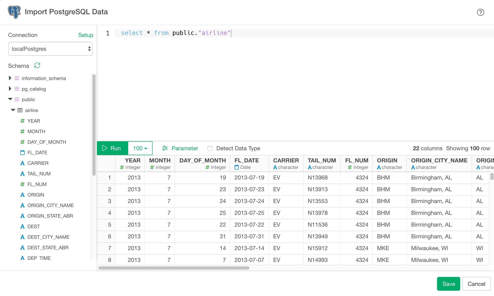

# PostgreSQL Database Data Import

You can quickly import data from your PostgreSQL Database into Exploratory.

## 1. Create a Connection to use

Create a connection following [this instruction](connection.html).

## 2. Open PostgreSQL Import dialog

Click '+' button next to 'Data Frames' and select 'Import Database Data'.


Click PostgreSQL to select.


## 3. Preview and Import

Click Preview button to see the data back from your PostgreSQL db.



If it looks ok, then you can click 'Import' to import the data into Exploratory.

## 4. Using Variables in SQL

First, create a custom R script.


Second, define a variable in the R script and save.


```
cutoff_date <- "\'2016-01-15\'"
```

Note that the ‘\’ (backslash) symbols are used to escape the single quotes, which are required to be used for characters in SQL queries.

Finally, you can use @{} to surround a variable name inside the query like below.

```
select *
from airline_2016_01
where fl_date > @{cutoff_date}
```

Here's a [blog post](https://blog.exploratory.io/using-variables-in-sql-query-2740924d9f20#.bdcn5v68x) for more detail.
