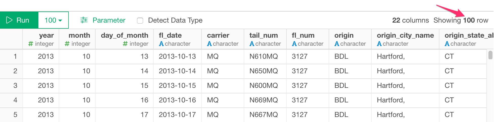

# PostgreSQLデータベースからデータをインポートする

PostgreSQLデータベースからExploratoryに素早くデータをインポートすることができます。

## 1. 使用するデータコネクションを作成する

[この手順](https://docs.exploratory.io/data_import/database-data/connection)に従って、データコネクションを作成します。

* SSL接続かどうかは自動的に判別されます。

## 2. PostgreSQLインポートダイアログを開く

データフレームの横の「＋」ボタンをクリックし、データベースデータを選択します。


PostgreSQLをクリックして選択します。


## 3. プレビューとインポート

実行ボタンをクリックすると、PostgreSQLのデータベースから取得してきたデータを見ることができます。


問題ないようであれば、「保存」ボタンをクリックしてExploratoryにデータをインポートすることができます。


## 4. SQLでパラメータを使う

まず、SQLデータインポートダイアログの「パラメーター」リンクをクリックします。

をクリックします。

次に、パラメーターを定義し、[保存]ボタンをクリックします。


最後に、クエリ内の変数名を@{}で囲むと、以下のようになります。

  ```
  select *
  from airline_2016_01
  where carrier = @{carrier}
  ```
  
  を入力すると、以下のようなパラメータが表示されます。
  
  のようになります。


詳しくはこちらの[ブログ記事](https://exploratory.io/note/kanaugust/An-Introduction-to-Parameter-in-Exploratory-WCO4Vgn7HJ)をご覧ください。

## 5. 行数

パフォーマンスの観点から、クエリ全体を再実行しないと取得できない、実際の行数を表示しないようにしました。



それでもクエリの結果の実数を表示したい場合は、システム設定により表示させることができます。


そして、"SQLデータインポートダイアログで実際の行数を表示"を「はい」に設定します。


これにより、以下のように実際の行数が表示されます。


## 6. AWSセキュリティグループの設定(Amazon RDSのみ)


MySQLのデータベースとしてAmazon RDSを使用していて、データベース接続エラーが発生した場合、AWSコンソールに移動し、MySQLデータベースインスタンスに関連付けられたDBセキュリティグループ（インバウンド）のルールにクライアントPCのIPアドレスが追加されていることを確認してください。

# 7. ジオメトリカラムの既知の問題

PostgreSQL インスタンスからデータをインポートしようとした場合、SQL クエリに Exploratory でサポートされていないデータ型が geometry のカラムが含まれていると、以下のエラーが表示されることがあります。

Error : No method asJSON S3 class: pq_geometry

回避策としては、[このコミュニティの投稿](https://community.exploratory.io/t/error-no-method-asjson-s3-class-pq-geometry-is-raised-when-try-to-import-data-from-postgresql/2102)を参照してください。
