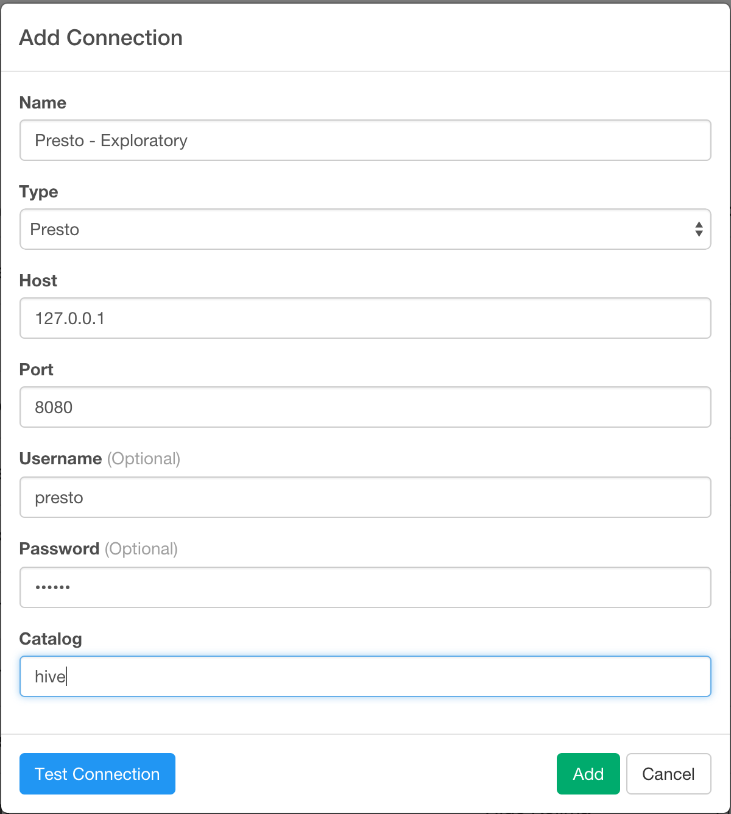
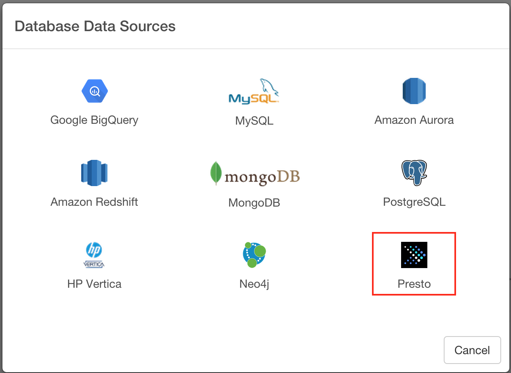
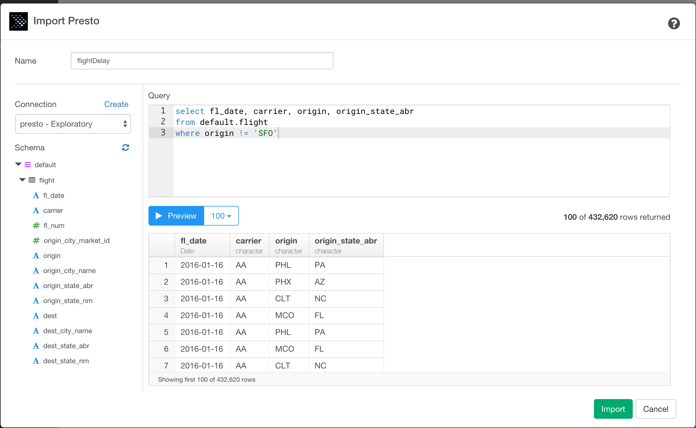

# Presto Data Import

You can quickly import data from your Presto into Exploratory.

## 1. Create a connection for Presto

First, you want to create a connection for Presto.

After filling the database information, click ‘Test Connection’ button to make sure the information is correct, before you save it.

## 2. Open Presto Import dialog

Select 'Import Database Data' from Add New Data Frame menu.

Click Presto to select.

## 3. Preview and Import

Click "Get Data" button to see the data back from your Presto.

If it looks ok, then you can click 'Import' to import the data into Exploratory.
