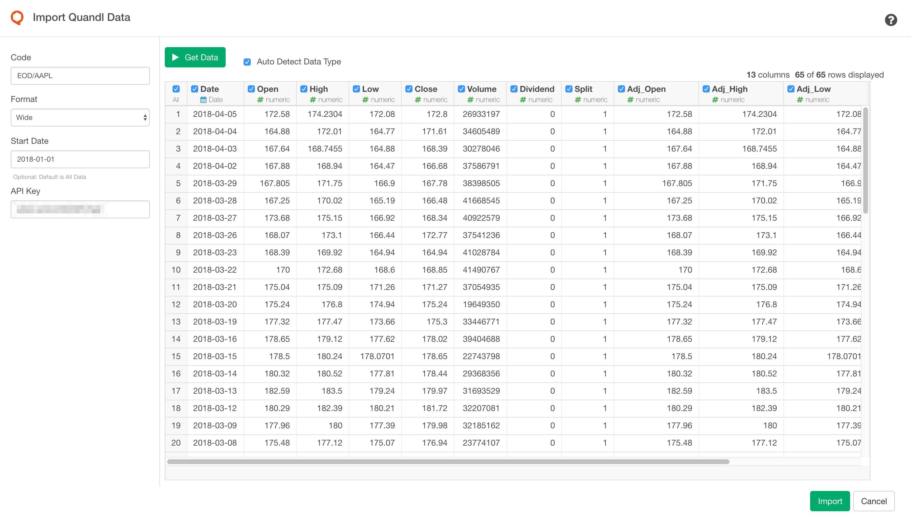
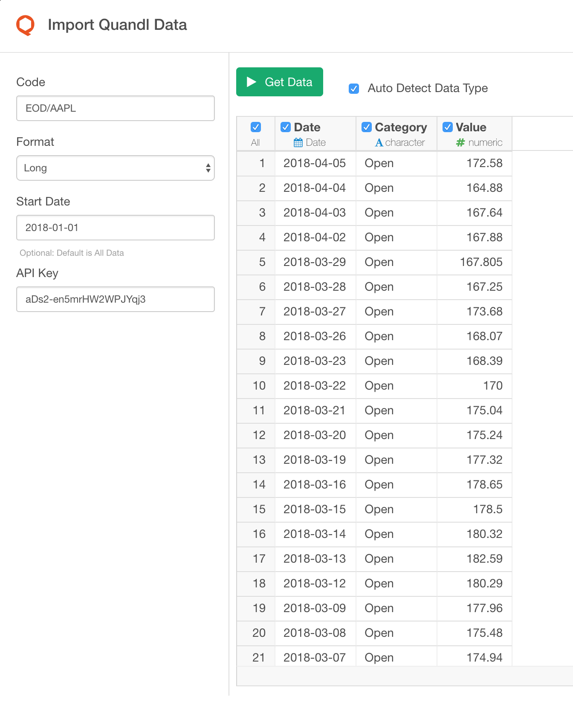
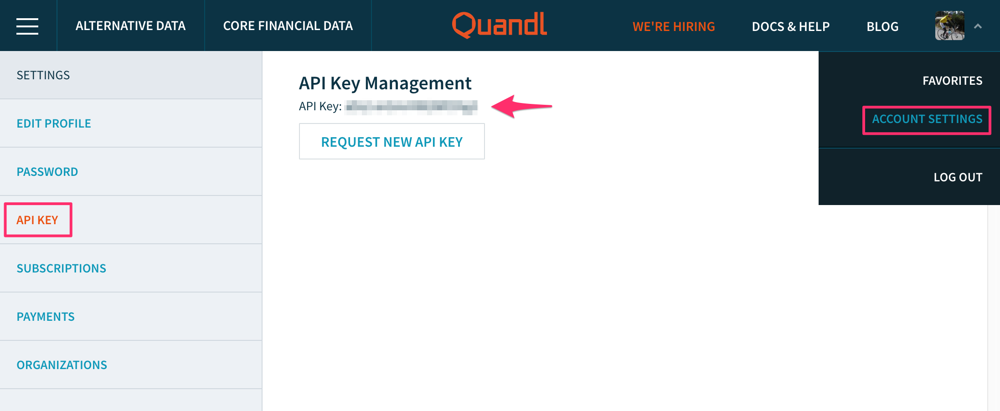

# Quandl Data Import

Allows to get data Financial Data from [Quandl](https://www.quandl.com), which delivers financial, economic and alternative data to over 250,000 people worldwide.

## 1. Parameters

### 1.1 Code

To get data from Qunadle, you need to pass Qunadl Code, which consists of Database and Ticker and looks like `{database}/{ticker}`.

For example,  if you want to get Apple's stock data you need to pass `EOD/AAPL` as Quandl Code.`EOD` is database name of `End of Day US Stock Prices` and `AAPL` is ticker for Apple,Inc.

To search available database on Quandl, you can use [Quandl Data Browser](https://www.quandl.com/search?query=) 

#### Stocks

There is a [blog post](https://blog.quandl.com/api-for-stock-data) from Quandl that explains API usage for the Stock Data.

For example, if you want to get `End of Day US Stock Prices` is EOD.

#### Commodity

There is a [blog post](https://blog.quandl.com/api-for-commodity-data) from Quandl that explains API usage for the Commodity Data.

For example, if you wanto to get a Gold data from London A.M Fixing, you can use `LBMA/GOLD` as Quandl Code. 

#### Economic Data

There is a [blog post](https://blog.quandl.com/api-for-economic-data)

For Economic Data, Qunadl Code consists of `{PUBLISHER}/{COUNTRY}_{INDICATOR}` fashion. 

So if you want to get the Population of China as published by the World Bank, you need to use `WORLDBANK/CHN_SP_POP_TOTL` as a Quandl Code.

### 1.2 Format

#### Wide

If you select `Wide` format, you will get columns for each metric. For example, for Stock price data, you'll get:

- Date
- Open
- High
- Low
- Close
- Volume
- Dividend 
- Split
- Adj_Open
- Adj_High
- Adj_Low
- Adj_Close
- Adj_Volume

#### Long

If you select `Long` format, you will get date and category(key)/value columns like below (for Stock Price case)
Category holds value type like Open, High, Low, Close etc.

- Date
- Category
- Value

### 1.3 API Key

To use Quandl API, you need to sign up (it's free) to [Quandl](https://www.quandl.com/)

Then after you get your API key, please set the API Key to the new Input Field on the Import Dialog

If the API key is not provided, the default API key is used, however, this has a limitation that authenticated users have a limit of 300 calls per 10 seconds, 2,000 calls per 10 minutes and a limit of 50,000 calls per day. (ref: https://help.quandl.com/article/356-i-keep-getting-a-download-failed-limit-exceeded-error-message-what-should-i-do)

## 2. Import

Once you confirmed the query result, click `Import` button to import the data as a data frame in Exploratory.

## 3. Reference

See [Getting Bitcoin Data and Visualizing in 3 Steps](https://blog.exploratory.io/getting-bitcoin-data-and-visualizing-in-3-steps-fd2bba78084f) for Bitcoin Data.
