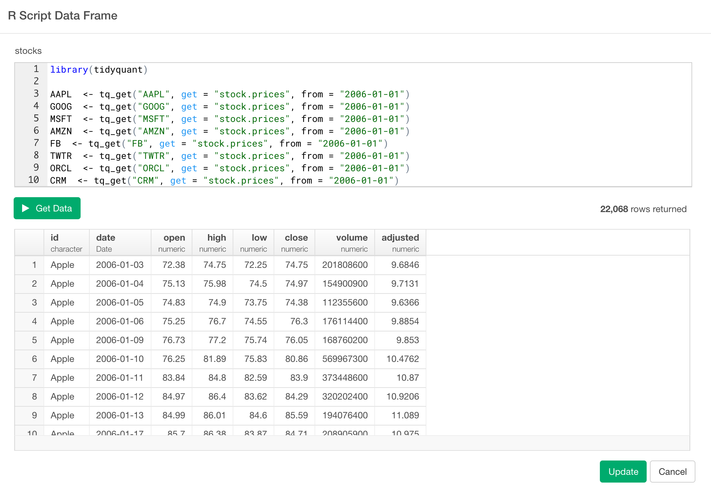

# R スクリプトを書いてデータを取得する

Exploratoryの中で、R スクリプトを書いてデータを取得できます。例えば"Google Trend"のようなR パッケージを使って検索用語のトレンディングデータを取得したり、"Quantmod"パッケージを使って株価、為替レートのような金融データを取得したり、または複数のファイルからデータを抽出して一つのデータフレームにするプログラムを書くこともできます。Rスクリプトを使うと、様々なデータを色々な方法で取得できるようになり、とても強力な機能です。

Rスクリプトを使ってデータを取得する、簡単に試せる例をいくつか以下に紹介しておきます。

* [Introduction to tidyquant - Stock Market Data Analysis(英語)](https://blog.exploratory.io/introduction-to-tidyquant-quantitative-financial-analysis-for-tidyverse-habitats-e5f72a023ce2)

* [SQLがややこしいのでdplyrでクエリーを書いて直接データベースからデータを取ってくる](https://exploratory.io/note/2ac8ae888097/7616236230994462?cb=1506281367163)

* [SparklyrでExploratoryからSparkに接続してみる (SQL編)](https://exploratory.io/note/2ac8ae888097/2569131745987096?cb=1506281323040)

* [SparklyrでExploratoryからSparkに接続してみる (dplyr編)](https://exploratory.io/note/2ac8ae888097/0305916276166750?cb=1506281306518)

* [Accessing SQLite with RSQLite and Querying with dplyr in R Script(英語)](https://exploratory.io/note/2ac8ae888097/6847080671738131)
