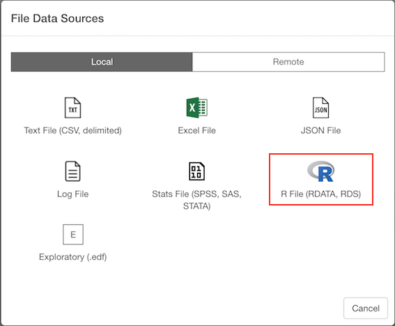
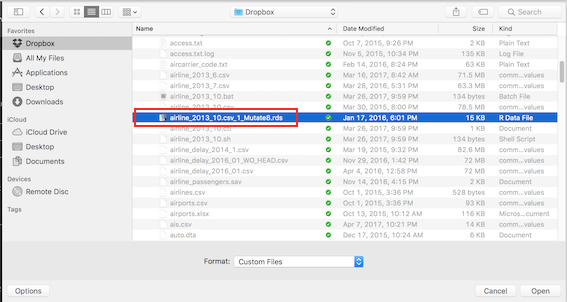
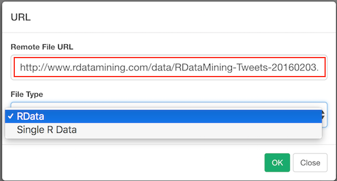
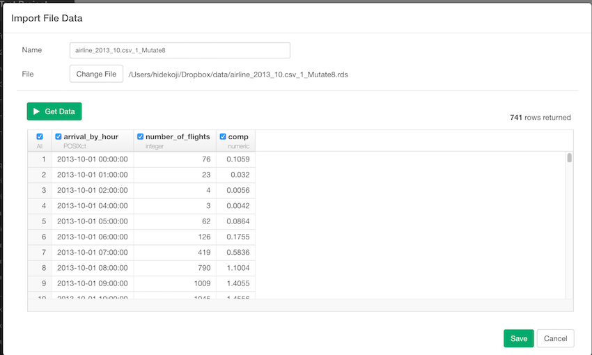
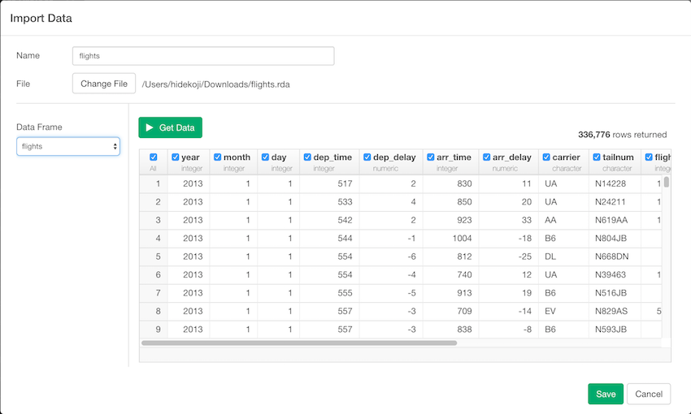

# Import R File (RDATA, RDS) File Data

You can import both local and remote R File (RDATA, RDS) File Data quickly.

## 1. Select R File (RDATA, RDS) File Data Menu

Click '+' button next to 'Data Frames' and select 'Import File Data'.

If you import R File (RDATA, RDS) File on your desktop or laptop, make sure Local tab is selected. If you import a file from remote server like Amazon S3, Dropbox, etc make sure Remote tab is selected. Click 'R File (RDATA, RDS)'

## 2. Select File.
If you select local, file picker shows up so select a file to import.
### 2.1 Local File

### 2.2 Remote File
if you select remote, small dialog shows up so enter a URL for the file. And select File Type, either RData for Single R Data(RDS), from pulldown list. 

## 3. Input parameters

### 3.1 RDS File

No Input Parameters for RDS

### 3.2 RDA File

Set these parameters.

* Data Frame - Since RDA file can have multiple data frames in it, please select a Data Frame that you want to import 

## 4. Column Selection

On top of input parameters, you can also use checkboxes on the preview table to include/exclude columns. if you uncheck the checkboxes on the columns, these columns are excluded when you save the data. 

## 5. Preview and Import

Click Preview button to see the data in R File (RDATA, RDS) File. If it looks ok, then you can click 'Import' to import the whole R File (RDATA, RDS) data into Exploratory.
