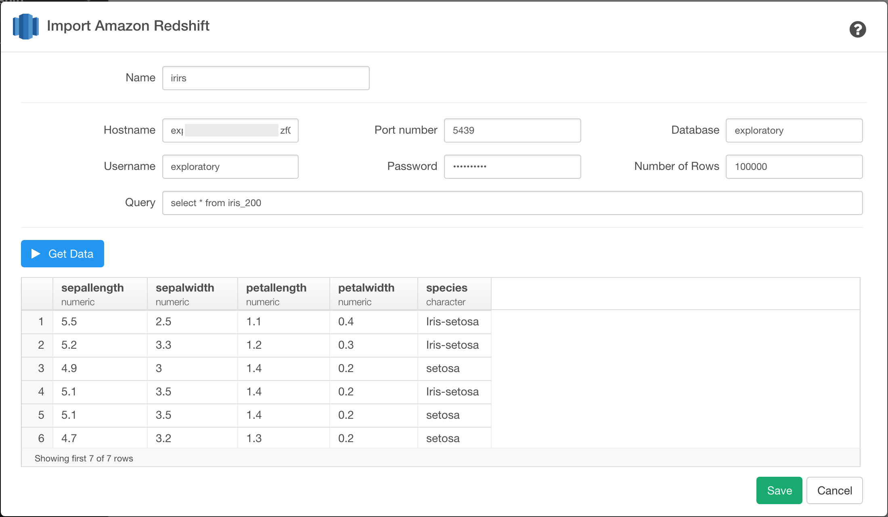

# Amazon Redshift Database Data Import

You can quickly import data from your Amazon Redshift Database into Exploratory.

## 1. Open Redshift Import dialog

Select 'Import Remote Data' from Add New Data Frame menu.

Click Redshift to select.

## 2. Set Parameters

Type your new data frame name

Type the following your Redshift DB connection related parameter values.

- Host name
- Port number
- Database name
- Username
- Password
- Number of Rows
- Query

## 3. Preview and Import

Click Preview button to see the data back from your Redshift db.

If it looks ok, then you can click 'Import' to import the data into Exploratory.
