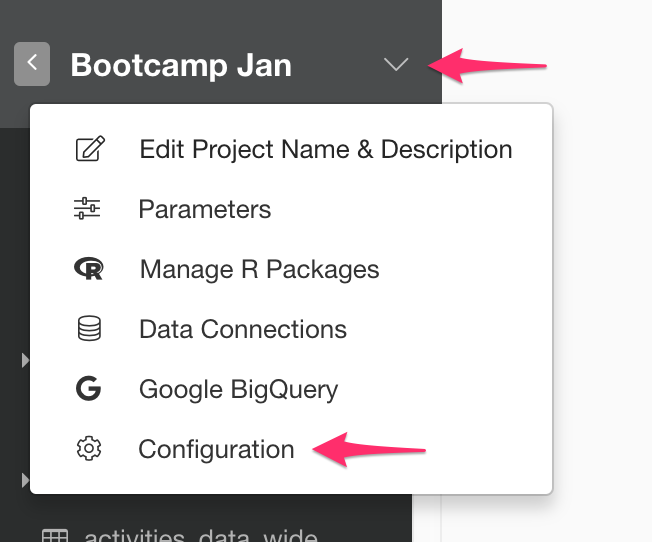

# Amazon Redshift Database Data Import

You can quickly import data from your Amazon Redshift Database into Exploratory.

Here is a [blog post](https://blog.exploratory.io/exploratory-data-analysis-for-amazon-redshift-with-r-dplyr-9a14441020eb#.aqcbfa6h8) introducing this support in detail.

## 1. Create a Connection to use

Create a connection following [this instruction](https://docs.exploratory.io/data_import/database-data/connection).


## 2. Open Redshift Import dialog

Click '+' button next to 'Data Frames' and select 'Database Data'.


Click Amazon Redshift to select.


## 3. Preview and Import

Click Preview button to see the data back from your Redshift db.


If it looks ok, then you can click 'Import' to import the data into Exploratory.

## 4. Querying Random Sample Data

You might want to take a random sample of the data that would be reasonable size for your analysis.

You can use [md5](http://docs.aws.amazon.com/redshift/latest/dg/r_MD5.html) function to get random number generated and use it like below to get the random sample of the data.

```
SELECT *
   FROM airline_2016_01
   ORDER BY md5('randomSeed' || flight_num)
   LIMIT 100000
```

## 5. Using Parameters in SQL

First, click a parameter link on the SQL Data Import Dialog.


Second, define a parameter and click Save button.


Finally, you can use @{} to surround a variable name inside the query like below.

  ```
  select *
  from airline_2016_01
  where carrier = @{carrier}
  ```
  
  If you type @ then it suggests parameters like below.
  
  


Here's a [blog post](https://exploratory.io/note/kanaugust/An-Introduction-to-Parameter-in-Exploratory-WCO4Vgn7HJ) for more detail.


## 6. AWS Security Group Setup


If you encounter a database connection error, please go to AWS console and make sure you added your client PC's IP address to your Security Group (Inbound) associated with the Redshift cluster.

## 7. Number of rows

From performance point of view, we no longer show actual number of rows which can be only fetched by executing whole query again.


If you still want to show the actual number of query for your query, you can do so by setting System Configuration.



Then set "Yes" For "Show Actual Number of Rows on SQL Data Import Dialog"


This will show you Actual Number of Rows like below.


## 8. Exploratory Data Analysis for Amazon Redshift with R & dplyr

Here is the link to the blog post [Exploratory Data Analysis for Amazon Redshift with R & dplyr](https://blog.exploratory.io/exploratory-data-analysis-for-amazon-redshift-with-r-dplyr-9a14441020eb)
