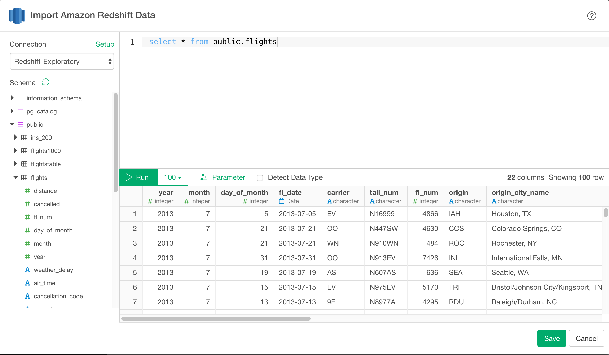
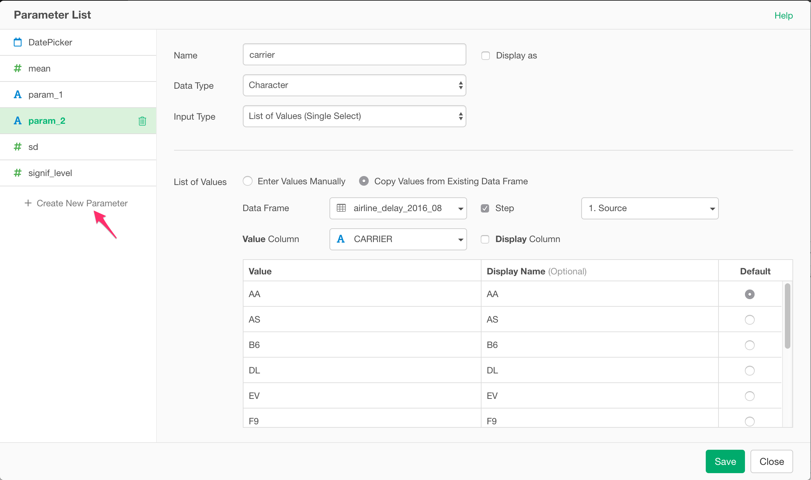

# Amazon Redshift データベースからデータをインポートする

Amazon Redshift DatabaseからExploratoryに素早くデータをインポートすることができます。

Redshiftについて詳しく紹介した[ブログ記事](https://blog.exploratory.io/exploratory-data-analysis-for-amazon-redshift-with-r-dplyr-9a14441020eb#.aqcbfa6h8)はこちらです。

## 1. 使用するデータコネクションを作成する

[この手順](https://docs.exploratory.io/data_import/database-data/connection)に従って、接続を作成します。


## 2. Redshift インポートダイアログを開く

データフレームの横にある「＋」ボタンをクリックし、「Database Data」を選択します。

をクリックします。

Amazon Redshiftをクリックして選択します。


## 3. プレビューとインポート

実行ボタンをクリックすると、Redshift データベースから取得してきたデータを確認することができます。



問題ないようであれば、「インポート」をクリックしてExploratoryにデータをインポートします。

## 4. ランダムサンプルデータのクエリ

分析に適したサイズのデータからランダムにサンプルを取りたい場合があります。

[md5](http://docs.aws.amazon.com/redshift/latest/dg/r_MD5.html)関数を使って乱数を生成し、以下のように使用することでデータのランダムサンプルを得ることができます。

```
SELECT *
   FROM airline_2016_01
   ORDER BY md5('randomSeed' || flight_num)
   LIMIT 100000
```

## 5. SQLでパラメータを使用する

まず、SQL データインポートダイアログのパラメータリンクをクリックします。

をクリックします。

次に、パラメータを定義し、[保存]ボタンをクリックします。



最後に、クエリ内の変数名を@{}で囲むと、以下のようになります。

  ```
  select *
  from airline_2016_01
  where carrier = @{carrier}
  ```
  
  を入力すると、以下のようなパラメータが表示されます。
  
  のようになります。


詳しくはこちらの[ブログ記事](https://exploratory.io/note/kanaugust/An-Introduction-to-Parameter-in-Exploratory-WCO4Vgn7HJ)をご覧ください。


## 6. AWSセキュリティグループの設定


データベース接続エラーが発生した場合は、AWSコンソールにアクセスし、Redshiftクラスタに関連付けられたセキュリティグループ（Inbound側に）にクライアントPCのIPアドレスが追加されていることを確認してください。

## 7. 実際の行数

パフォーマンスの観点から、クエリ全体を再実行しないと取得できない、実際の行数を表示しないようにしました。


それでもクエリの結果の実数を表示したい場合は、システム設定により表示させることができます。


そして、"SQLデータインポートダイアログで実際の行数を表示"を「はい」に設定します。


これにより、以下のように実際の行数が表示されます。


## 8. Rとdplyrを使ったAmazon Redshiftの探索的データ分析

ブログ記事R & dplyrによるAmazon Redshiftの探索的データ分析への[リンクはこちらです](https://blog.exploratory.io/exploratory-data-analysis-for-amazon-redshift-with-r-dplyr-9a14441020eb)。