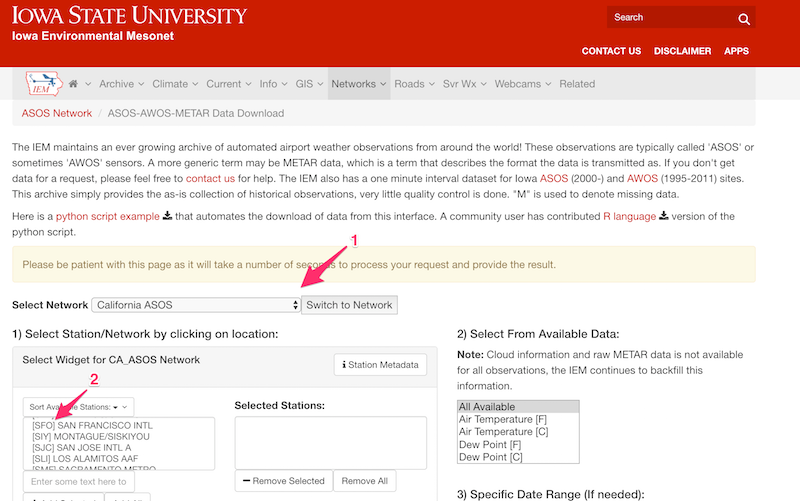
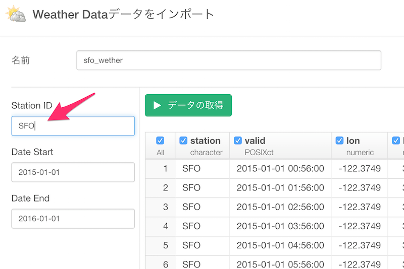

# Whether Data Import

Allows to get weather data from Automated Surface Observing System (ASOS) stations (airports) in the whole world thanks to the Iowa Environment Mesonet website.

## Parameters

### Station ID

You can find Station ID from [this site](https://mesonet.agron.iastate.edu/request/download.phtml?network=CA_ASOS).

1. Choose a network of the area where you want to get data and click "Switch to Network".
2. Choose the characters of the station like "SFO" from the list.

Then type it to Station ID.

### Date Start / Date End

You can limit the range of time with explicit dates like '2015-11-03' with these parameters.

## Output

* station - three or four character site identifier
* valid - timestamp of the observation (UTC)
* tmpf - Air Temperature in Fahrenheit, typically @ 2 meters
* dwpf - Dew Point Temperature in Fahrenheit, typically @ 2 meters
* relh - Relative Humidity in
* drct - Wind Direction in degrees from north
* sknt - Wind Speed in knots
* p01i - One hour precipitation for the period from the observation time to the time of the previous
hourly precipitation reset. This varies slightly by site. Values are in inches. This value
may or may not contain frozen precipitation melted by some device on the sensor or estimated
by some other means. Unfortunately, we do not know of an authoritative database denoting
which station has which sensor.
* alti - Pressure altimeter in inches
* mslp - Sea Level Pressure in millibar
* vsby - Visibility in miles
* gust - Wind Gust in knots
riem_networks 3
* skyc1 - Sky Level 1 Coverage
* skyc2 - Sky Level 2 Coverage
* skyc3 - Sky Level 3 Coverage
* skyc4 - Sky Level 4 Coverage
* skyl1 - Sky Level 1 Altitude in feet
* skyl2 - Sky Level 2 Altitude in feet
* skyl3 - Sky Level 3 Altitude in feet
* skyl4 - Sky Level 4 Altitude in feet
* presentwx: Present Weather Codes (space seperated), see e.g. [this manual](http://www.ofcm.gov/fmh-
1/pdf/H-CH8.pdf) for further explanations.
* metar - unprocessed reported observation in METAR format
