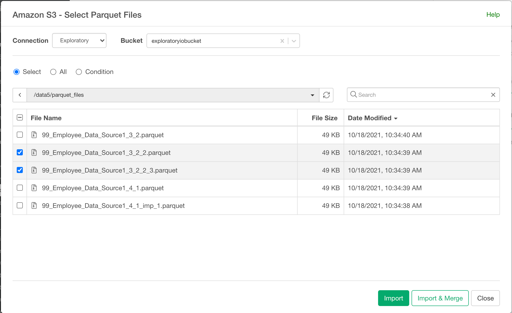

# Import CSV / Delimited File or Excel File or Parquet File Data from Amazon S3

You can import CSV / Delimited File or Excel File or Parquet File from Amazon S3.

# 1. Create Amazon S3 connection

When you try to import data from Amazon S3 for the first time, it shows you below Create Connection Dialog forAmazon S3.

Type in AWS Region, Access Key ID, and Access Key Secret.

# 2. Select Amazon S3 from File Data

## 2.1 Select files to import

## 3. Input Parameters

Input parameters are same Text File (CSV, delimited) import, Excel File import, and Parquet File Import.

## 4. Preview and import

Click the Preview button to see the data in CSV / Delimited or Excel File or Parquet File. You can limit number of rows for the preview by selecting number from pulldown list on the preview table. If it looks ok, then you can click 'Import' to import the whole CSV / Delimited or Excel or Parquet data into Exploratory.
