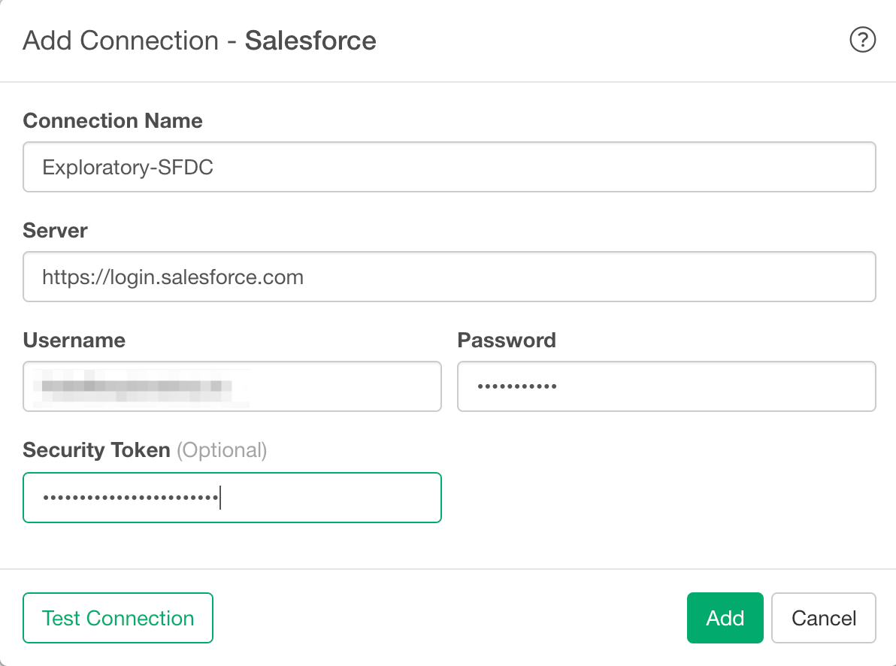

# Salesforce Data Import

You can quickly import data from your Salesforce into Exploratory.

## 1. Create a connection for Salesforce 

First, you want to create a connection for Salesforce.

After filling the below database information:

- Server - Salesforce login server
- Username - Username of the Salesforce
- Password - Password of the Salesforce
- Security Token - (Optional) Security token of the Salesforce

Click ‘Test Connection’ button to make sure the information is correct, before you save it.

## 2. Open Salesforce Import dialog

Select 'Cloud Apps Data' from Add New Data Frame menu.

Click Snowflake to select.

## 3. Preview and Import

Click "Run" button to see the data back from Salesforce.

If it looks ok, then you can click 'Import' to import the data into Exploratory.
