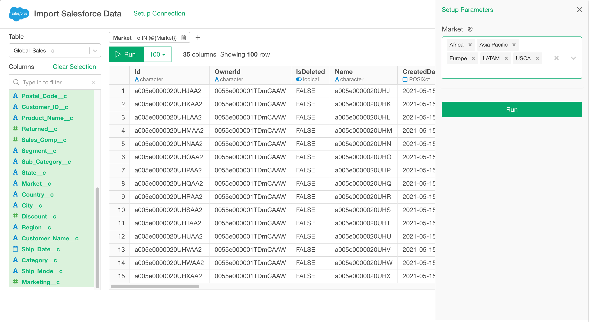
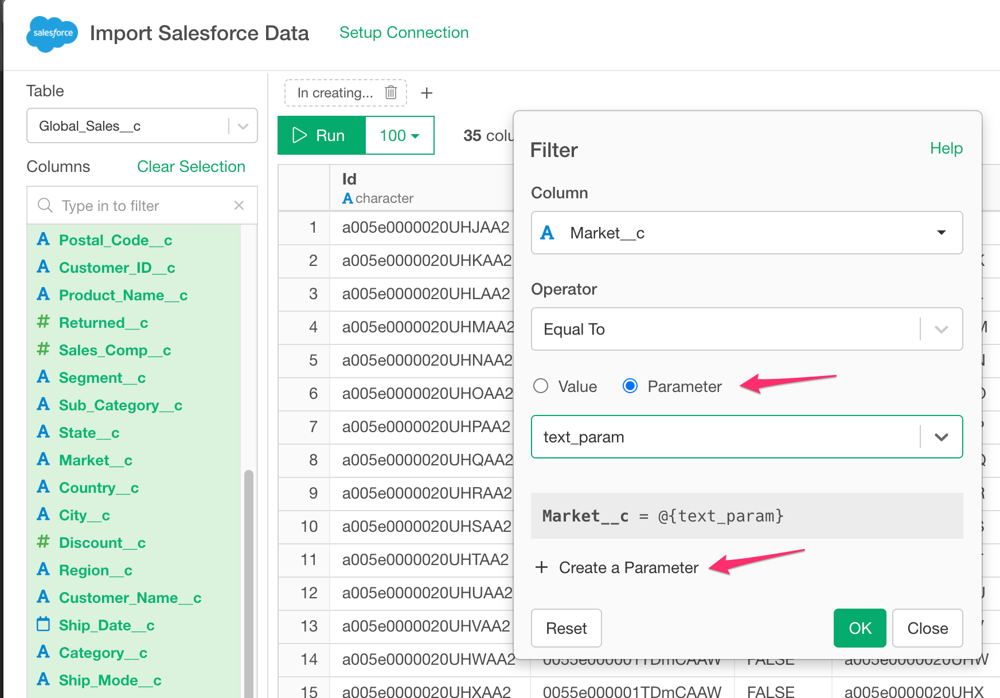

# Salesforce Data Import

You can quickly import data from your Salesforce into Exploratory.

## 1. Create a connection for Salesforce 

First, you want to create a connection for Salesforce.

After filling the below database information:

- Server - Salesforce login server
- Username - Username of the Salesforce
- Password - Password of the Salesforce
- Security Token - (Optional) Security token of the Salesforce

Click ‘Test Connection’ button to make sure the information is correct, before you save it.

## 2. Open Salesforce Import dialog

Select 'Cloud Apps Data' from Add New Data Frame menu.

Click Snowflake to select.

## 3. Preview and Import

Click "Run" button to see the data back from Salesforce. You can add filters to limit your query results.

## 4. Using Parameters inside Filters.

First, click the Add Filter Button.

Click the Create Parameter button.

Then define a parameter and click Save button.

Finally, you can select the parameter for the filter like below.

Click the Parameter link to open the parameter pane.

Select the parameter value and click the Run button, then you can previewed the data filtered by the parameter.

If it looks ok, then you can click 'Save' to import the data into Exploratory.

## 4. Known Restrictions

If the selected columns don't have any values, they are not included in the result.
