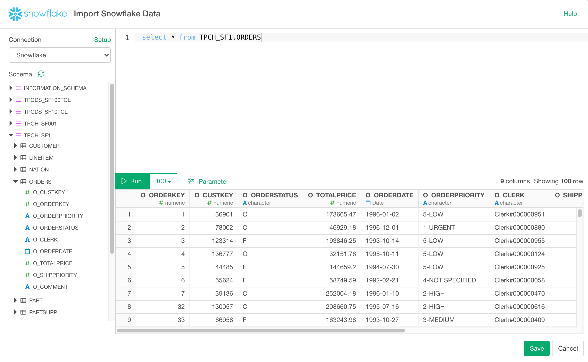

# Snowflake Data Import

You can quickly import data from your Snowflake into Exploratory.


## Prerequisite: ODBC Drivers

To use the Snowflake Data Source, you need to install ODBC driver.

### Install ODBC Driver for Windows

To Install ODBC Driver for Snowflake for Windows, please follow the [instruction](https://docs.snowflake.com/en/user-guide/odbc-windows.html) 

### Install ODBC Driver for Mac

First, you need to install homebrew to manage your packages and you have the necessary admin rights on your machine.

Homebrew installation: [link](http://brew.sh/)

1. Install unixodbc
Install with your shell/terminal:

```sh
brew install unixodbc
```

Then follow the [instruction](https://docs.snowflake.com/en/user-guide/odbc-mac.html) to install Mac ODBC Driver. Once installed, now you need to register the ODBC driver.

Since now you installed the unixODBC, you can use `odbcinst` command from Terminal. And if you try `odbcinst -j`, you can know the location of driver registration file (odbcinst.ini) like below.

```sh
➜  ~ odbcinst -j
unixODBC 2.3.9
DRIVERS............: /usr/local/etc/odbcinst.ini
SYSTEM DATA SOURCES: /usr/local/etc/odbc.ini
FILE DATA SOURCES..: /usr/local/etc/ODBCDataSources
USER DATA SOURCES..: /Users/exploratory/.odbc.ini
SQLULEN Size.......: 8
SQLLEN Size........: 8
SQLSETPOSIROW Size.: 8
```

So add the below to the odbcinst.ini file

```sh
[SnowflakeDSIIDriver]
APILevel=1
ConnectFunctions=YYY
Description=Snowflake DSII
Driver=/opt/snowflake/snowflakeodbc/lib/universal/libSnowflake.dylib
DriverODBCVer=03.52
SQLLevel=1
```

## 1. Create a connection for Snowflake 

First, you want to create a connection for Snowflake.


After filling the below database information:

- Host - Snowflake server
- Warehouse - Warehouse Name
- Database - Database Name
- ODBC Driver Name for Snowflake - It shows list of installed drivers. Regardless of the driver selected here, when you publish a Data source that uses the connection, "/usr/lib64/snowflake/odbc/lib/libSnowflake.so" is used for Scheduling. (Both exploratory.io and Collaboration Server have /usr/lib64/snowflake/odbc/lib/libSnowflake.so)
- Username - Username of the Snowflake
- Password - Password of the Snowflake


Click ‘Test Connection’ button to make sure the information is correct, before you save it.


## 2. Open Snowflake Import dialog

Select 'Import Database Data' from Add New Data Frame menu.


Click Snowflake to select.


## 3. Preview and Import

Click "Run" button to see the data back from Snowflake.




If it looks ok, then you can click 'Import' to import the data into Exploratory.
