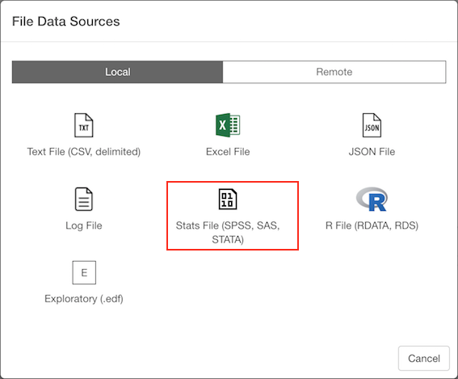
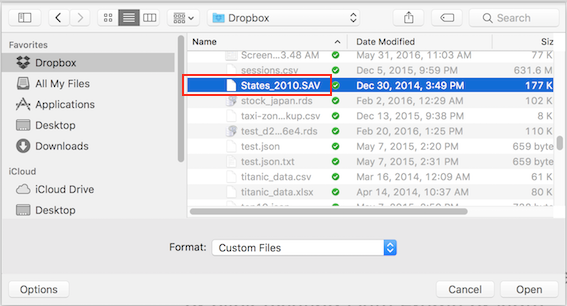
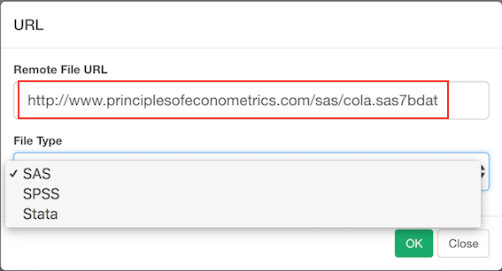
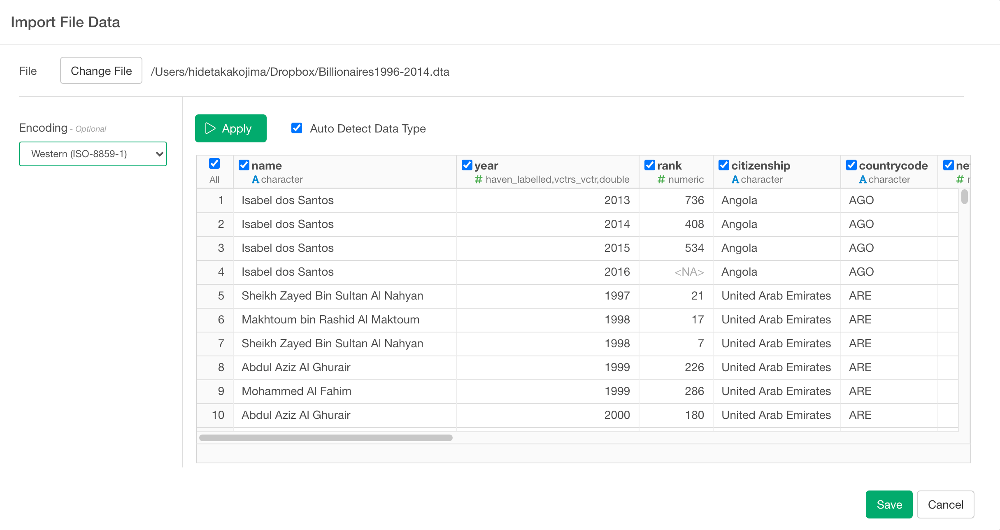

# Import Stats (SAS / SPSS / STAT) File Data

You can import both local and remote Stats (SAS / SPSS / STAT) File Data quickly.

## 1. Select Stats (SAS / SPSS / STAT) File Data Menu

Click '+' button next to 'Data Frames' and select 'Import File Data'.

If you import Stats (SAS / SPSS / STAT) File on your desktop or laptop, make sure Local tab is selected. If you import a file from remote server like Amazon S3, Dropbox, etc make sure Remote tab is selected. Click 'Stats File (SPSS, SAS, STATA)'

## 2. Select File.
If you select local, file picker shows up so select a file to import.
### 2.1 Local File

### 2.2 Remote File
if you select remote, small dialog shows up so enter a URL for the file. And select File Type from Pulldown list.

## 3. Input parameters

- Encoding (Optional) : The character encoding used for the data file.

## 4. Column Selection

On top of input parameters, you can also use checkboxes on the preview table to include/exclude columns. if you uncheck the checkboxes on the columns, these columns are excluded when you save the data. 

## 5. Preview and Import

Click Preview button to see the data in Stats (SAS / SPSS / STAT) File. If it looks ok, then you can click 'Import' to import the whole Stats (SAS / SPSS / STAT) data into Exploratory.
