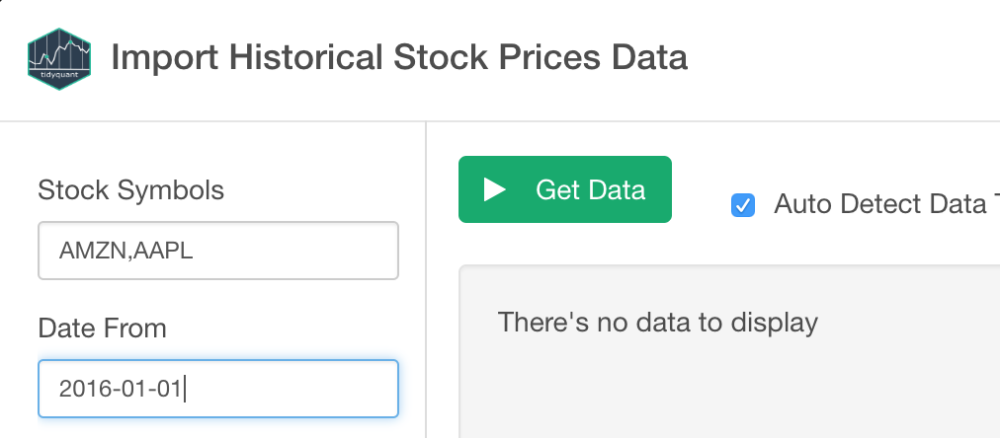

# Historical Stock Price Data Import

Allows to get historical stock prices.

## 1. Parameters

### 1.1 Stock Symbols

To get historical stock prices, you need to pass Stock Symbols. You can pass multiple Stock Symbols by separating them with comma(,).
For example, to get Amazon and Apple's Historical Price Data, you can pass "AMZN, APPL" like below.

### 1.2 Date From

The Start Date of the period that you want to get Historical Stock Price Data.

### 1.3 Date To

The End Date of the period that you want to get Historical Stock Price Date. If not provided, today's date is used as a default value.

## 2. Import

Once you confirmed the query result, click `Import` button to import the data as a data frame in Exploratory.

## 3. Output

* symbol - Stock Symbol.
* date - Date for the Stock Price.
* open - Open Price of the Stock for the date.
* high - Highest Price of the Stock for the date.
* low - Lowest Price of the Stock for the date.
* close - Close Price of the Stock for the date.
* volume - Number of shares or contracts traded for the date.
* adjusted - Adjusted Closing Price of the Stock for the date.

## 4. Reference

[Quantitative Financial Analysis For Beginners with Exploratory.io and tidyquant](https://blog.exploratory.io/quantitative-financial-analysis-for-beginners-with-exploratory-io-and-tidyquant-808fe2793c2e)

[Introduction to tidyquant — quantitative financial analysis for tidyverse habitats](https://blog.exploratory.io/introduction-to-tidyquant-quantitative-financial-analysis-for-tidyverse-habitats-e5f72a023ce2)