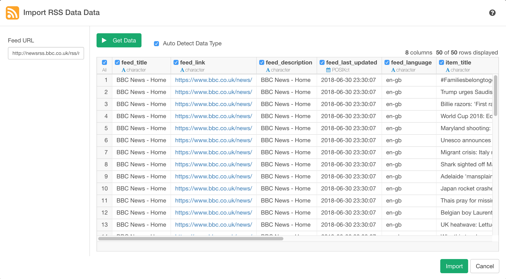

# RSS Data Import

Allows to get data from RSS feeds.

## 1. Parameters

### 1.1 Feed URL

To get data from [RSS](https://en.wikipedia.org/wiki/RSS) Feed, you need to pass Feed URL (e.g http://newsrss.bbc.co.uk/rss/newsonline_world_edition/front_page/rss.xml).

## 2. Import

Once you confirmed the query result, click `Import` button to import the data as a data frame in Exploratory.

## 3. Output

* feed_title - Title of the Feed.
* feed_link - URL of the Feed Link.
* feed_description - Description of the Feed.
* feed_last_updated - Last Updated Date of the Feed.
* feed_language - Language used for the Feed. (eg. en-gb)
* item_title - Title of the Feed Item.
* item_date_published - Date on which the Item was published.
* item_link - URL of the Feed Item.

