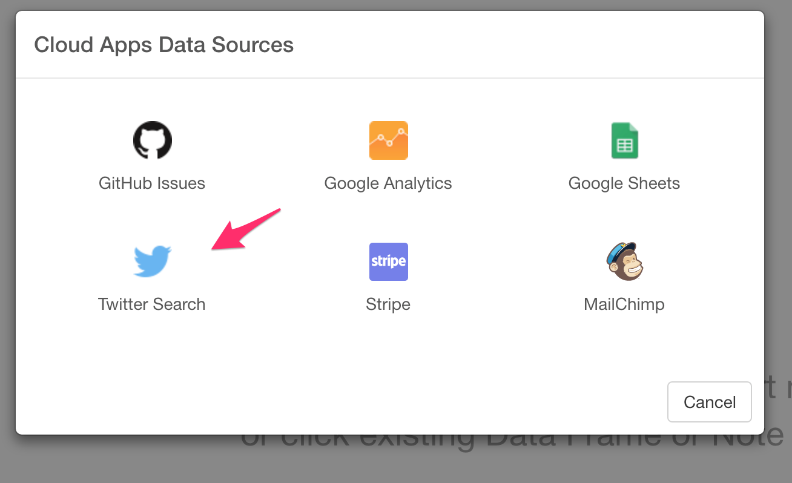

# Import Twitter Search API data

You can query and extract Twitter's tweet data.

* [Quick Video: How to Query and Extract Twitter Data](https://exploratory.io/tutorial#querying-extracting-twitter-data)

Note that due to the Twitter Search API’s restriction, the data is supposed to be only for the last 7 days, though it usually returns 6 to 9 days of the data in most cases.

Number of tweets returned will often be less than what was specified by the user. This can happen because (a) the search query did not return many results (the search pool is already thinned out from the population of tweets to begin with), (b) because user hitting rate limit for a given token, or (c) of recent activity (either more tweets, which affect pagination in returned results or deletion of tweets).

## 1. Select Twitter Search Data Menu

Click '+' button next to 'Data Frames' and select 'Import Cloud Apps Data'.

Click 'Twitter Search'

## 2. OAuth Setting

Create a connection following [this instruction](oauth-connection.html).

## 3. Input parameters

* Max # of tweets - Set max number of the tweets to return.
* Language - Set a language code if you want to limit the tweets to certain languages. The code is [ISO 639-1 alpha-2](https://en.wikipedia.org/wiki/ISO_639-1).
* Last N Days - Set number of the past days for the search data.
* Search Text - Type text to search.

Here's a list of the examples of how you can query tweets.

| Operator	 | Finds Tweets... |
| ---------- |:----------------|
| watching now |	containing both “watching” and “now”. This is the default operator.|
| “happy hour” |	containing the exact phrase “happy hour”. |
| love OR hate |	containing either “love” or “hate” (or both). |
| beer -root |	containing “beer” but not “root”. |
| #haiku |	containing the hashtag “haiku”. |
| from:interior |	sent from Twitter account “interior”. |
| list:NASA/astronauts-in-space-now	 |sent from a Twitter account in the NASA list astronauts-in-space-now |
| to:NASA |	a Tweet authored in reply to Twitter account “NASA”. |
| @NASA	 |mentioning Twitter account “NASA”. |
| politics filter:safe |	containing “politics” with Tweets marked as potentially sensitive removed. |
| puppy filter:media |	containing “puppy” and an image or video. |
| puppy -filter:retweets |	containing “puppy”, filtering out retweets |
| puppy filter:native_video |	containing “puppy” and an uploaded video, Amplify video, Periscope, or Vine. |
| puppy filter:periscope |	containing “puppy” and a Periscope video URL. |
| puppy filter:vine |	containing “puppy” and a Vine. |
| puppy filter:images |	containing “puppy” and links identified as photos, including third parties such as Instagram. |
| puppy filter:twimg |	containing “puppy” and a pic.twitter.com link representing one or more photos. |
| hilarious filter:links |	containing “hilarious” and linking to URL. |
| puppy url:amazon	 |containing “puppy” and a URL with the word “amazon” anywhere within it. |
| superhero since:2015-12-21 |	containing “superhero” and sent since date “2015-12-21” (year-month-day). |
| puppy until:2015-12-21 |	containing “puppy” and sent before the date “2015-12-21”. |
| movie -scary :) |	containing “movie”, but not “scary”, and with a positive attitude. |
| flight :( |	containing “flight” and with a negative attitude. |
| traffic ?	 | containing “traffic” and asking a question.|

For more details, please visit [Twitter's Tweets Search page](https://developer.twitter.com/en/docs/tweets/search/guides/standard-operators).

## 4. Preview and Import

Click Preview button to see the data back from Twitter. If it looks ok, then you can click 'Import' to import the data into Exploratory.
