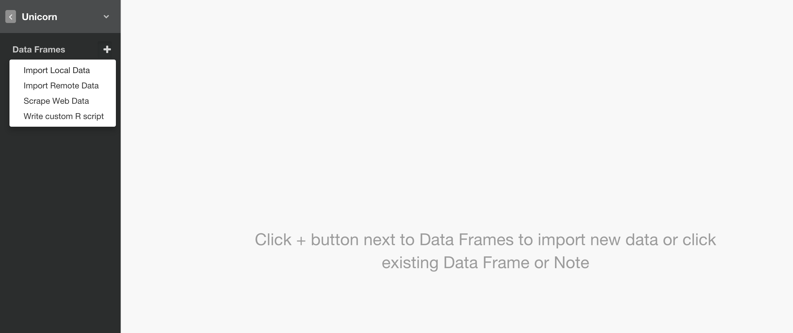
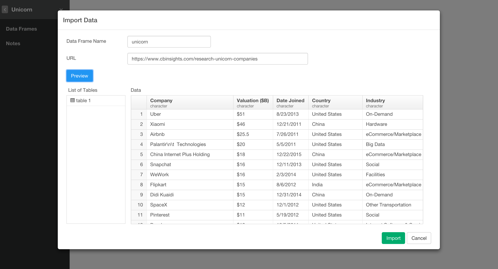
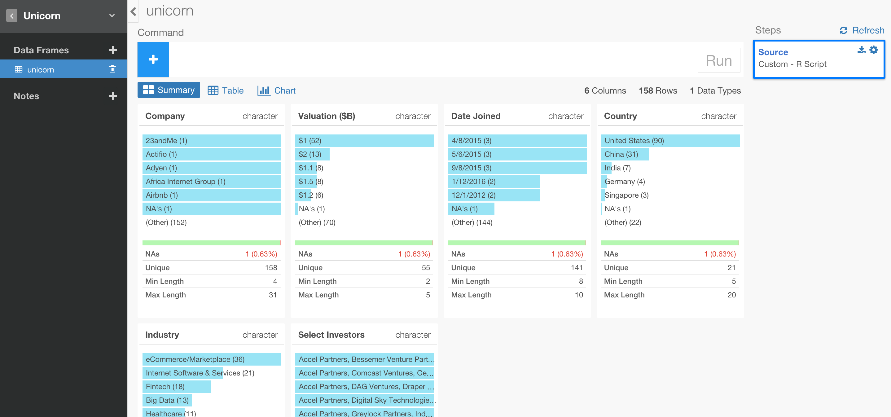

# Scrape Web Data

Click '+' button next to 'Data Frame' and Select 'Scrape Web Data'.

Type a name for Data Frame, type an URL, and click 'Preview' button.

Review the data in the preview table and click 'Import' button to import the data. Now the data is in Exploratory.

