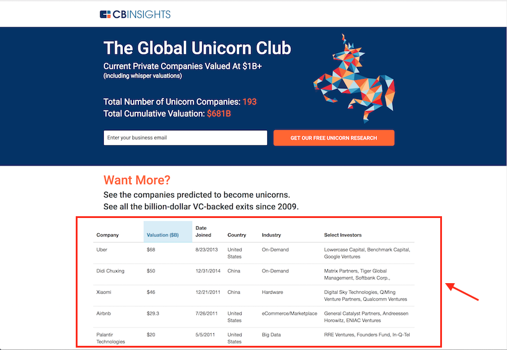
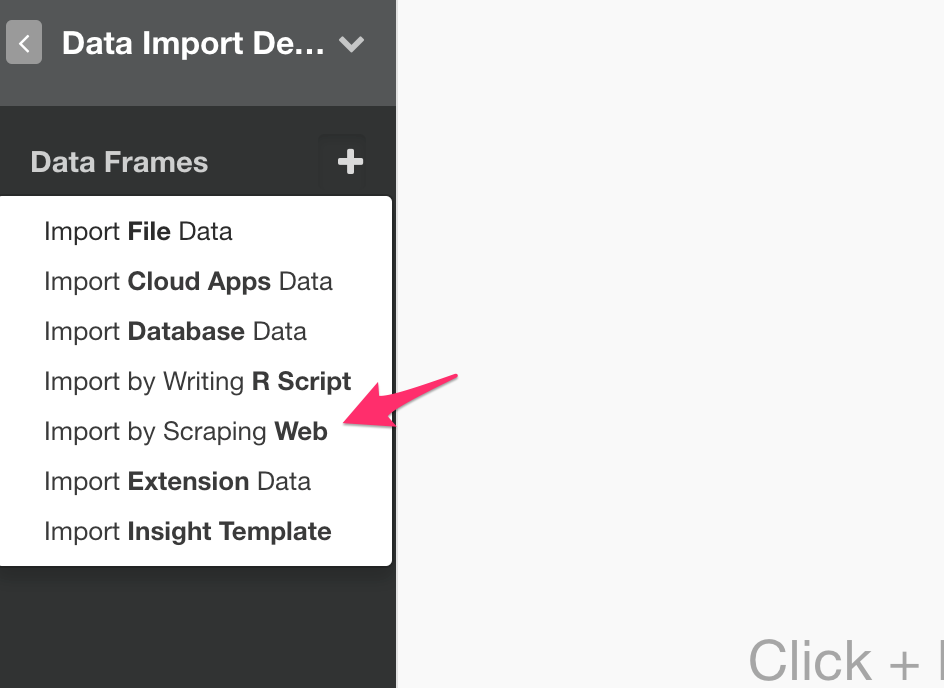
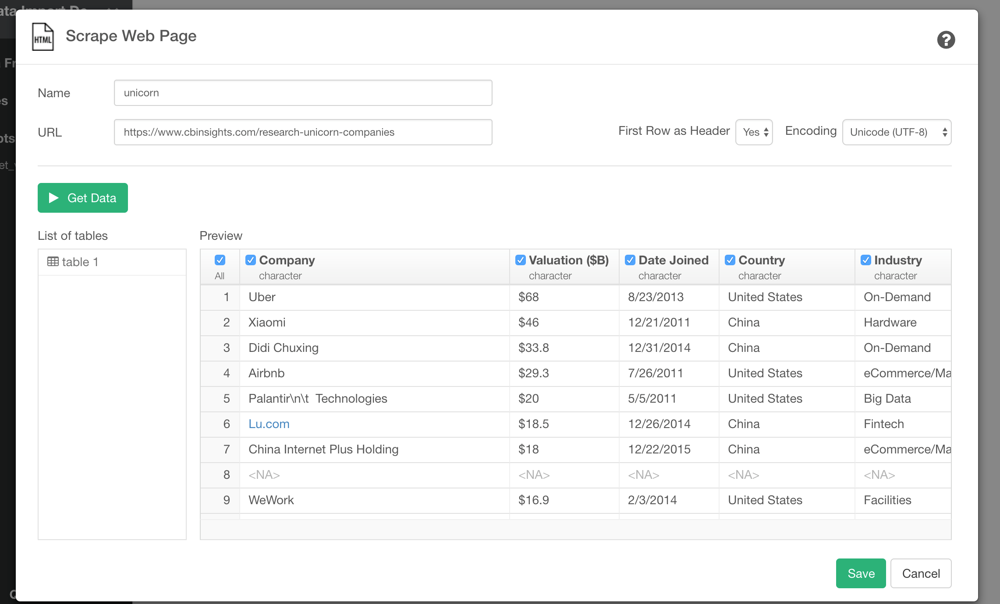
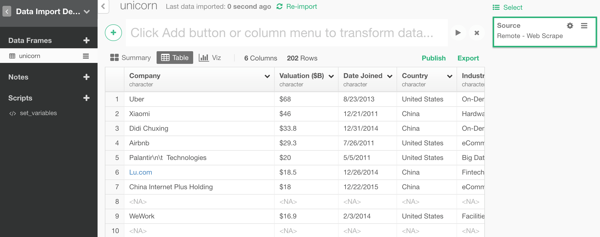

# Import Data by Web Scraping

You can import data in ``<TABLE>`` tag in web sites. For example, if you want to scrape Unicorn company data from [CB Insight's The Global Unicorn Club](https://www.cbinsights.com/research-unicorn-companies) , you can do it as follows.

Click '+' button next to 'Data Frames' and Select 'Import by Writing Scraping Web'.

Type a name for Data Frame, type an URL, and click 'Preview' button.

If the page has multiple ``<TABLE>`` tag, select a table that you want to get data from List of tables, Review the data in the preview table and click 'Import' button to import the data. Now the data is in Exploratory.

