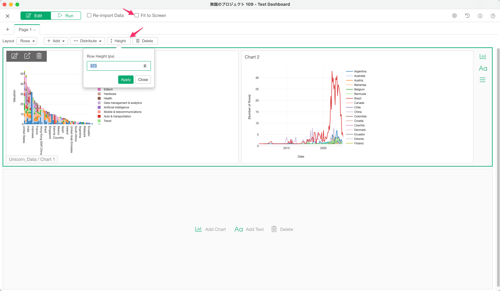

# Dashboard 

## An Introduction to Exploratory Dashboard

This [note](https://exploratory.io/note/2ac8ae888097/0937480844541865) explains how to create a Dashboard with Exploratory Desktop and share it with your co-workers.

## Parameter

If you add charts, analytics or data frames that contain the parameters to the dashboard, those parameters will show up automatically when you run the dashboard. You can change the parameters to update charts and analytics in the dashboard on the fly. 

Please see [here](../parameter/parameter.md) for more details about Parameter.

## Showing a Parameter Value on Dashboard

You can show the current parameter value on Dashboard using the R code chunk or R inline expression. Please see [here](../parameter/parameter.md#showing-the-parameter-value-on-note-dashboard) for more details.

## Row Height Setting 

You can set a row height of each row if "Fit to Screen" option is disabled. 

## View the Chart/Analytics in the Full-Screen Mode

You can view the chart in the full-screen mode by clicking the "Show in fullscreen" icon on each Chart/Analytics. 

This feature is not supported on the Number chart type for now.

## Download the Image of the Chart/Analytics

You can download the chart image in either PNG or SVG file format by selecting the "Export Chart Image" menu on each Chart/Analytics. 

The dimension of the image file is following. 

* Width: 1,200px
* Height: 800px if Repeat By is not used in the chart. Height stretches to include all the charts if Repeat By is used.
* Pixel Ratio: 200%

The "Export Chart Image" menu is available only on dashboards published to the server. 

This feature is not supported on Number, Word Cloud and Map chart types. 

## Download the Data of the Chart/Analytics

You can download the chart data in the CSV format by selecting the "Export Chart Data" menu on each Chart/Analytics. 

The "Export Chart Data" menu is available only on dashboards published to the server. You also need to select the "CSV" download option when you publish the dashboard. 

This feature is not supported on the Number chart type for now.

## Show the Comment of the Chart/Analytics

If your chart/analytics has a comment, you can view it on the dashboard by hovering/clicking the comment icon on each Chart/Analytics. 

This feature is not supported on the Number chart type for now.