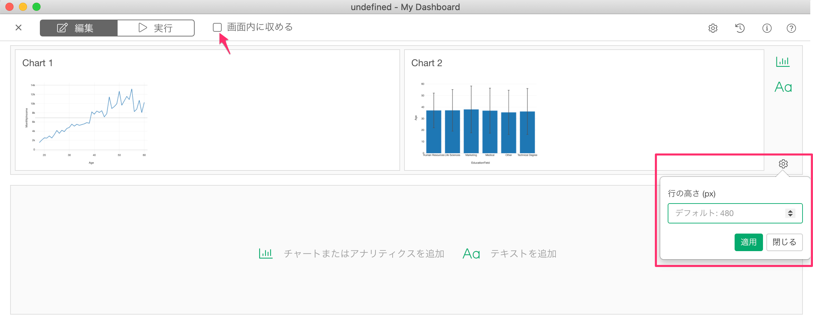

# ダッシュボード

## Exploratoryダッシュボードの紹介

Exploratoryデスクトップを使って、ダッシュボードを作成し、他のメンバーとシェアする方法は[こちら]( (https://exploratory.io/note/2ac8ae888097/2211291771961907)を参照してください。

## パラメータ

ダッシュボードの中で参照されているチャート、アナリティクス、データフレームなどにパラメータがある場合、ダッシュボードを実行するとそれらのパラメータが自動的に表示されます。パラメータの値を変更することで、ダッシュボード内で使われているチャートやアナリティクスを動的に変更することができます。

パラメータの詳細に関しては[こちら](parameter/parameter_ja.md)をご覧ください。

## ダッシュボード上にパラメータの値を表示する方法

ダッシュボードでは、Rコードブロックや、インラインRコードを使って、パラメーターの値をダッシュボード上に表示することができます。詳細は[こちら](parameter/parameter_ja.md#ntoyadasshubdoniparamtnowosuru)をご覧ください。

## 行の高さの設定

ダッシュボードの行の高さを設定することができます。行の高さを設定するには、「画面内に収める」の機能が無効になっている必要があります。

