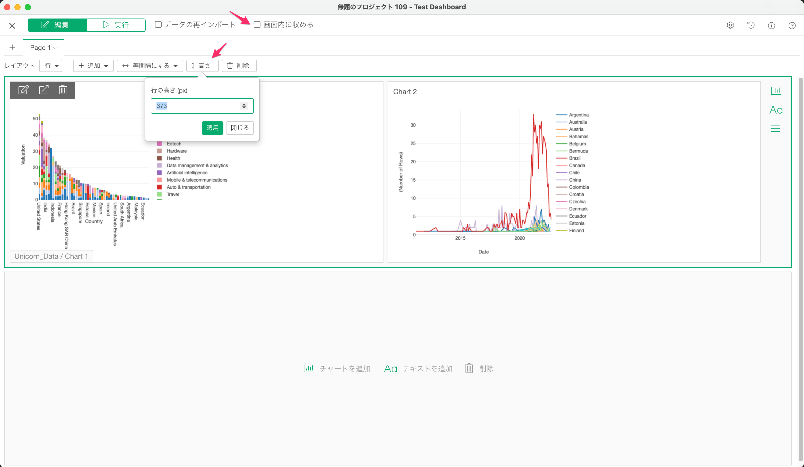

# ダッシュボード

## Exploratoryダッシュボードの紹介

Exploratoryデスクトップを使って、ダッシュボードを作成し、他のメンバーとシェアする方法は[こちら]( (https://exploratory.io/note/2ac8ae888097/2211291771961907)を参照してください。

## パラメータ

ダッシュボードの中で参照されているチャート、アナリティクス、データフレームなどにパラメータがある場合、ダッシュボードを実行するとそれらのパラメータが自動的に表示されます。パラメータの値を変更することで、ダッシュボード内で使われているチャートやアナリティクスを動的に変更することができます。

パラメータの詳細に関しては[こちら](../parameter/parameter_ja.md)をご覧ください。

## ダッシュボード上にパラメータの値を表示する方法

ダッシュボードでは、Rコードブロックや、インラインRコードを使って、パラメーターの値をダッシュボード上に表示することができます。詳細は[こちら](../parameter/parameter_ja.md#ntoyadasshubdoniparamtnowosuru)をご覧ください。

## 行の高さの設定

ダッシュボードの行の高さを設定することができます。行の高さを設定するには、「画面内に収める」の機能が無効になっている必要があります。

## コンテンツエリアのタイトルを非表示にする

ダッシュボードの設定ダイアログで、コンテンツエリアの設定の「タイトルを表示する」のチェックボックスを外すことで、ダッシュボードのそれぞれのコンテンツのエリアのタイトルを、非表示にすることができます。

## チャート/アナリティクスを全画面で表示する

ダッシュボード上のチャートやアナリティクスの右上にある「全画面で表示」アイコンをクリックすることで、チャートやアナリティクスを全画面で表示することができます。

ナンバーチャートには現在対応しておりません。

## チャート/アナリティクスの画像をダウンロードする

ダッシュボード上のチャートやアナリティクスの右上にある「チャートの画像をエクスポート」を選択すると、チャートを画像ファイル(PNGかSVG)としてダウンロードすることができます。

「チャートの画像をエクスポート」のメニューは、パブリッシュされたダッシュボード上でのみ利用可能です。また、ナンバーチャート、地図、ワードクラウドには現在対応しておりません。

## チャート/アナリティクスのデータをダウンロードする

ダッシュボード上のチャートやアナリティクスの右上にある「チャートのデータをエクスポート」を選択すると、チャートで使われているデータを、CSV形式でダウンロードすることができます。

「チャートのデータをエクスポート」のメニューは、パブリッシュされたダッシュボード上でのみ利用可能です。また、ダッシュボードをパブリッシュする際に、ダウンロードオプションで「CSV」を選択する必要があります。

ナンバーチャートには現在対応しておりません。

## チャート/アナリティクスのコメントを見る

もし、チャートやアナリティクスにコメントがある場合、チャートやアナリティクスの右上にあるコメントアイコンをホバーかクリックすることで、コメントを確認することができます。

ナンバーチャートには現在対応しておりません。
