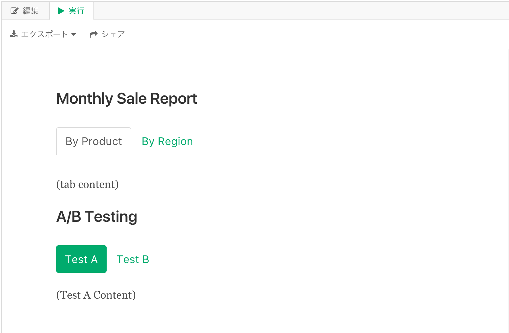
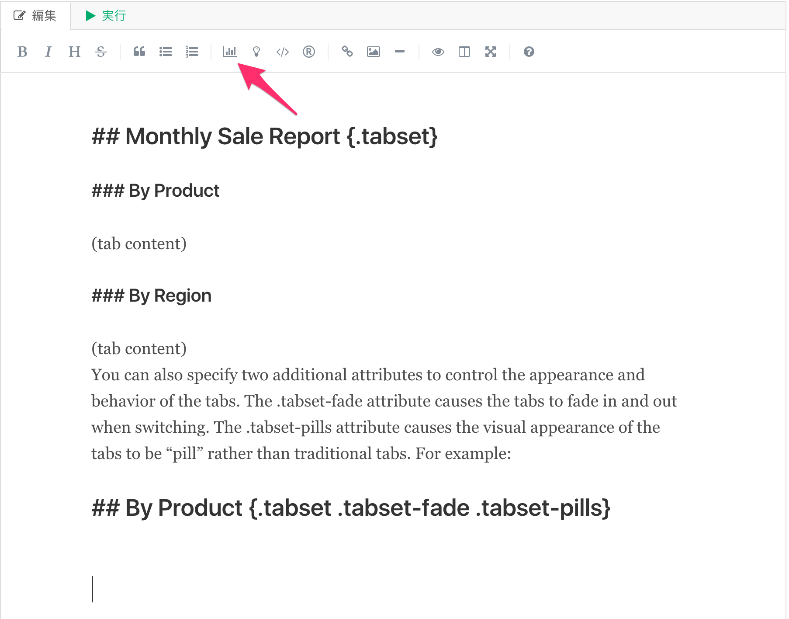
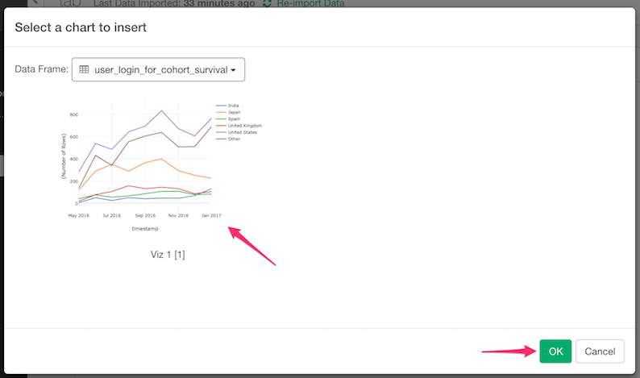
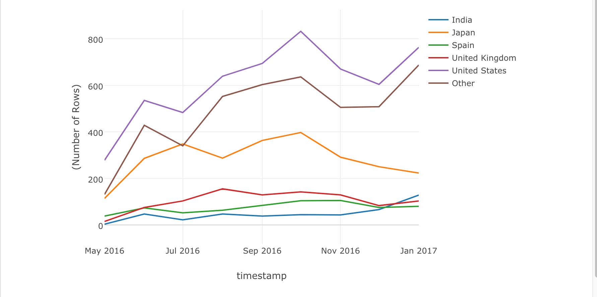
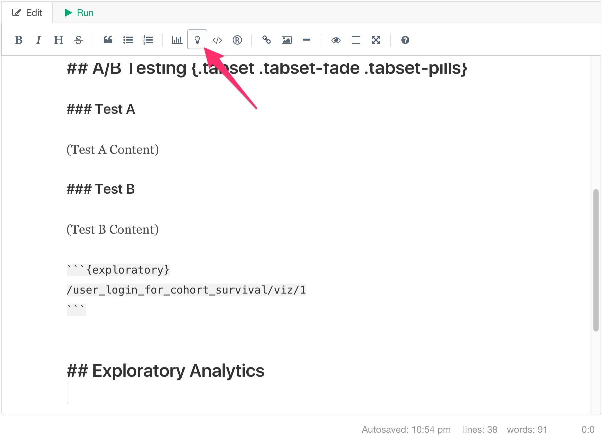
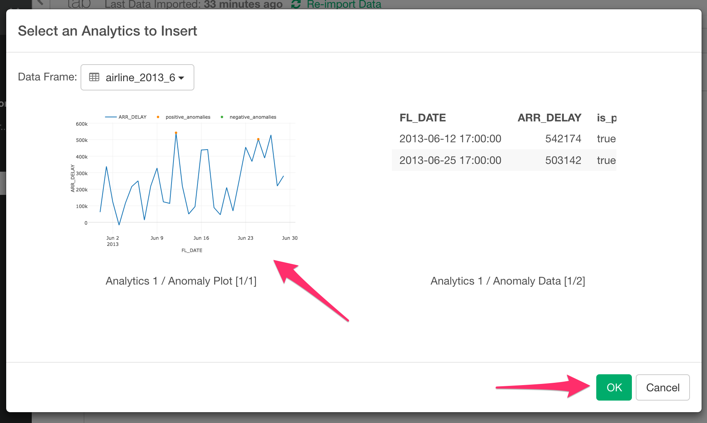
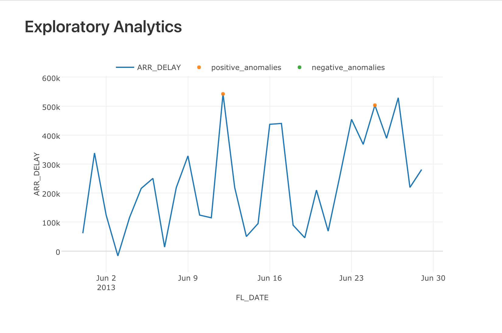
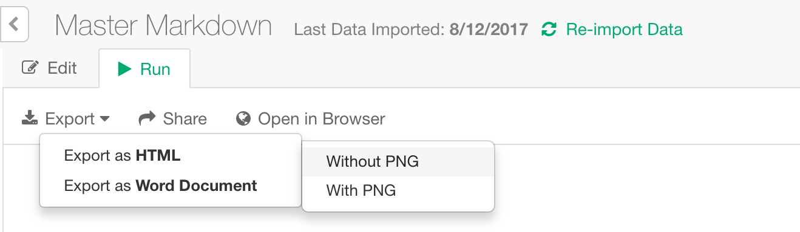
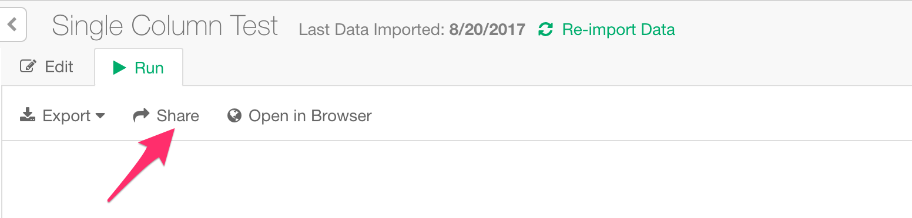
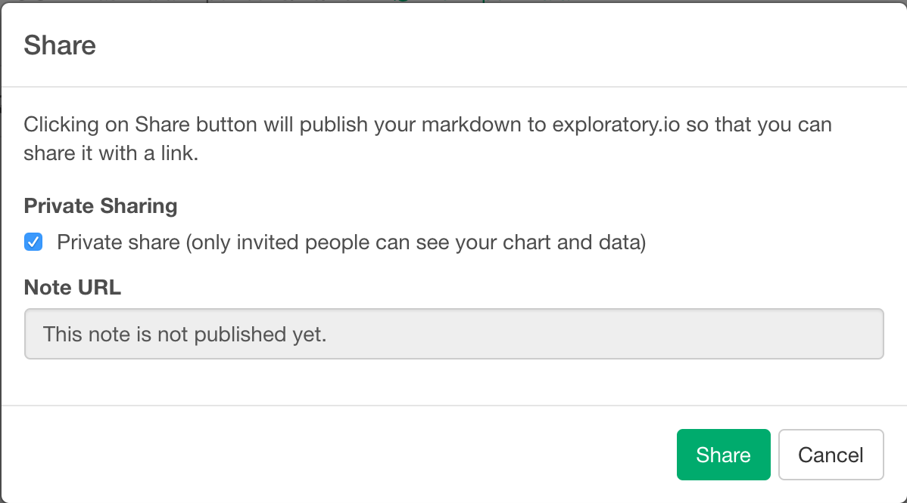

# A Guide for Writing Note with Markdown Editor

You can use Simple Markdown Editor to write notes to communicate your insights with others easily. This guide shows  how you can use it.

##### Table of Contents  

* Basic Markdown formatting  
  * [Headers](#headers)  
  * [Emphasis](#emphasis)  
  * [Lists](#lists)  
  * [Links](#links)  
  * [Images](#images)  
  * [Code](#code)  
  * [Tables](#tables)  
  * [Blockquotes](#blockquotes)  
  * [Inline HTML](#inlinehtml)  
  * [Horizontal Rule](#hr)  
  * [Line Breaks](#lines)  
  * [Tabbed Sections](#tabbedsections)  
* [Charts from Visualization View](#charts)  
* [Charts from Analytics](#analytics)　　
* [R Script - Code Block](#rcodeblock)
* [R Script - Inline](#rinline)
* [Export to HTML/Word](#exportto)
* [Publish and Share](#publishandshare)


<a name="headers"></a>

## Headers

```no-highlight
# H1
## H2
### H3
#### H4
##### H5
###### H6

Alternatively, for H1 and H2, an underline-ish style:

Alt-H1
======

Alt-H2
------
```

# H1
## H2
### H3
#### H4
##### H5
###### H6

Alternatively, for H1 and H2, an underline-ish style:

Alt-H1
======

Alt-H2
------

<a name="emphasis"></a>

## Emphasis

```no-highlight
Emphasis, aka italics, with *asterisks* or _underscores_.

Strong emphasis, aka bold, with **asterisks** or __underscores__.

Combined emphasis with **asterisks and _underscores_**.

Strikethrough uses two tildes. ~~Scratch this.~~
```

Emphasis, aka italics, with *asterisks* or _underscores_.

Strong emphasis, aka bold, with **asterisks** or __underscores__.

Combined emphasis with **asterisks and _underscores_**.

Strikethrough uses two tildes. ~~Scratch this.~~


<a name="lists"></a>

## Lists

(In this example, leading and trailing spaces are shown with with dots: ⋅)

```no-highlight
1. First ordered list item
2. Another item
⋅⋅* Unordered sub-list.
1. Actual numbers don't matter, just that it's a number
⋅⋅1. Ordered sub-list
4. And another item.

⋅⋅⋅You can have properly indented paragraphs within list items. Notice the blank line above, and the leading spaces (at least one, but we'll use three here to also align the raw Markdown).

⋅⋅⋅To have a line break without a paragraph, you will need to use two trailing spaces.⋅⋅
⋅⋅⋅Note that this line is separate, but within the same paragraph.⋅⋅
⋅⋅⋅(This is contrary to the typical GFM line break behaviour, where trailing spaces are not required.)

* Unordered list can use asterisks
- Or minuses
+ Or pluses
```

1. First ordered list item
2. Another item
  * Unordered sub-list.
1. Actual numbers don't matter, just that it's a number
  1. Ordered sub-list
4. And another item.

   You can have properly indented paragraphs within list items. Notice the blank line above, and the leading spaces (at least one, but we'll use three here to also align the raw Markdown).

   To have a line break without a paragraph, you will need to use two trailing spaces.  
   Note that this line is separate, but within the same paragraph.  
   (This is contrary to the typical GFM line break behavior, where trailing spaces are not required.)

* Unordered list can use asterisks
- Or minuses
+ Or pluses

<a name="links"></a>

## Links

There are two ways to create links.

```no-highlight
[I'm an inline-style link](https://exploratory.io)

[I'm an inline-style link with title](https://exploratory.io "Exploratory's Homepage")

[I'm a reference-style link][Arbitrary case-insensitive reference text]

[I'm a relative reference to a repository file](../../index.html)

[You can use numbers for reference-style link definitions][1]

Or leave it empty and use the [link text itself].

URLs and URLs in angle brackets will automatically get turned into links.
http://exploratory.io or <http://exploratory.io> and sometimes
example.com (but not on Github, for example).

Some text to show that the reference links can follow later.

[arbitrary case-insensitive reference text]: https://www.mozilla.org
[1]: http://slashdot.org
[link text itself]: http://www.reddit.com
```

[I'm an inline-style link](https://exploratory.io)

[I'm an inline-style link with title](https://exploratory.io "Exploratory's Homepage")

[I'm a reference-style link][Arbitrary case-insensitive reference text]

[I'm a relative reference to a repository file](../../index.html)

[You can use numbers for reference-style link definitions][1]

Or leave it empty and use the [link text itself].

URLs and URLs in angle brackets will automatically get turned into links.
http://exploratory.io or <http://exploratory.io> and sometimes
example.com (but not on Github, for example).

Some text to show that the reference links can follow later.

[arbitrary case-insensitive reference text]: https://www.mozilla.org
[1]: http://slashdot.org
[link text itself]: http://www.reddit.com

<a name="images"></a>

## Images

```no-highlight
Here's our logo (hover to see the title text):

Inline-style:


Reference-style:
![alt text][logo]

[logo]: file://Users/exploratory/images/logo_top.png "Logo Title Text 2"
```

Here's our logo (hover to see the title text):

Inline-style:


Reference-style:
![alt text][logo]

[logo]: images/logo_top.png "Logo Title Text 2"

<a name="code"></a>

## Code

Code blocks are part of the Markdown spec and Exploratory uses R Markdown's pygments for syntax highlighting.

```no-highlight
`r now()` is the best time to learn Inline R codes that have `back-ticks around` it.
```

2017-08-18 21:23:21 is the best time to learn Inline R codes that have `back-ticks around` it.

Blocks of code are either fenced by lines with three back-ticks <code>```</code>, or are indented with four spaces. I recommend only using the fenced code blocks -- they're easier and only they support syntax highlighting.

<pre lang="no-highlight"><code>```{r}
summary(mtcars)
```

```
No language indicated, so no syntax highlighting.
But let's throw in a &lt;b&gt;tag&lt;/b&gt;.
```
</code></pre>

```r
summary(mtcars)
```

<pre><code>
##       mpg             cyl             disp             hp       
##  Min.   :10.40   Min.   :4.000   Min.   : 71.1   Min.   : 52.0  
##  1st Qu.:15.43   1st Qu.:4.000   1st Qu.:120.8   1st Qu.: 96.5  
##  Median :19.20   Median :6.000   Median :196.3   Median :123.0  
##  Mean   :20.09   Mean   :6.188   Mean   :230.7   Mean   :146.7  
##  3rd Qu.:22.80   3rd Qu.:8.000   3rd Qu.:326.0   3rd Qu.:180.0  
##  Max.   :33.90   Max.   :8.000   Max.   :472.0   Max.   :335.0  
##       drat             wt             qsec             vs        
##  Min.   :2.760   Min.   :1.513   Min.   :14.50   Min.   :0.0000  
##  1st Qu.:3.080   1st Qu.:2.581   1st Qu.:16.89   1st Qu.:0.0000  
##  Median :3.695   Median :3.325   Median :17.71   Median :0.0000  
##  Mean   :3.597   Mean   :3.217   Mean   :17.85   Mean   :0.4375  
##  3rd Qu.:3.920   3rd Qu.:3.610   3rd Qu.:18.90   3rd Qu.:1.0000  
##  Max.   :4.930   Max.   :5.424   Max.   :22.90   Max.   :1.0000  
##        am              gear            carb      
##  Min.   :0.0000   Min.   :3.000   Min.   :1.000  
##  1st Qu.:0.0000   1st Qu.:3.000   1st Qu.:2.000  
##  Median :0.0000   Median :4.000   Median :2.000  
##  Mean   :0.4062   Mean   :3.688   Mean   :2.812  
##  3rd Qu.:1.0000   3rd Qu.:4.000   3rd Qu.:4.000  
##  Max.   :1.0000   Max.   :5.000   Max.   :8.000
</code></pre>


```
No language indicated, so no syntax highlighting in.
But let's throw in a <b>tag</b>.
```


<a name="tables"></a>

## Tables

They are an easy way of adding tables to your email -- a task that would otherwise require copy-pasting from another application.

```no-highlight
Colons can be used to align columns.

| Tables        | Are           | Cool  |
| ------------- |:-------------:| -----:|
| col 3 is      | right-aligned | $1600 |
| col 2 is      | centered      |   $12 |
| zebra stripes | are neat      |    $1 |

There must be at least 3 dashes separating each header cell.
The outer pipes (|) are optional, and you don't need to make the
raw Markdown line up prettily. You can also use inline Markdown.

Markdown | Less | Pretty
--- | --- | ---
*Still* | `renders` | **nicely**
1 | 2 | 3
```

Colons can be used to align columns.

| Tables        | Are           | Cool |
| ------------- |:-------------:| -----:|
| col 3 is      | right-aligned | $1600 |
| col 2 is      | centered      |   $12 |
| zebra stripes | are neat      |    $1 |

There must be at least 3 dashes separating each header cell. The outer pipes (|) are optional, and you don't need to make the raw Markdown line up prettily. You can also use inline Markdown.

Markdown | Less | Pretty
--- | --- | ---
*Still* | `renders` | **nicely**
1 | 2 | 3

<a name="blockquotes"></a>

## Blockquotes

```no-highlight
> Blockquotes are very handy in email to emulate reply text.
> This line is part of the same quote.

Quote break.

> This is a very long line that will still be quoted properly when it wraps. Oh boy let's keep writing to make sure this is long enough to actually wrap for everyone. Oh, you can *put* **Markdown** into a blockquote.
```

> Blockquotes are very handy in email to emulate reply text.
> This line is part of the same quote.

Quote break.

> This is a very long line that will still be quoted properly when it wraps. Oh boy let's keep writing to make sure this is long enough to actually wrap for everyone. Oh, you can *put* **Markdown** into a blockquote.

<a name="inlinehtml"></a>

## Inline HTML

You can also use raw HTML in your Markdown, and it'll mostly work pretty well.

```no-highlight
<dl>
  <dt>Definition list</dt>
  <dd>Is something people use sometimes.</dd>

  <dt>Markdown in HTML</dt>
  <dd>Does *not* work **very** well. Use HTML <em>tags</em>.</dd>
</dl>
```

<dl>
  <dt>Definition list</dt>
  <dd>Is something people use sometimes.</dd>

  <dt>Markdown in HTML</dt>
  <dd>Does *not* work **very** well. Use HTML <em>tags</em>.</dd>
</dl>

<a name="hr"></a>

## Horizontal Rule

```
Three or more...

---

Hyphens

***

Asterisks

___

Underscores
```

Three or more...

---

Hyphens

***

Asterisks

___

Underscores

<a name="lines"></a>

## Line Breaks

My basic recommendation for learning how line breaks work is to experiment and discover -- hit &lt;Enter&gt; once (i.e., insert one newline), then hit it twice (i.e., insert two newlines), see what happens. You'll soon learn to get what you want. "Markdown Toggle" is your friend.

Here are some things to try out:

```
Here's a line for us to start with.

This line is separated from the one above by two newlines, so it will be a *separate paragraph*.

This line is also a separate paragraph, but...
This line is only separated by a single newline, so it's a separate line in the *same paragraph*.
```

Here's a line for us to start with.

This line is separated from the one above by two newlines, so it will be a *separate paragraph*.

This line is also begins a separate paragraph, but...  
This line is only separated by a single newline, so it's a separate line in the *same paragraph*.


<a name="tabbedsections"></a>

## Tabbed Sections

You can organize content using tabs by applying the .tabset class attribute to headers within a document. This will cause all sub-headers of the header with the .tabset attribute to appear within tabs rather than as standalone sections. For example:

```no-highlight
## Monthly Sale Report {.tabset}

### By Product

(tab content)

### By Region

(tab content)
You can also specify two additional attributes to control the appearance and behavior of the tabs. The .tabset-fade attribute causes the tabs to fade in and out when switching. The .tabset-pills attribute causes the visual appearance of the tabs to be “pill” rather than traditional tabs. For example:

## A/B Testing {.tabset .tabset-fade .tabset-pills}

### Test A

(Test A Content)

### Test B

(Test B Content)

```


<a name="charts"></a>

## Exploratory Charts

On Exploratory Desktop, You can select Exploratory Charts when you writing Markdown note. Click Chart Icon on Toolbar.



This will open up Chart Selector Dialog like this.



After you select a Chart and Click OK, following Exploratory Code block is inserted into your Markdown content. Syntax is `/<dataframe_name>/<type>/<index>`

<pre><code>
```{exploratory}
/user_login_for_cohort_survival/viz/1
```
</code></pre>

And when you click Run, this code block is converted to Exploratory Chart like below.



<a name="analytics"></a>

## Exploratory Analytics Viz

On Exploratory Desktop, You can select Exploratory Analytics Viz when you writing Markdown note. Click Analytics Icon on Toolbar.



This will open up Chart Selector Dialog like this.



After you select a Chart and Click OK, following Exploratory Code block is inserted into your Markdown content. Syntax is `/<dataframe_name>/<type>/<index>`

<pre><code>
```{exploratory}
/airline_2013_6/analytics/1/1
```
</code></pre>

And when you click Run, this code block is converted to Exploratory Analytics Viz like below.



<a name="exportto"></a>

## Export to HTML/Word



To Export output as HTML, click Export button and select `Export as HTML`.
Then you'll have two options, `Without PNG` and `With PNG`. If you want to share the HTML on Dropbox or other places where javascript execute is not supported, you might want to select `with PNG` so that charts are rendered as images. Otherwise, select `Without PNG` so that you can share the charts with full interactivity and can reduce the output file size.

To Export as Word Document, click Export button and select `Export as Word Document`.

<a name="publishandshare"></a>

## Publish and Share

To publish and share your Markdown Note, click Share button.



And on the Share dialog, check 'Private' if you want to privately share the Markdown Note and Click `Share` button.


