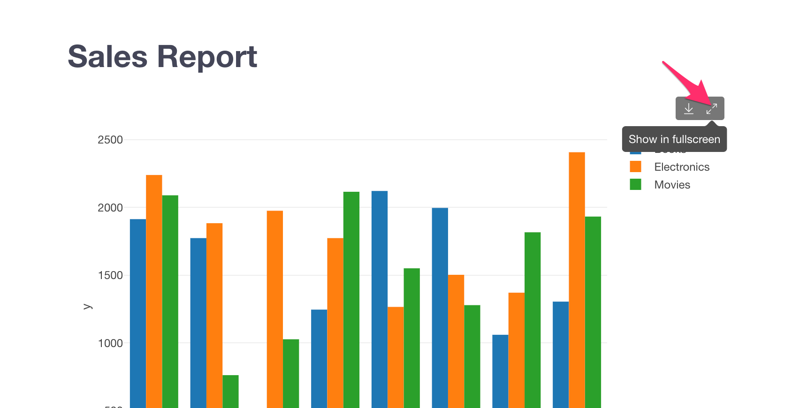
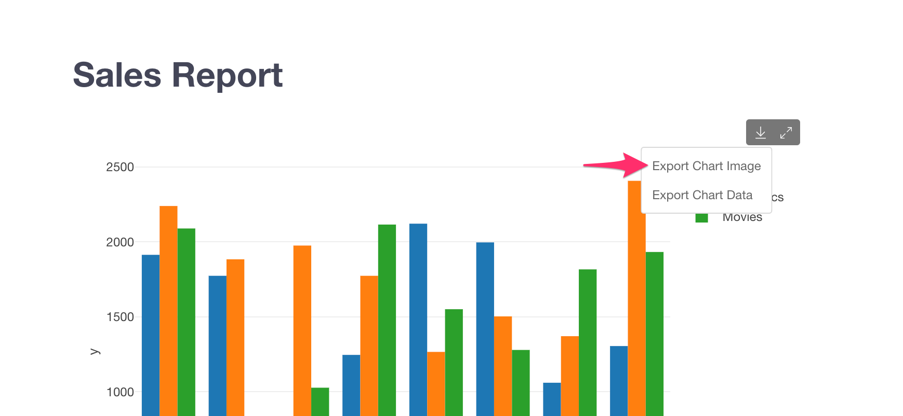
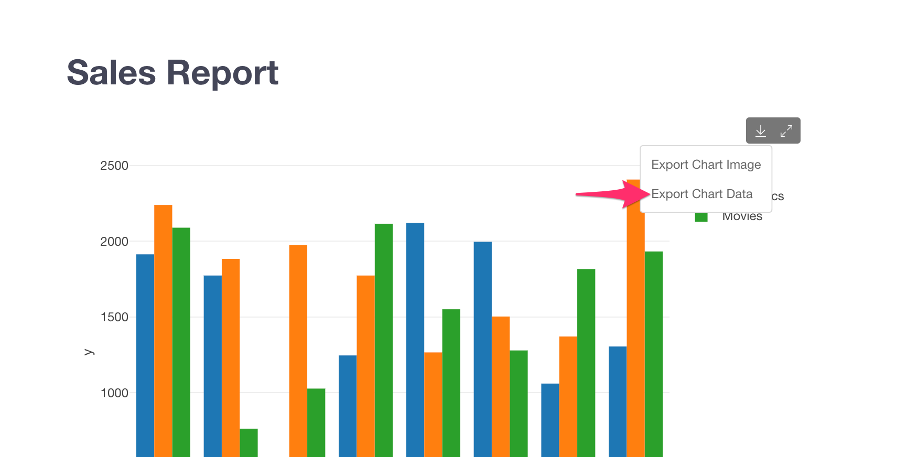
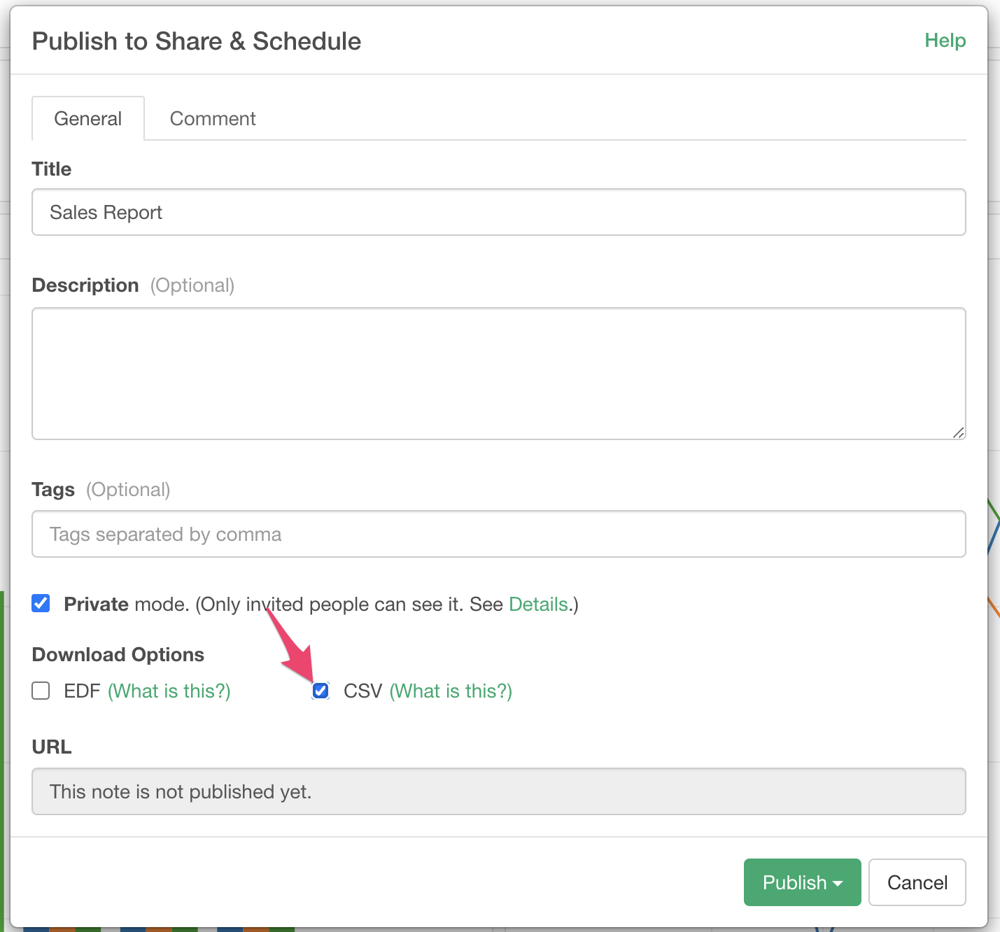
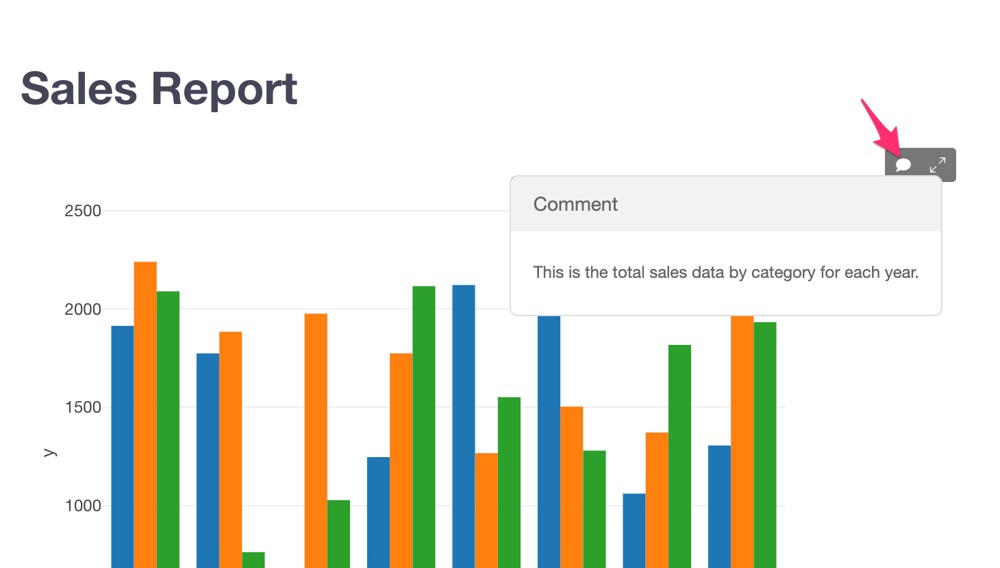

# Note

## An Introduction to Note with Simple Markdown Editor

This [note](https://exploratory.io/note/kanaugust/An-Introduction-to-Note-with-Simple-Markdown-Editor-5790975430740516) explains how to create a note using Simple Markdown Editor with Exploratory Desktop and share it with your co-workers.

## Parameter

If you add charts, analytics or data frames that contain the parameters to the note, those parameters will show up automatically when you run the note. You can change the parameters to update charts and analytics in the note on the fly. 

Please see [here](../parameter/parameter.md) for more details about Parameter.

## Showing a Parameter Value on Note

You can show the current parameter value on Note using the R code chunk or R inline expression. Please see [here](../parameter/parameter.md#showing-the-parameter-value-on-note-dashboard) for more details.

## View Mode

### Side by Side Mode

In Side by Side mode, you can see the edit screen and the preview screen side by side in a single window. You can click the refresh button anytime to confirm the preview while you are editing. 

### Switching to Side by Side Mode

You can click the "Switch to Side By Side Mode" button to switch from Single View mode to Side By Side mode. 

### Single View Mode

In Single View mode, you can show either the edit screen or the preview screen at a time. You can switch the edit screen or the preview screen by clicking "Edit" or "Run" button at the top left corner of the screen. 

In Single View mode, you can use the full window area for editing and previewing. It is useful if you want to check how users actually view your note. 

Edit screen

Preview screen

### Switching to Single View Mode

You can click the "Switch to Single View Mode" button to switch from ModeSide By Side mode to Single View mode. 

## Export

You can export your note in various formats. You can access to the export menus from the Export button at the top right corner of the screen. 

### Open in Web Browser

You can preview the output in the web browser. 

### Export as HTML

You can export the note output in HTML format. 

### Export as Word Document 

You can export the note output in Microsoft Word format. 

The "Export as Word Document" feature is only available in Single View mode. You can see [here](#switching-to-single-view-mode) for how to switch to Single View mode.

### Export as EDF

You can export the note output in EDF format. The exported EDF includes not only the text in the note, but also charts, analytics, data frames and others referenced in the note. You can import that EDF anytime to reproduce the note completely. 

## View the Chart/Analytics in the Full-Screen Mode

You can view the chart in the full-screen mode by clicking the "Show in fullscreen" icon on each Chart/Analytics. 

This feature is not supported on the Number chart type for now.

## Download the Image of the Chart/Analytics

You can download the chart as an image file by selecting the "Export Chart Image" menu on each Chart/Analytics. 

The dimension of the image file is following. 

* Width: 1,200px
* Height: 800px if Repeat By is not used in the chart. Height stretches to include all the charts if Repeat By is used.
* Pixel Ratio: 200%

The "Export Chart Image" menu is available only on notes published to the server. 

This feature is not supported on Number and Map chart types. 

## Download the Data of the Chart/Analytics

You can download the chart data in the CSV format by selecting the "Export Chart Data" menu on each Chart/Analytics. 

The "Export Chart Data" menu is available only on notes published to the server. You also need to select the "CSV" download option when you publish the note. 

This feature is not supported on the Number chart type for now.

## Show the Comment of the Chart/Analytics

If your chart/analytics has a comment, you can view it on the note by hovering/clicking the comment icon on each Chart/Analytics. 

This feature is not supported on the Number chart type for now.