# ノート

## シンプル・マークダウン・エディタによるノートの紹介

Exploratoryデスクトップでシンプル・マークダウン・エディタを使って、ノートを作成し、他のメンバーとシェアする方法は[こちら](https://exploratory.io/note/2ac8ae888097/VMX6SSV0nc)を参照してください。

## パラメータ

ノートの中で参照されているチャート、アナリティクス、データフレームなどにパラメータがある場合、ノートを実行するとそれらのパラメータが自動的に表示されます。パラメータの値を変更することで、ノート内で使われているチャートやアナリティクスを動的に変更することができます。

パラメータの詳細に関しては[こちら](../parameter/parameter_ja.md)をご覧ください。

## ノート上にパラメータの値を表示する方法

ノートでは、Rコードブロックや、インラインRコードを使って、パラメーターの値をノート上に表示することができます。詳細は[こちら](../parameter/parameter_ja.md#ntoyadasshubdoniparamtnowosuru)をご覧ください。

## ビュー・モード

### 画面分割モード

画面分割モードでは、左側に編集画面、右側にプレビュー画面が同一画面上に横並びで表示されます。画面分割モードでは、左側で編集をしながら、リフレッシュボタンを押すことで随時、出力を確認することができます。

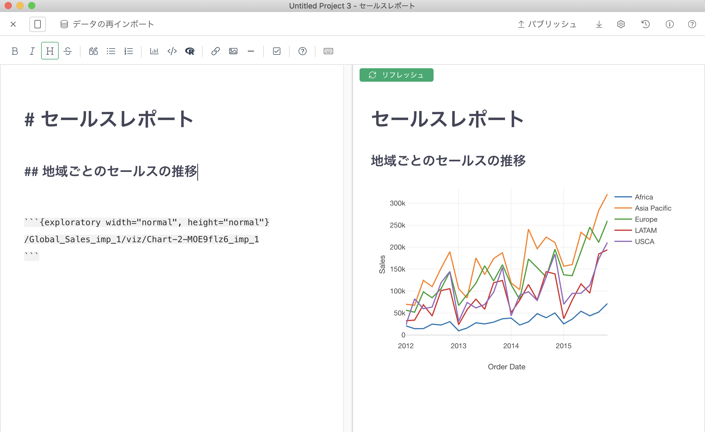

### 画面分割モードへの切り替え

シングル・ビュー・モードから画面分割モードに切り替えるには、画面左上の切り替えボタンを押します。

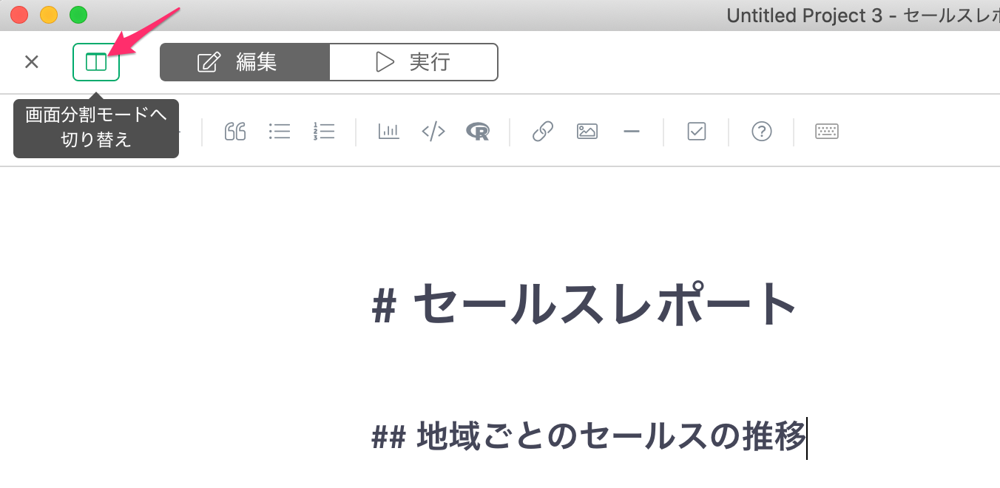

### シングル・ビュー・モード

シングル・ビュー・モードは、編集画面とプレビュー画面が独立しています。編集画面とプレビュー画面の切り替えは、画面左上の「編集」「実行」ボタンで行うことができます。シングル・ビュー・モードは画面いっぱいに表示が行えるので、より実際のブラウザの画面に近い状態で編集およびプレビューを行うことができます。

編集画面

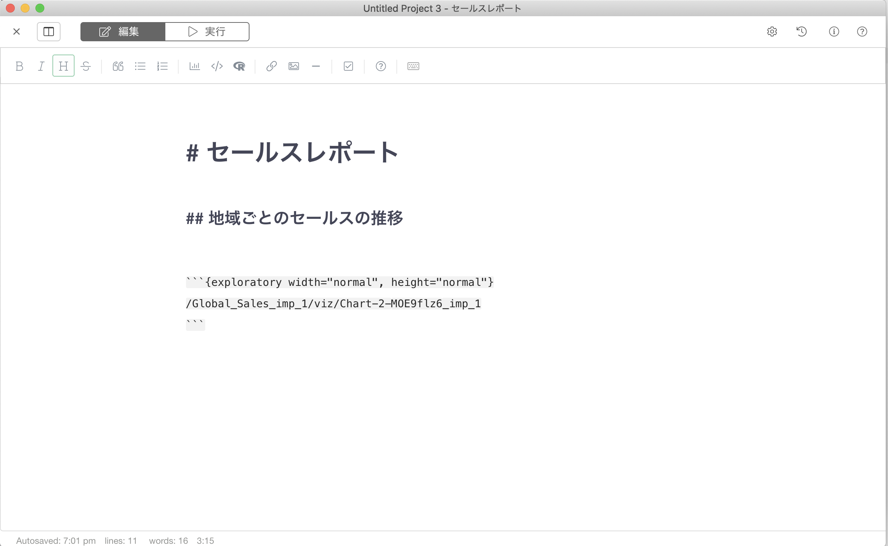

プレビュー画面

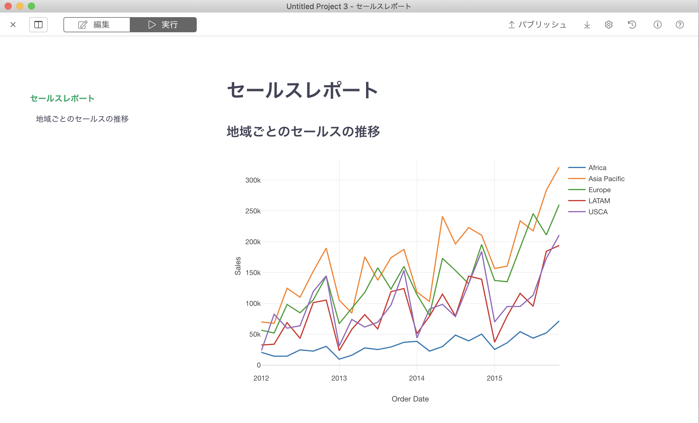

### シングル・ビュー・モードへの切り替え

画面分割モードからシングル・ビュー・モードに切り替えるには、画面左上の切り替えボタンを押します。

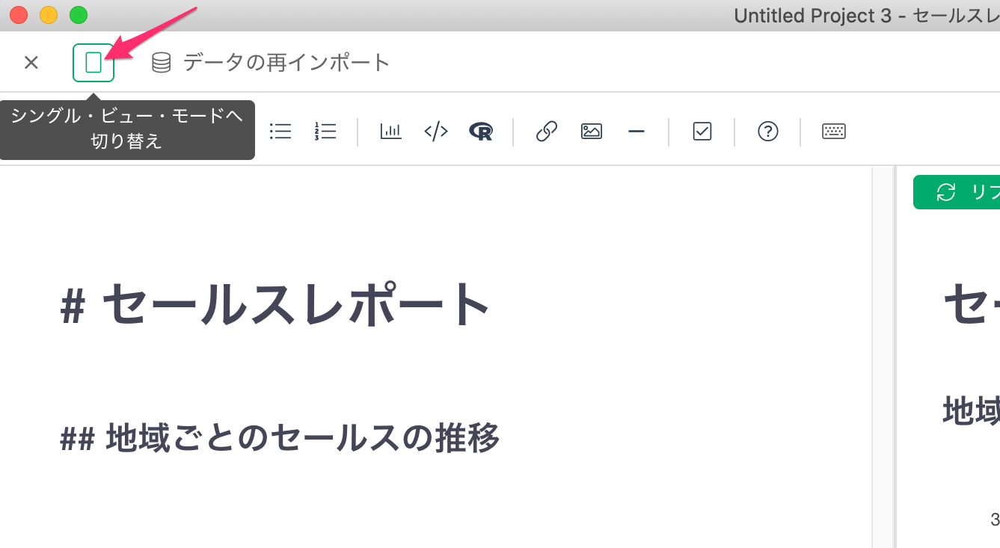

## エクスポート

ノートを様々な形でエクスポートすることができます。エクスポートのメニューは、画面右上のエクスポートボタンからアクセスすることができます。

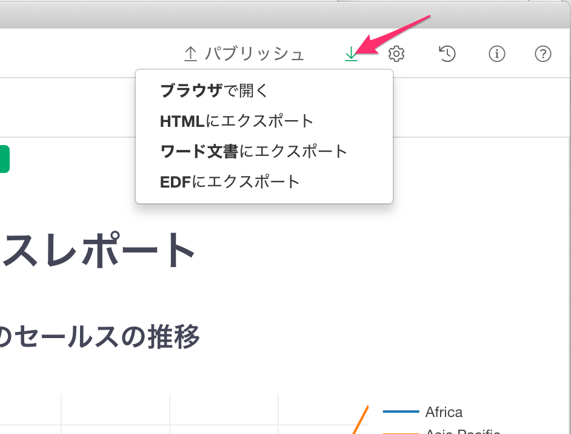

### ブラウザで開く

プレビューをブラウザで開いて確認することができます。

### HTMLにエクスポート

ノートの出力をHTML形式でエクスポートすることができます。

### ワード文書にエクスポート

ノートの出力をワード形式の文書でエクスポートすることができます。

ワード文書にエクスポートは、シングル・ビュー・モードからしか現在行うことができません。シングル・ビュー・モードへの切替方法は、[こちら](#shingurubymdohenorie)をご覧ください。

### EDFにエクスポート

ノートをEDF形式でエクスポートすることができます。エクスポートされたEDFには、ノートと、ノートに含まれるチャート、データフレームなど、ノートを再現するのに必要なものがすべてエクスポートされます。

## チャート/アナリティクスを全画面で表示する

ノート上のチャートやアナリティクスの右上にある「全画面で表示」アイコンをクリックすることで、チャートやアナリティクスを全画面で表示することができます。

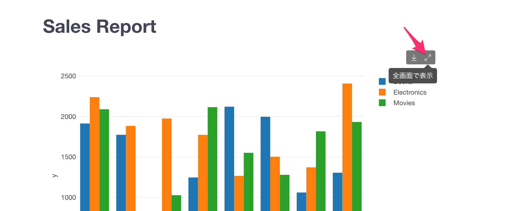

ナンバーチャートには現在対応しておりません。

## チャート/アナリティクスの画像をダウンロードする

ノート上のチャートやアナリティクスの右上にある「チャートの画像をエクスポート」を選択すると、チャートを画像ファイルとしてダウンロードすることができます。

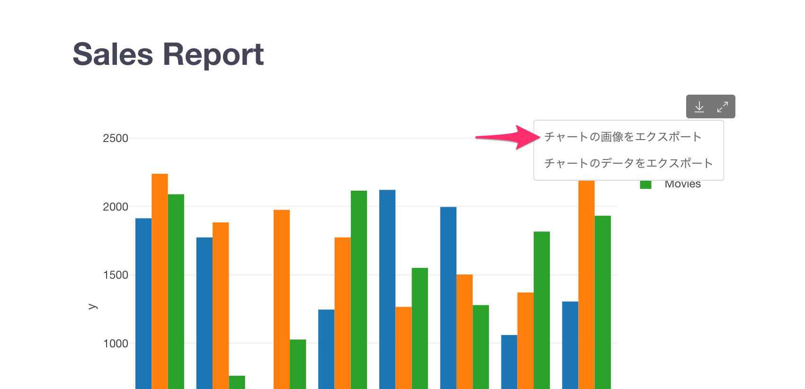

ダウンロードされる画像のサイズは以下のとおりです。

* 幅: 1,200ピクセル
* 高さ: チャートに繰り返しがない場合は 800ピクセル。ある場合は、繰り返しが全部入る高さ。
* ピクセル比率: 200%

「チャートの画像をエクスポート」のメニューは、パブリッシュされたノート上でのみ利用可能です。また、ナンバーチャート、地図チャートには現在対応しておりません。

## チャート/アナリティクスのデータをダウンロードする

ノート上のチャートやアナリティクスの右上にある「チャートのデータをエクスポート」を選択すると、チャートで使われているデータを、CSV形式でダウンロードすることができます。

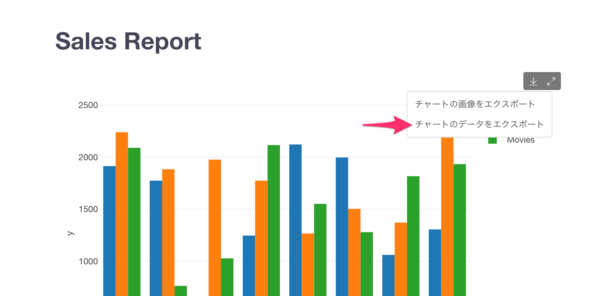

「チャートのデータをエクスポート」のメニューは、パブリッシュされたノート上でのみ利用可能です。また、ノートをパブリッシュする際に、ダウンロードオプションで「CSV」を選択する必要があります。

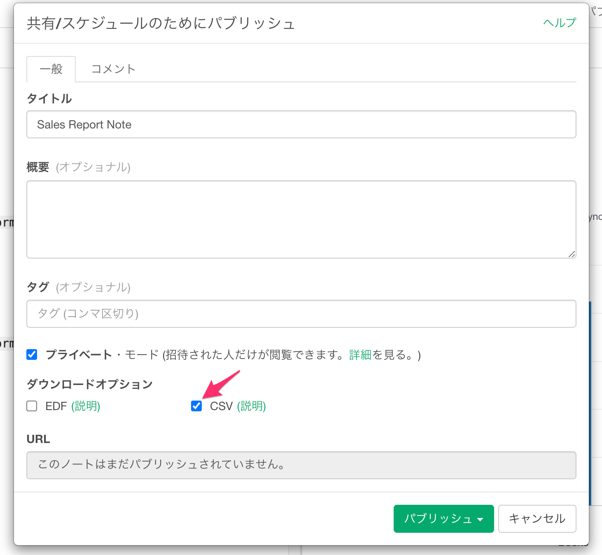

ナンバーチャートには現在対応しておりません。

## チャート/アナリティクスのコメントを見る

もし、チャートやアナリティクスにコメントがある場合、チャートやアナリティクスの右上にあるコメントアイコンをホバーかクリックすることで、コメントを確認することができます。

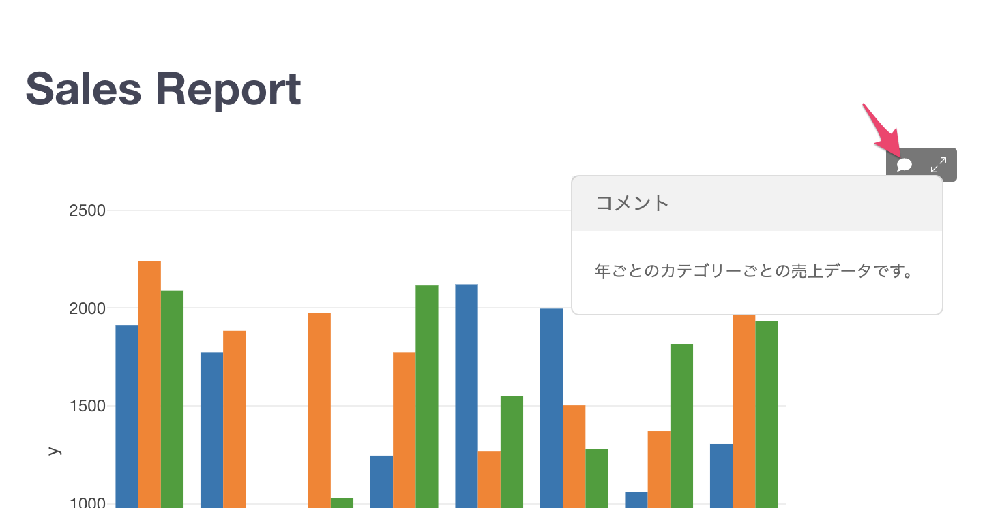

ナンバーチャートには現在対応しておりません。
