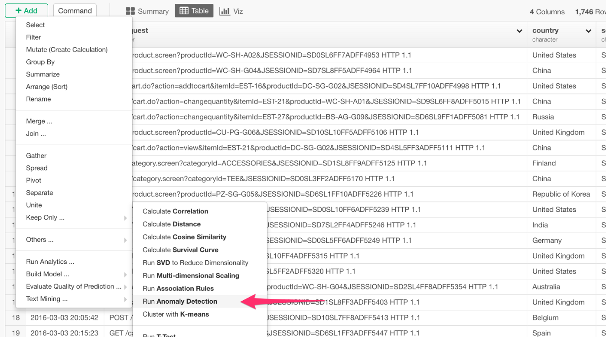
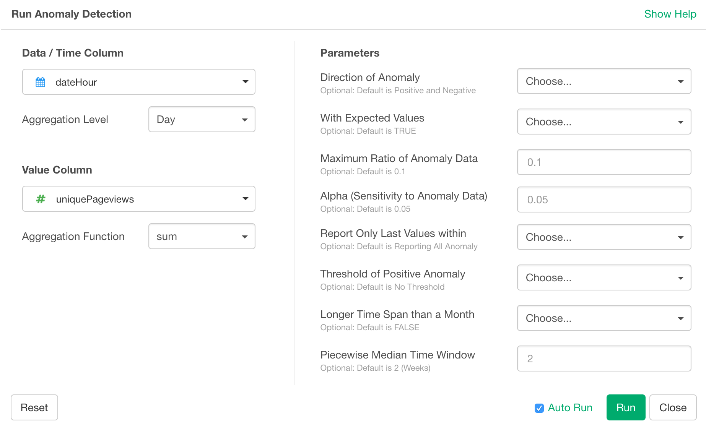
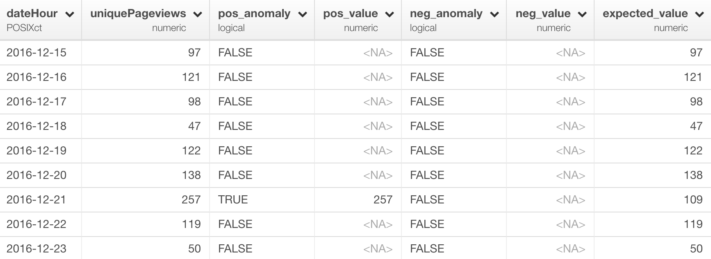

# Anomaly Detection

## Introduction

## Step-by-Step Tutorial with Access Log data.

It detects anomaly in time series data frame. It employs an algorithm referred to as Seasonal Hybrid ESD (S-H-ESD), which can detect both global as well as local anomalies in the time series data by taking seasonality and trend into account. It’s built by a team at Twitter for their use on monitoring their traffics.

## How to Access?

## How to Configure?

### Column Selection

* Date/Time Column - Select a Date or POSIXct data type column that holds date/time information.
  * Aggregation Level - When data type is Date, data is aggregated (e.g. summed, averaged, etc.) for each day. When data type is POSIXct, level of aggregation can be day, hour, minute, or second.
* Value Column - Select either 'Number of Rows' or a numeric column for which you want to detect anomalies.
  * Aggregation Function - Select an aggregate function such as 'sum', 'mean', etc. to aggregate the values.

### Parameters

* How to Fill NA - This algorithm requires NAs to be filled. The default is Fill with Previous Value. This can be...
  * Fill with Previous Value
  * Fill with Zero
  * Linear Interpolation 
  * Spline Interpolation 
* Direction of Anomaly (Optional) - The default is "both". Direction of anomaly. This can be...
  * "both" - Both positive and negative direction.
  * "pos" - Only positive direction.
  * "neg" - Only negative direction.
* With Expected Values (Optional) - The default is TRUE. Whether expected_values should be returned.
* Maximum Ratio of Anomaly Data (Optional) - The default is 0.1. The maximum ratio of anomaly data compared to the number of total data.
* Alpha (Sensitivity to Anomaly Data) (Optional) - The default is 0.05. The larger the value, the more anomaly data are captured.
* Report Only Last Values within (Optional) - The default is NULL.　Find only last anomalies within a day or hour. This can be
  * NULL - Find all anomalies.
  * "day" - Find last anomalies within a day.
  * "hr" - Find last anomalies within an hour.
* Threshold of Positive Anomaly (Optional) - The default is 'None'. If this is specified, only positive anomalies above the threshold are reported. This can be
  * 'None' - No threshold.
  * 'med_max' - Median of daily max values.
  * 'p95' - 95th percentile of the daily max values.
  * 'p99' - 99th percentile of the daily max values.
* Longer Time Span than a Month (Optional) - The default is FALSE. This should be TRUE if the time span is longer than a month.
* Piecewise Median Time Window (Optional) - The default is 2. The size of piecewise median time window (span of seasons). The unit is weeks.

## How to Read the Result?

* Date / Time Column
* Value Column
* pos_anomaly - Returns TRUE if anomaly is detected in the positive detection for each row.
* pos_value - Anomaly values in the positive direction.
* neg_anomaly - Returns TRUE if anomaly is detected in the negative detection for each row.
* neg_value - Anomaly values in the negative direction.
* expected_value - The values that the model would have expected based on the underlying trend.

### Underlying R Package

* [AnomalyDetection](https://github.com/twitter/AnomalyDetection)

## Step-by-Step Tutorial with Access Log data.

* [Introduction to Anomaly Detection in R with Exploratory](https://blog.exploratory.io/introduction-to-anomaly-detection-in-r-with-exploratory-a0507d40385d)
