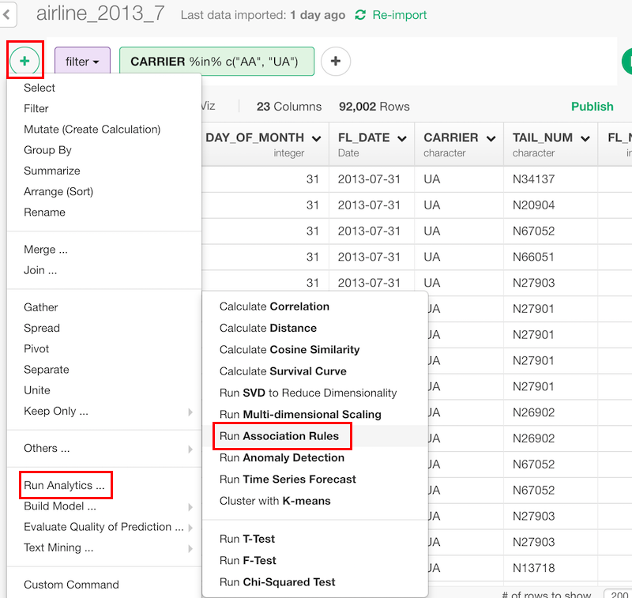
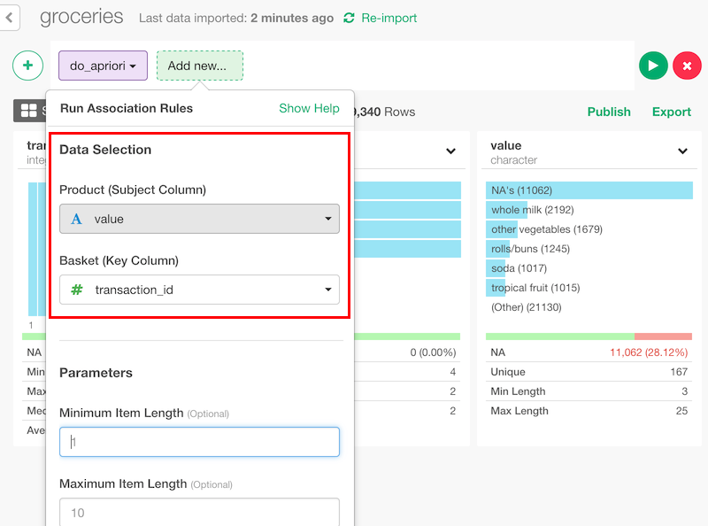

# Market Basket Analysis - Association Rules

## Introduction

Find rules of what tend to occur at the same time from transaction data.

## How to Access?

You can access from 'Add' (Plus) button.

## How to Use?

#### Column Selection

* Product (Subject Column) - Set a column to find rules for. If it's purchasing data, this should be a column of product names.
* Basket (Key Column) - Set a column to use as an id of transactions.

### Parameters

* Minimum Item Length, Maximum Item Length (Optional) - As default, minlen is 1 and maxlen is 10. How many subjects should appear in a rule.
* Minimum Support Value, Maximum Support Value (Optional) - As default, min_support is 0.1 and max_support is 1. The range of support value for results.
* Minimum Confidence Value (Optional) - The default is 0.5. The minimum value of confidence.
* Left Hand Side Items, Right Hand Side Items (Optional) - The default is NULL. What subjects should come to lhs or rhs.

## Step-by-Step Tutorial with Grocery store data.

* [Introduction to Association Rules (Market Basket Analysis) in R](https://blog.exploratory.io/introduction-to-association-rules-market-basket-analysis-in-r-7a0dd900a3e0)
