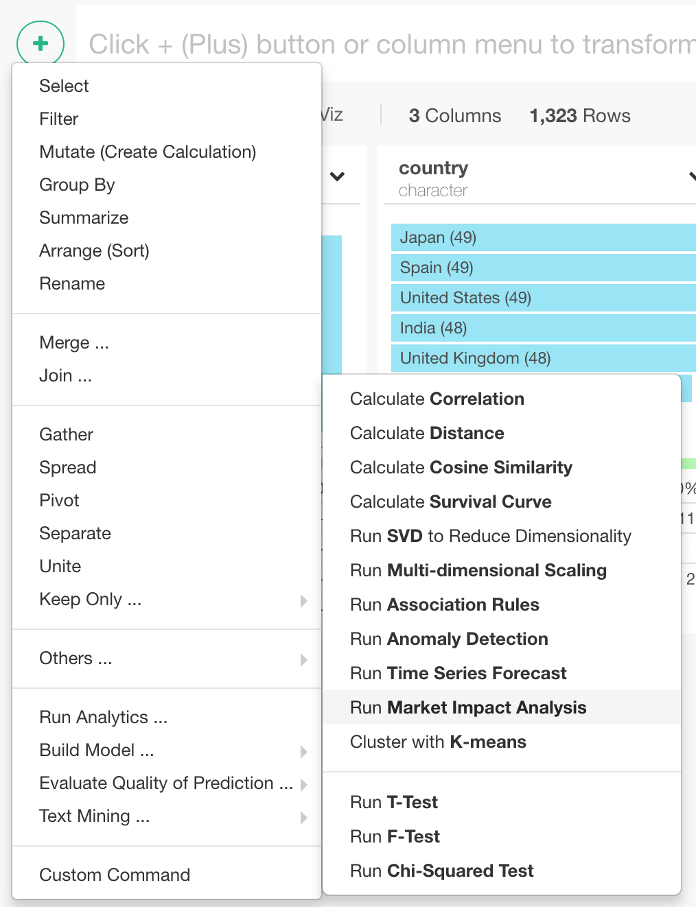
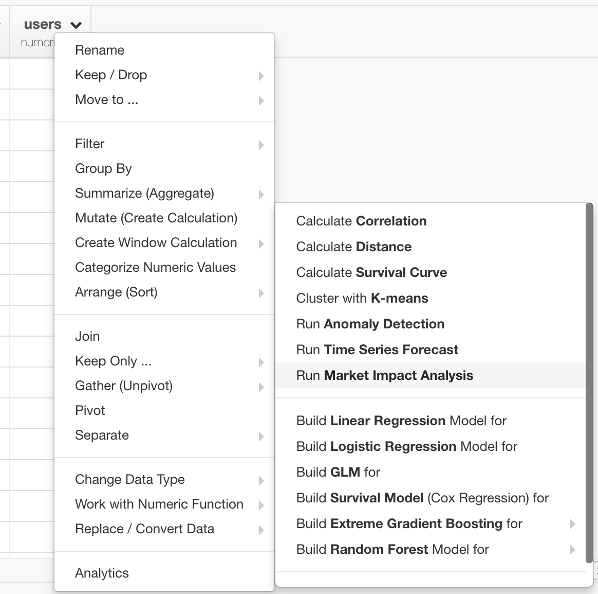
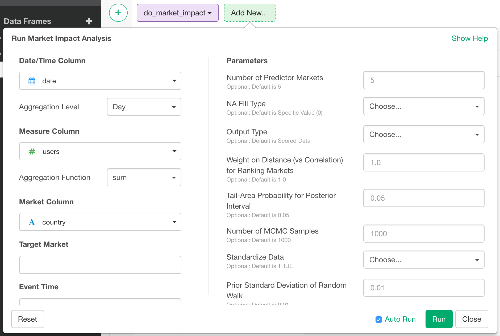

# Marketing Impact Analysis

With Marketing Impact Analysis, you can estimate impact of an event (advertisement, etc.) on a market, by using other markets to form a synthetic baseline.

## Input Data
Input data should be a time series data frame. It should have following columns.
  * Date/Time Column - A date/time column with Date or POSIXct data.
  * Measure Column - A numeric column with the values that you want to estimate the impact of the event upon.
  * Market Column - A character or factor column that has ID/name of the market for the row.

## How to Access This Feature

### From + (plus) Button
You can access this feature from 'Add' (Plus) button. Mouse over "Run Analytics ..." menu, and select "Run Market Impact Analysis".

### From Column Menu
You can also access this feature from the column menu of the Measure Column. Mouse over "Run Analytics ..." menu and select "Run Market Impact Analysis" menu.

## How to Use This Feature

1. Select date/time column with "Date / Time Column" dropdown.
2. Select aggregation level from "Aggregation Level" dropdown. Input data is aggregated with this time unit. For example, if you select "Day" and there are multiple rows that falls within a same day, the values for those rows are aggregated to form single row for the date. As a result, this becomes the time unit for the resulting time series data frame. Aggregation level can be one of the following.
  * Day
  * Week
  * Month
  * Quarter
  * Year
3. Select a numeric column from "Measure Column" dropdown. This is the value of interest that you want to estimate the impact of the event upon.
4. Select aggregation function from "Aggregation Function" dropdown. This is how the multiple rows that falls under same time period (the one you specified with "Aggregation Level".) is aggregated. Its value can be one of the following.
  * sum
  * mean
  * count
  * median
  * max
  * min
  * first
  * last
  * mad - Median Absolute Deviation
  * sd - Standard Deviation
  * var - Variance
5. Select a character/factor column from "Market Column" dropdown that has IDs/names of markets.
6. Select a value from Market Column that is the market of interest.
7. In the "Event Time" field, specify the date when the event of interest happened.
8. Specify optional parameters in "Parameters" section.
  * Number of Predictor Markets
  * NA Fill Type
  * Output Type
  * Weight on Distance (vs Correlation) for Ranking Markets
  * Tail-Area Probability for Posterior Interval
  * Number of MCMC Samples
  * Standardize Data
  * Prior Standard Deviation of Random Walk
  * Period of Seasonal Trend
  * Duration of a Season
  * Dynamic Regression
9. Click "Run" button.

## Output Data
The output data is time series with original measure, synthetic baseline, and estimated impact of the event upon the market of interest.
Following is the list of output columns.
* time - Time for each row.
* actual - Actual values from the target market.
* expected - Expected values of the target market if it were not for the event of the interest (advertisement etc.). Synthetic control calculated from values of other markets.
* expected_high / expected_low - Confidence interval of _expected_.
* impact - Impact of the event calculated as the difference between actual value and expected value.
* impact_high / impact_low - Confidence interval of _impact_.
* cumulative_impact - Cumulated sum of the _impact_.
* cumulative_impact_high / cumulative_impact_low - Confidence interval of _cumulative_impact_.
* actual_at_event_time - Actual value at the event time. Useful to mark the event time at visualization.

## Reference
* [An Introduction to Causal Impact Analysis](https://blog.exploratory.io/an-introduction-to-causal-impact-analysis-a57bce54078e)
