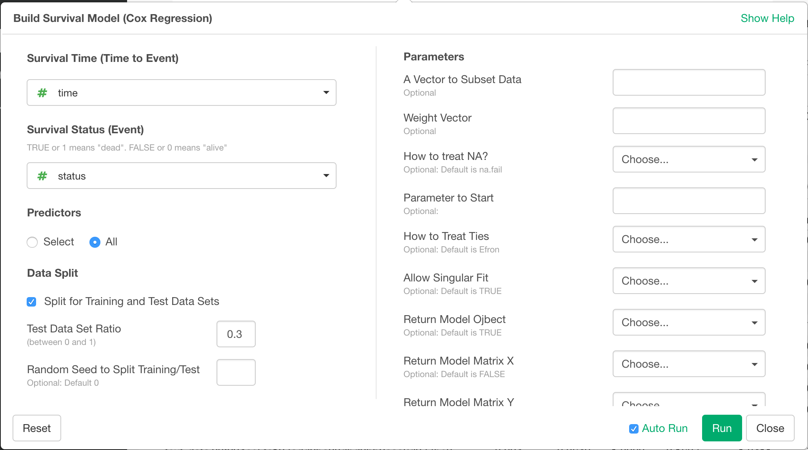
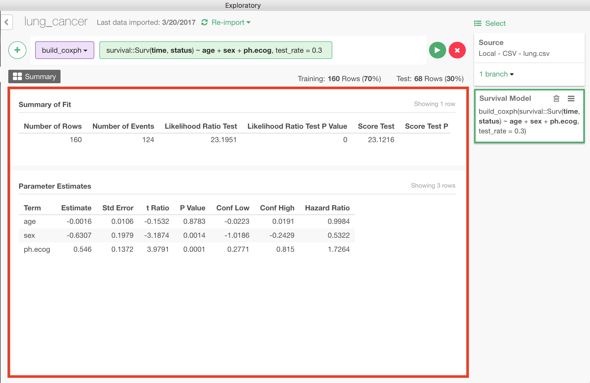

# Survival Analysis - Cox Regression / Proportional Hazard

With Cox Proportional Hazard Model, you can predict how particular type of subjects would survive as time goes by, based on the survival data from the past.

## Input Data
Input data should be a survival data. Each row should represent one observation (e.g. one user of a subscription service). It should have following columns.
  * Survival Time - A numeric column with survival time. Also called "time to event".
  * Survival Status - A boolean or binary numeric value (can take value of 1 or 0) column with survival status. When this column is true or 1, it means the event of interest happened to the subject at the end of survival time. If it is false or 0, it means we know that the event had not happened to the subject at least until the end of the survival time, but we don't know what happened to the subject after that point.

## How to Access This Feature
* Click "+" button and mouse over "Build Model ...", and select "Build Survival Model (Cox Regression)" submenu to open "Build Survival Model (Cox Regression)" dialog.
* You can also select "Analytics" from column menu of the survival time column, and then select "Build Survival Model (Cox Regression) for" submenu to open "Build Survival Model (Cox Regression)" dialog.

## Build Survival Model
After "Build Survival Model (Cox Regression)" dialog is opened, follow the steps below to build Survival Model.

1. Select survival time column with "Survival Time (Time to Event)" dropdown.
2. Select survival status column with "Survival Status (Event)" dropdown.
3. Select Predictor Columns in "Predictor" section.
  * If you want to include all the columns in the input data other than Survival Time Column and Survival Status Column, choose "All" radio button.
  * If you want to specify particular columns in the input data as predictors, choose "Select" radio button, and select columns from the column selector that appears in this section.
4. Split test data from traininig data
  In the "Data Split" section, you can split the data into training and test to evaluate the performance of the model later.

  

  * Test Data Set Ratio - Ratio of test data in the whole data.
  * Random Seed to Split Training/Test - You can change random seed to try other training and test data combination.
5. (Optional) Specify additional parameters in "Parameters" section.
  * A Vector to Subset Data
  * Weight Vector
  * How to treat NA?
  * Parameter to Start
  * How to Treat Ties
  * Allow Singular Fit
  * Return Model Object
  * Return Model Matrix X
  * Return Model Matrix Y
  * Time-Transform Function
  * Convergence Tolerance (Epsilon)
  * Tolerance for Singularity during Cholesky Decomposition (Epsilon)
  * Max Iterations
  * Tolerance for Infinite Coefficient Value
  * Max Iterations for Outer Loop
6. Click "Run" button.

## How to Read Model Summary
After building Survival Model, following Model Summary shows up.

### Summary of Fit

* Number of Rows - Number of training data rows.
* Number of Events - Number of events (deaths) that happened in the training survival data.
* Likelihood Ratio Test - Test result number for how well the model fits the training data. The larger the better. See Reference.
* Likelihood Ratio Test P Value - P value calculated from Likelihood Ratio Test result. Can be interpreted as possibility of the model being only as good as a model with no predictor (null model).
* Score Test - Another test result number for how well the model fits the training data.
* Score Test P Value - P value calculated from Score Test result
* Wald Test - Another test result number for how well the model fits the training data.
* Wald Test P Value - P value calculated from Wald Test result.
* R Square - Pseudo R-squeared. See Reference.
* R Square Max - Maximum for the pseudo R-squared. See Reference.
* Concordance - How well the order of the survival times of the subjects in training data corresponds with order of the hazards of the subjects predicted by the model.
* Std Error Concordance - Standard error of the concordance when it is viewed as a random variable.
* Log Likelihood - Likelihood of the model producing the result that is same as the training data, on log scale
* AIC - Akaike information criterion
* BIC - Bayesian information criterion

### Parameter Estimates
* Term - Name of a predictor
* Estimate - Fitted coefficient for the predictor
* Std Error - Standard error of "Estimates" when it is viewed as a random variable.
* t Ratio - "Estimate" divided by "Std Error". Indicator of whether the estimate is statistically significantly different from zero.
* P Value - Can be interpreted as the probability of the predictor being totally irrelevant.
* Conf Low - Lower limit of confidence interval for "Estimate"
* Conf High - Upper limit of confidence interval for "Estimate"
* Hazard Ratio - If this predictor goes up by one unit mount, hazard of the event (death) in a unit time goes up by this ratio.

## Reference
* [Introduction to Survival Analysis Part 2 — Survival Model (Cox Regression)](https://blog.exploratory.io/introduction-to-survival-analysis-part-2-survival-model-cox-regression-47a170eacf5d)
* [HOW ARE THE LIKELIHOOD RATIO, WALD, AND LAGRANGE MULTIPLIER (SCORE) TESTS DIFFERENT AND/OR SIMILAR?](http://stats.idre.ucla.edu/other/mult-pkg/faq/general/faqhow-are-the-likelihood-ratio-wald-and-lagrange-multiplier-score-tests-different-andor-similar/)
* [WHAT ARE PSEUDO R-SQUAREDS?](http://stats.idre.ucla.edu/other/mult-pkg/faq/general/faq-what-are-pseudo-r-squareds/)
