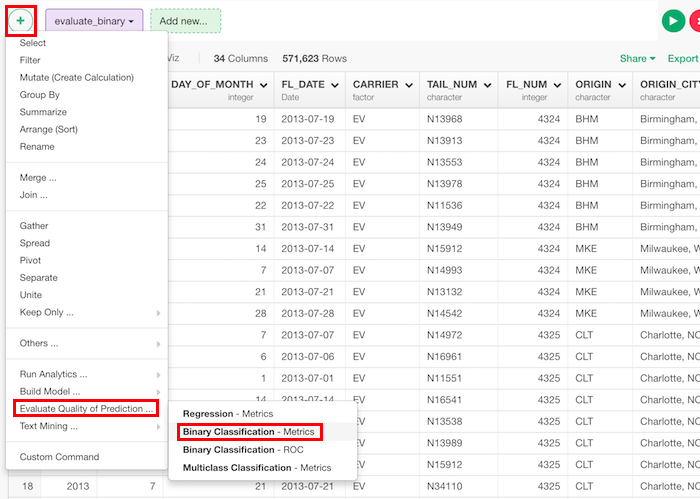
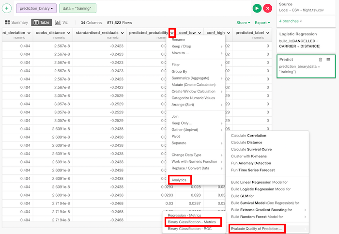
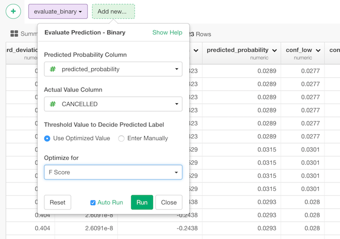

# Evaluate Prediction - Binary

Returns a data frame with evaluation score of binary classification including the below.

* AUC
* f_score
* accuracy
* misclassification_rate
* precision
* recall
* specificity
* true_positive - Number of positive predictions that actually are positive.
* false_positive - Number of positive predictions that actually are negative.
* true_negative - Number of negative predictions that actually are negative.
* false_negative - Number of negative predictions that actually are positive.
* test_size - The number of tested data.
* threshold - threshold value for prediction.

## How to Access This Feature

### From + (plus) Button
There are two ways to access. One is to access from 'Add' (Plus) button.

Another way is to access from a column header menu.

## How to Use?

* Predicted Probability Column - The column with predicted values. Usually, it's predicted_probability in the framework of Exploratory.
* Actual Value Column - The column with actual value.
* Threshold Value to Decide Predicted Label - You can choose how to decide threshold for predicted label.
  * Use Optimized Value - This searches threshold to optimize the chosen metric. It can be
    * F Score
    * Accuracy
    * Precision
    * Recall
    * Specificity
  * Enter Manually
    * Set threshold value manually.
