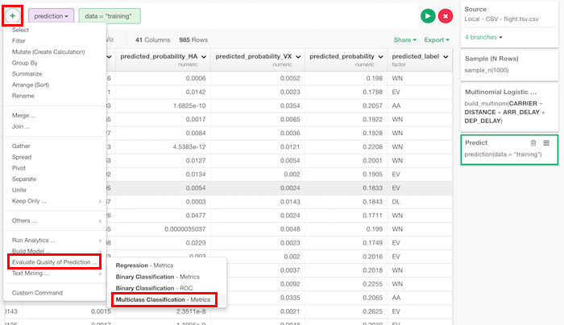
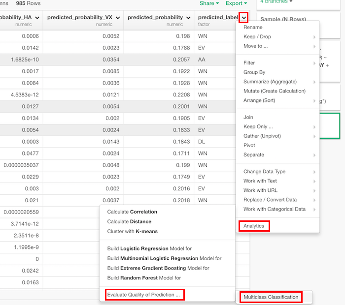
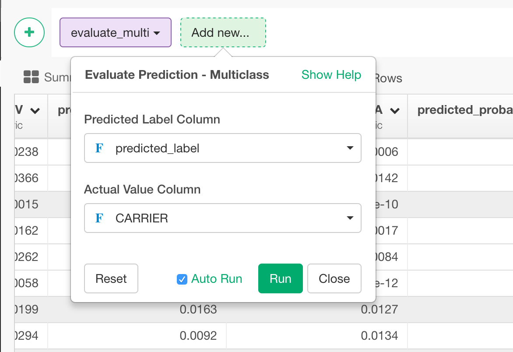

# Evaluate Prediction - Multiclass

Returns a data frame with evaluation score of multi classification including the below.

* micro_f_score
* macro_f_score
* accuracy
* misclassification_rate

## How to Access This Feature

### From + (plus) Button
There are two ways to access. One is to access from 'Add' (Plus) button.

Another way is to access from a column header menu.

## How to Use?

* Predicted Label Column - The column with predicted values. Usually, it's predicted_probability in the framework of Exploratory.
* Actual Value Column - The column with actual value.
